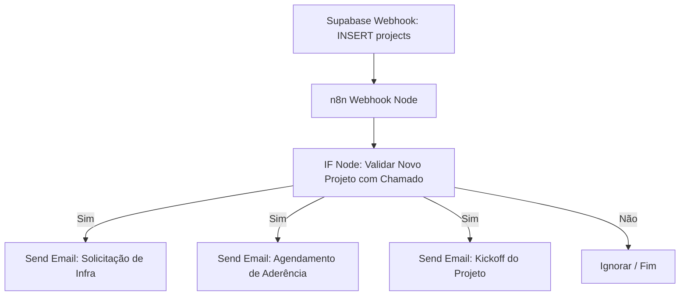
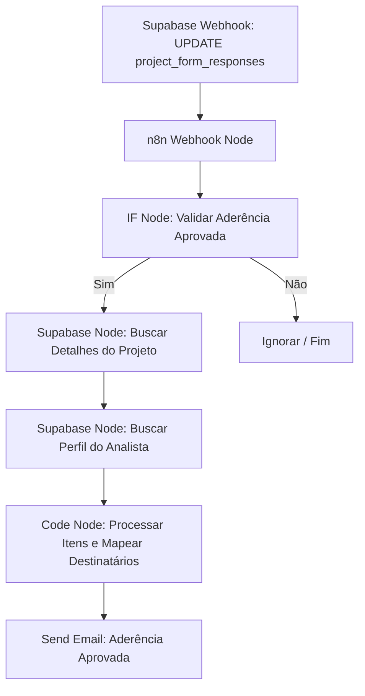
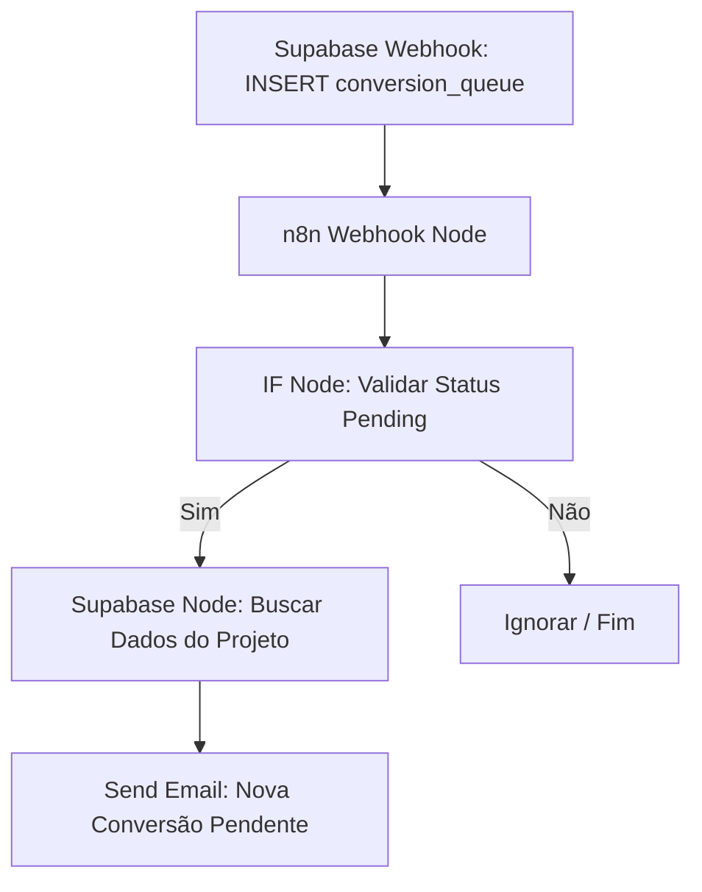
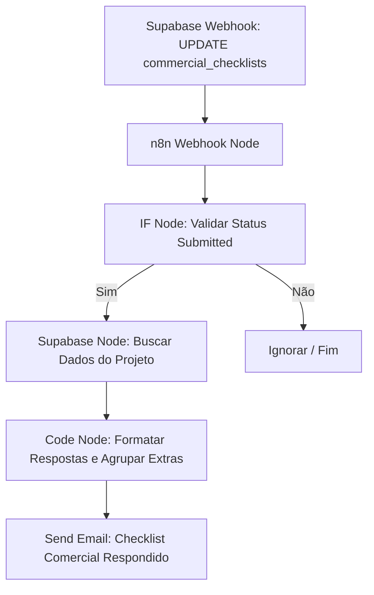
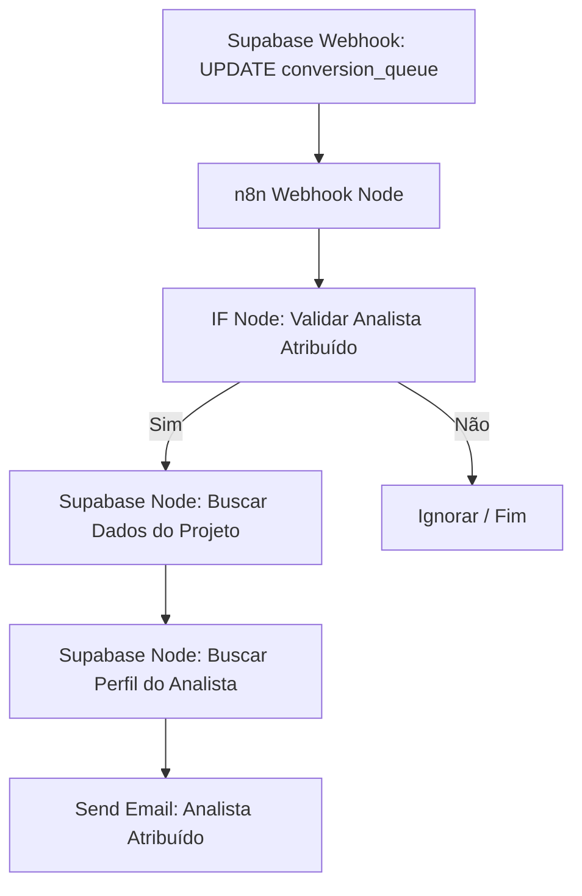

# 🚀 Guia Passo a Passo: Implantação de Automações de Disparo de E-mail — Siplan HUB

Este documento é o manual tático e operacional definitivo para a configuração e implantação das automações de disparo de e-mail do **Siplan HUB**, utilizando a plataforma de integração **n8n (versão 2.22.6 / 0.222.6)**, banco de dados **Supabase** (Database Webhooks e nós nativos do Supabase no n8n) e envio de e-mails via **Gmail SMTP** com App Password configurada.

---

## 📋 Pré-requisitos e Infraestrutura Geral

Antes de iniciar a montagem de cada automação no n8n, é necessário garantir que as credenciais e conexões base estejam configuradas corretamente no ambiente.

### 1. Configuração da Credencial SMTP (Gmail) no n8n
Para enviar e-mails a partir de uma conta do Gmail usando o nó **Send Email (SMTP)** do n8n, configure a credencial conforme os parâmetros abaixo:

*   **Credentials Type:** `SMTP`
*   **Host:** `smtp.gmail.com`
*   **Port:** `465` (com SSL/TLS ativo) ou `587` (com STARTTLS ativo)
*   **SSL/TLS:** Ativado (caso use a porta 465)
*   **User:** O seu e-mail do Gmail (ex: `seu-email@gmail.com` ou e-mail corporativo gerenciado pelo Google Workspace)
*   **Password:** A sua **App Password** de 16 dígitos gerada no painel de segurança da conta Google.
*   **From Address:** O e-mail de origem dos disparos (deve coincidir com o e-mail autenticado ou ser um alias autorizado).

### 2. Configuração de Webhooks de Banco de Dados no Supabase
Todas as automações são baseadas em eventos do banco de dados (Event-driven). O Supabase permite disparar chamadas HTTP (POST) sempre que ocorrerem operações de `INSERT` ou `UPDATE` nas tabelas.

#### Como configurar um Database Webhook no Supabase:
1.  Acesse o painel do Supabase do projeto Siplan HUB.
2.  No menu lateral esquerdo, vá em **Database** e selecione **Webhooks**.
3.  Clique em **Create Webhook**.
4.  Preencha as informações do webhook:
    *   **Name:** Nome descritivo da automação (ex: `n8n_novo_projeto`).
    *   **Table:** A tabela que sofrerá o evento (ex: `projects`).
    *   **Events:** Marque as caixas dos eventos desejados (`Insert` e/ou `Update`).
    *   **Method:** `POST`.
    *   **URL:** A URL gerada pelo nó **Webhook** do n8n.
        *   *Dica:* Durante o desenvolvimento e testes, utilize a **Test URL** do n8n. Ao ativar o fluxo em produção, altere a URL no Supabase para a **Production URL**.
    *   **Headers:** `Content-Type: application/json`.
5.  Clique em **Save**.

### 3. Conexão Nativa do Supabase no n8n
As consultas complementares de dados (como buscar informações do projeto ou o perfil do usuário) serão realizadas utilizando o **nó nativo do Supabase** já configurado no n8n.

*   **Credentials Type:** `Supabase API`
*   **Host:** A URL da API do seu projeto Supabase (ex: `https://xxxxxx.supabase.co`).
*   **Service Role API Key:** A chave de serviço secreta (`service_role` ou `service_key`) necessária para burlar políticas de RLS quando necessário em rotinas de retaguarda.

### 4. Tabela Geral de Mapeamento de E-mails (Fallback)
Se por algum motivo de inconsistência no banco de dados o e-mail do usuário não for encontrado na tabela de perfis (`public.profiles`), utilize o mapeamento de fallback abaixo:

| Nome do Colaborador | E-mail Oficial |
| :--- | :--- |
| **Marcus** | `marcus.vinicius@siplan.com.br` |
| **Bruno Fernandes** | `bruno.fernandes@siplan.com.br` |
| **Marcos Ortiz** | `marcos.ortiz@siplan.com.br` |
| **Ademar** | `ademar.souza@siplan.com.br` |
| **Luciane** | `luciane.lima@siplan.com.br` |
| **Eduardo Silva** | `eduardo.silva@siplan.com.br` |
| **Luan Caldeira** | `luan.caldeira@siplan.com.br` |
| **Amanda Flor** | `amanda.flor@siplan.com.br` |
| **Maurilio Camargo** | `maurilio.camargo@siplan.com.br` |
| **Maria** | `maria.santos@siplan.com.br` |
| **Alex Silva** | `alex.silva@siplan.com.br` |
| **Hugo Januário** | `hugo.santariosi@siplan.com.br` |

---

## 🛠️ Automação 1: Criação de Novo Projeto via Automação 0800

### 1. Descrição do Fluxo
Esta automação é disparada quando um integrador externo insere um novo projeto na tabela `projects`. O fluxo valida a entrada e dispara três e-mails distintos com layouts profissionais para diferentes equipes.



### 2. Passo a Passo da Configuração dos Nós no n8n

#### Nó 1: Webhook (Gatilho)
*   **Name:** `Webhook - Novo Projeto`
*   **Authentication:** `None`
*   **HTTP Method:** `POST`
*   **Path:** `novo-projeto-0800`
*   **Response Mode:** `onReceived`
*   **Response Code:** `200`
*   **Options -> Raw Body:** `False`

#### Nó 2: IF (Validação)
Este nó garante que a automação só execute se for uma inserção (`INSERT`) e se existirem dados de chamado associados (`ticket_number` ou `external_id`).
*   **Name:** `IF - Valida Origem`
*   **Conditions -> String:**
    *   **Value 1:** `{{ $json.body.type }}`
    *   **Operation:** `Equal`
    *   **Value 2:** `INSERT`
*   **Conditions -> String (Adicionar condição com operador AND):**
    *   **Value 1:** `{{ $json.body.record.ticket_number }}`
    *   **Operation:** `Not Empty`

#### Nó 3: Send Email (SMTP) - Solicitação de Infraestrutura
*   **Name:** `Email - Solicitação de Infra`
*   **Authentication:** `SMTP Credentials` (Gmail)
*   **From Email:** `seu-email@gmail.com`
*   **To Email:** `marcus.vinicius@siplan.com.br, alex.silva@siplan.com.br, hugo.santariosi@siplan.com.br`
*   **Subject:** `[SIPLAN HUB] [Infraestrutura] Solicitação de Análise de Infra — {{ $json.body.record.client_name }} (#{{ $json.body.record.ticket_number }})`
*   **Format:** `HTML`
*   **Body (HTML):**
```html
<!DOCTYPE html>
<html lang="pt-BR">
<head>
  <meta charset="UTF-8">
  <meta name="viewport" content="width=device-width, initial-scale=1.0">
  <title>Solicitação de Infraestrutura</title>
</head>
<body style="margin: 0; padding: 0; background-color: #f8fafc; font-family: 'Segoe UI', Helvetica, Arial, sans-serif; color: #334155; line-height: 1.6;">
  <table width="100%" border="0" cellspacing="0" cellpadding="0" style="background-color: #f8fafc; padding: 20px 0;">
    <tr>
      <td align="center">
        <table width="600" border="0" cellspacing="0" cellpadding="0" style="background-color: #ffffff; border-radius: 8px; overflow: hidden; box-shadow: 0 4px 6px rgba(0,0,0,0.05); border: 1px solid #e2e8f0;">
          <!-- Header -->
          <tr>
            <td style="background-color: #0f172a; padding: 20px 30px; text-align: left;">
              <span style="color: #3b82f6; font-size: 12px; font-weight: bold; text-transform: uppercase; letter-spacing: 1.5px;">Notificação Automática</span>
              <h1 style="color: #ffffff; font-size: 20px; margin: 5px 0 0 0; font-weight: 600; font-family: 'Segoe UI', Arial, sans-serif;">SIPLAN HUB</h1>
            </td>
          </tr>
          <!-- Body -->
          <tr>
            <td style="padding: 40px 30px;">
              <h2 style="color: #1e293b; font-size: 18px; margin-top: 0; border-bottom: 2px solid #f1f5f9; padding-bottom: 10px;">Solicitação de Análise de Infraestrutura</h2>
              <p style="font-size: 15px; color: #475569;">Olá equipe de Infraestrutura,</p>
              <p style="font-size: 15px; color: #475569;">Um novo projeto foi integrado via automação 0800 e necessita da <strong>Análise de Infraestrutura</strong> inicial. Por favor, revisem os detalhes abaixo e prossigam com o fluxo operacional.</p>
              
              <!-- Card de Informações -->
              <table width="100%" border="0" cellspacing="0" cellpadding="10" style="background-color: #f8fafc; border-radius: 6px; margin: 25px 0; border: 1px solid #edf2f7;">
                <tr>
                  <td width="30%" style="font-weight: bold; color: #64748b; font-size: 14px;">Cliente/Cartório:</td>
                  <td style="color: #1e293b; font-size: 14px; font-weight: 600;">{{ $json.body.record.client_name }}</td>
                </tr>
                <tr>
                  <td style="font-weight: bold; color: #64748b; font-size: 14px;">Chamado:</td>
                  <td style="color: #1e293b; font-size: 14px;">#{{ $json.body.record.ticket_number }}</td>
                </tr>
                <tr>
                  <td style="font-weight: bold; color: #64748b; font-size: 14px;">Sistema:</td>
                  <td style="color: #1e293b; font-size: 14px;">{{ $json.body.record.system_type }}</td>
                </tr>
                <tr>
                  <td style="font-weight: bold; color: #64748b; font-size: 14px;">Líder do Projeto:</td>
                  <td style="color: #1e293b; font-size: 14px;">{{ $json.body.record.project_leader }}</td>
                </tr>
              </table>

              <p style="font-size: 15px; color: #475569;">Acesse o painel do Siplan HUB para atribuir o responsável e iniciar a coleta de dados de hardware do servidor do cliente.</p>
              
              <table width="100%" border="0" cellspacing="0" cellpadding="0" style="margin-top: 30px;">
                <tr>
                  <td align="center">
                    <a href="https://hub.siplan.com.br/projects/{{ $json.body.record.id }}" style="background-color: #3b82f6; color: #ffffff; padding: 12px 24px; text-decoration: none; border-radius: 5px; font-weight: bold; font-size: 14px; display: inline-block; box-shadow: 0 2px 4px rgba(59,130,246,0.3);">Acessar Projeto no Siplan HUB</a>
                  </td>
                </tr>
              </table>
            </td>
          </tr>
          <!-- Footer -->
          <tr>
            <td style="background-color: #f1f5f9; padding: 20px 30px; text-align: center; font-size: 12px; color: #94a3b8; border-top: 1px solid #e2e8f0;">
              Este é um e-mail automático gerado pelo Siplan HUB.<br>
              © Siplan - Soluções para Cartórios Extrajudiciais
            </td>
          </tr>
        </table>
      </td>
    </tr>
  </table>
</body>
</html>
```

#### Nó 4: Send Email (SMTP) - Agendamento de Aderência
*   **Name:** `Email - Agendamento de Aderência`
*   **Authentication:** `SMTP Credentials` (Gmail)
*   **From Email:** `seu-email@gmail.com`
*   **To Email:** `marcus.vinicius@siplan.com.br, maria.santos@siplan.com.br`
*   **Subject:** `[SIPLAN HUB] [Aderência] Agendar Análise — {{ $json.body.record.client_name }} (#{{ $json.body.record.ticket_number }}) — Sistema: {{ $json.body.record.system_type }}`
*   **Format:** `HTML`
*   **Body (HTML):**
```html
<!DOCTYPE html>
<html lang="pt-BR">
<head>
  <meta charset="UTF-8">
  <meta name="viewport" content="width=device-width, initial-scale=1.0">
  <title>Agendamento de Aderência</title>
</head>
<body style="margin: 0; padding: 0; background-color: #f8fafc; font-family: 'Segoe UI', Helvetica, Arial, sans-serif; color: #334155; line-height: 1.6;">
  <table width="100%" border="0" cellspacing="0" cellpadding="0" style="background-color: #f8fafc; padding: 20px 0;">
    <tr>
      <td align="center">
        <table width="600" border="0" cellspacing="0" cellpadding="0" style="background-color: #ffffff; border-radius: 8px; overflow: hidden; box-shadow: 0 4px 6px rgba(0,0,0,0.05); border: 1px solid #e2e8f0;">
          <!-- Header -->
          <tr>
            <td style="background-color: #0f172a; padding: 20px 30px; text-align: left;">
              <span style="color: #3b82f6; font-size: 12px; font-weight: bold; text-transform: uppercase; letter-spacing: 1.5px;">Notificação Automática</span>
              <h1 style="color: #ffffff; font-size: 20px; margin: 5px 0 0 0; font-weight: 600; font-family: 'Segoe UI', Arial, sans-serif;">SIPLAN HUB</h1>
            </td>
          </tr>
          <!-- Body -->
          <tr>
            <td style="padding: 40px 30px;">
              <h2 style="color: #1e293b; font-size: 18px; margin-top: 0; border-bottom: 2px solid #f1f5f9; padding-bottom: 10px;">Necessidade de Agendamento - Análise de Aderência</h2>
              <p style="font-size: 15px; color: #475569;">Olá Marcus e Maria,</p>
              <p style="font-size: 15px; color: #475569;">O projeto do cliente abaixo foi cadastrado e agora aguarda o agendamento da <strong>Análise de Aderência</strong> para mapeamento de rotinas operacionais.</p>
              
              <!-- Card de Informações -->
              <table width="100%" border="0" cellspacing="0" cellpadding="10" style="background-color: #f8fafc; border-radius: 6px; margin: 25px 0; border: 1px solid #edf2f7;">
                <tr>
                  <td width="30%" style="font-weight: bold; color: #64748b; font-size: 14px;">Cliente:</td>
                  <td style="color: #1e293b; font-size: 14px; font-weight: 600;">{{ $json.body.record.client_name }}</td>
                </tr>
                <tr>
                  <td style="font-weight: bold; color: #64748b; font-size: 14px;">Chamado:</td>
                  <td style="color: #1e293b; font-size: 14px;">#{{ $json.body.record.ticket_number }}</td>
                </tr>
                <tr>
                  <td style="font-weight: bold; color: #64748b; font-size: 14px;">Sistema Contratado:</td>
                  <td style="color: #1e293b; font-size: 14px; font-weight: 600; color: #3b82f6;">{{ $json.body.record.system_type }}</td>
                </tr>
              </table>

              <p style="font-size: 15px; color: #475569;">Favor entrar em contato com o cliente para agendar a reunião de aderência e preencher os dados correspondentes no Siplan HUB.</p>
              
              <table width="100%" border="0" cellspacing="0" cellpadding="0" style="margin-top: 30px;">
                <tr>
                  <td align="center">
                    <a href="https://hub.siplan.com.br/projects/{{ $json.body.record.id }}/adherence" style="background-color: #3b82f6; color: #ffffff; padding: 12px 24px; text-decoration: none; border-radius: 5px; font-weight: bold; font-size: 14px; display: inline-block; box-shadow: 0 2px 4px rgba(59,130,246,0.3);">Agendar no Siplan HUB</a>
                  </td>
                </tr>
              </table>
            </td>
          </tr>
          <!-- Footer -->
          <tr>
            <td style="background-color: #f1f5f9; padding: 20px 30px; text-align: center; font-size: 12px; color: #94a3b8; border-top: 1px solid #e2e8f0;">
              Este é um e-mail automático gerado pelo Siplan HUB.<br>
              © Siplan - Soluções para Cartórios Extrajudiciais
            </td>
          </tr>
        </table>
      </td>
    </tr>
  </table>
</body>
</html>
```

#### Nó 5: Send Email (SMTP) - Kickoff do Projeto
Como o líder do projeto sempre será Marcus Vinicius ou Bruno Fernandes, a lista fixa do Kickoff já cobre todos de forma ideal.
*   **Name:** `Email - Kickoff do Projeto`
*   **Authentication:** `SMTP Credentials` (Gmail)
*   **From Email:** `seu-email@gmail.com`
*   **To Email:** `marcus.vinicius@siplan.com.br, marcos.ortiz@siplan.com.br, bruno.fernandes@siplan.com.br`
*   **Subject:** `[SIPLAN HUB] [Kickoff] Novo Projeto Cadastrado — {{ $json.body.record.client_name }} (#{{ $json.body.record.ticket_number }})`
*   **Format:** `HTML`
*   **Body (HTML):**
```html
<!DOCTYPE html>
<html lang="pt-BR">
<head>
  <meta charset="UTF-8">
  <meta name="viewport" content="width=device-width, initial-scale=1.0">
  <title>Kickoff do Projeto</title>
</head>
<body style="margin: 0; padding: 0; background-color: #f8fafc; font-family: 'Segoe UI', Helvetica, Arial, sans-serif; color: #334155; line-height: 1.6;">
  <table width="100%" border="0" cellspacing="0" cellpadding="0" style="background-color: #f8fafc; padding: 20px 0;">
    <tr>
      <td align="center">
        <table width="600" border="0" cellspacing="0" cellpadding="0" style="background-color: #ffffff; border-radius: 8px; overflow: hidden; box-shadow: 0 4px 6px rgba(0,0,0,0.05); border: 1px solid #e2e8f0;">
          <!-- Header -->
          <tr>
            <td style="background-color: #0f172a; padding: 20px 30px; text-align: left;">
              <span style="color: #3b82f6; font-size: 12px; font-weight: bold; text-transform: uppercase; letter-spacing: 1.5px;">Notificação Automática</span>
              <h1 style="color: #ffffff; font-size: 20px; margin: 5px 0 0 0; font-weight: 600; font-family: 'Segoe UI', Arial, sans-serif;">SIPLAN HUB</h1>
            </td>
          </tr>
          <!-- Body -->
          <tr>
            <td style="padding: 40px 30px;">
              <h2 style="color: #1e293b; font-size: 18px; margin-top: 0; border-bottom: 2px solid #f1f5f9; padding-bottom: 10px;">Novo Projeto Disponível (Kickoff)</h2>
              <p style="font-size: 15px; color: #475569;">Prezados,</p>
              <p style="font-size: 15px; color: #475569;">Informamos que o projeto de implantação para o cliente <strong>{{ $json.body.record.client_name }}</strong> foi devidamente inserido no sistema e está pronto para o alinhamento de kickoff.</p>
              
              <!-- Card de Informações -->
              <table width="100%" border="0" cellspacing="0" cellpadding="10" style="background-color: #f8fafc; border-radius: 6px; margin: 25px 0; border: 1px solid #edf2f7;">
                <tr>
                  <td width="35%" style="font-weight: bold; color: #64748b; font-size: 14px;">Cliente:</td>
                  <td style="color: #1e293b; font-size: 14px; font-weight: 600;">{{ $json.body.record.client_name }}</td>
                </tr>
                <tr>
                  <td style="font-weight: bold; color: #64748b; font-size: 14px;">Chamado:</td>
                  <td style="color: #1e293b; font-size: 14px;">#{{ $json.body.record.ticket_number }}</td>
                </tr>
                <tr>
                  <td style="font-weight: bold; color: #64748b; font-size: 14px;">Sistema:</td>
                  <td style="color: #1e293b; font-size: 14px; font-weight: bold; color: #0f172a;">{{ $json.body.record.system_type }}</td>
                </tr>
                <tr>
                  <td style="font-weight: bold; color: #64748b; font-size: 14px;">Horas Vendidas:</td>
                  <td style="color: #10b981; font-size: 14px; font-weight: bold;">{{ $json.body.record.sold_hours }} horas</td>
                </tr>
                <tr>
                  <td style="font-weight: bold; color: #64748b; font-size: 14px;">Líder de Implantação:</td>
                  <td style="color: #1e293b; font-size: 14px;">{{ $json.body.record.project_leader }}</td>
                </tr>
              </table>

              <p style="font-size: 15px; color: #475569;">Alinhem os próximos passos e verifiquem a alocação dos recursos para o atendimento deste cartório.</p>
              
              <table width="100%" border="0" cellspacing="0" cellpadding="0" style="margin-top: 30px;">
                <tr>
                  <td align="center">
                    <a href="https://hub.siplan.com.br/projects/{{ $json.body.record.id }}" style="background-color: #0f172a; color: #ffffff; padding: 12px 24px; text-decoration: none; border-radius: 5px; font-weight: bold; font-size: 14px; display: inline-block; box-shadow: 0 2px 4px rgba(15,23,42,0.3);">Abrir Ficha do Projeto</a>
                  </td>
                </tr>
              </table>
            </td>
          </tr>
          <!-- Footer -->
          <tr>
            <td style="background-color: #f1f5f9; padding: 20px 30px; text-align: center; font-size: 12px; color: #94a3b8; border-top: 1px solid #e2e8f0;">
              Este é um e-mail automático gerado pelo Siplan HUB.<br>
              © Siplan - Soluções para Cartórios Extrajudiciais
            </td>
          </tr>
        </table>
      </td>
    </tr>
  </table>
</body>
</html>
```

### 3. Plano de Teste para Automação 1
1.  **Ativar o modo de escuta no n8n:** Clique em **Listen for test event** no nó `Webhook - Novo Projeto`.
2.  **Inserir dados de teste no Supabase:** Acesse o painel SQL Editor do Supabase e execute a seguinte consulta de teste:
    ```sql
    INSERT INTO public.projects (
        client_name, 
        ticket_number, 
        system_type, 
        project_leader, 
        sold_hours, 
        last_update_by, 
        external_id
    ) VALUES (
        'Cartório de Testes de Automação', 
        '999991', 
        'Orion TN', 
        'Marcus', 
        50, 
        'Automacao 0800', 
        'EXT-0800-TEST'
    );
    ```
3.  **Verificar a Execução no n8n:** O n8n deve receber a requisição. Verifique se o fluxo seguiu pelo caminho `true` do IF.
4.  **Confirmar os E-mails Recebidos:** Acesse as caixas de e-mail de teste para garantir que as variáveis foram preenchidas e que os e-mails chegaram com sucesso.
5.  **Limpar Banco de Dados (Pós-teste):**
    ```sql
    DELETE FROM public.projects WHERE ticket_number = '999991';
    ```

---

## ⚖️ Automação 2: Análise de Aderência Finalizada

### 1. Descrição do Fluxo
Esta automação é disparada quando um formulário de aderência (`project_form_responses` com `stage = 'adherence'`) é atualizado para o status `'approved'`. O fluxo recupera o projeto relacionado do banco, busca dinamicamente o e-mail do analista aprovador na tabela `public.profiles` através de seu UUID, processa recursivamente o JSON de respostas para extrair os itens com impacto técnico e envia a notificação com cópia inteligente (CC) configurada.



### 2. Passo a Passo da Configuração dos Nós no n8n

#### Nó 1: Webhook (Gatilho)
*   **Name:** `Webhook - Aderência Aprovada`
*   **Authentication:** `None`
*   **HTTP Method:** `POST`
*   **Path:** `aderencia-aprovada`
*   **Response Mode:** `onReceived`

#### Nó 2: IF (Validação de Status)
*   **Name:** `IF - Status Approved`
*   **Conditions:**
    *   `{{ $json.body.record.stage }} == 'adherence'` **AND**
    *   `{{ $json.body.record.status }} == 'approved'` **AND**
    *   `{{ $json.body.old_record.status }} != 'approved'` (Garante disparo único na aprovação).

#### Nó 3: Supabase (Consulta de Projeto)
Busca os metadados do projeto na tabela `projects`.
*   **Name:** `Supabase - Get Project`
*   **Operation:** `Get`
*   **Table:** `projects`
*   **Filter -> Column:** `id`
*   **Filter -> Operator:** `Equal`
*   **Filter -> Value:** `{{ $node["Webhook - Aderência Aprovada"].json.body.record.project_id }}`

#### Nó 4: Supabase (Consulta de Perfil do Analista)
Consulta a tabela `profiles` do Supabase para obter dinamicamente o e-mail e nome do analista aprovador.
*   **Name:** `Supabase - Get Analyst Profile`
*   **Operation:** `Get`
*   **Table:** `profiles`
*   **Filter -> Column:** `id`
*   **Filter -> Operator:** `Equal`
*   **Filter -> Value:** `{{ $node["Webhook - Aderência Aprovada"].json.body.record.approved_by }}`

#### Nó 5: Code (Extração de Itens e Destinatários)
*   **Name:** `Code - Processar Itens e Destinatários`
*   **Language:** `JavaScript`
*   **Code:**
```javascript
const responseRecord = $('Webhook - Aderência Aprovada').item.json.body.record;
const projectData = $('Supabase - Get Project').item.json;
let analystProfile = null;

try {
  analystProfile = $('Supabase - Get Analyst Profile').item.json;
} catch (e) {
  // Ignora se o nó de profile não retornou dados para evitar quebra do fluxo
}

const formData = responseRecord.data || {};
const finalVerdict = formData.finalVerdict || 'Não informado';
const finalNotes = formData.finalNotes || 'Nenhuma justificativa informada.';

// Processamento recursivo dos itens com impacto === true
const impactedItems = [];

function traverse(obj, currentSection = 'Geral') {
  if (!obj || typeof obj !== 'object') return;
  
  for (const key in obj) {
    if (Object.prototype.hasOwnProperty.call(obj, key)) {
      const val = obj[key];
      if (val && typeof val === 'object') {
        if ('impacto' in val) {
          if (val.impacto === true) {
            impactedItems.push({
              section: currentSection,
              question: key.replace(/_/g, ' ').replace(/\b\w/g, c => c.toUpperCase()),
              details: val.detalhes || 'Nenhum detalhe informado.',
              impactLevel: val.nivel_impacto || 'SIM'
            });
          }
        } else {
          traverse(val, key.replace(/_/g, ' ').replace(/\b\w/g, c => c.toUpperCase()));
        }
      }
    }
  }
}

traverse(formData, 'Geral');

// Formatar Tabela HTML
let impactedHtmlTable = '';
if (impactedItems.length === 0) {
  impactedHtmlTable = '<p style="color: #10b981; font-weight: bold; font-size: 14px;">✓ Nenhum item com impacto técnico ou impeditivo foi identificado nesta análise.</p>';
} else {
  impactedHtmlTable = `
    <table width="100%" border="0" cellspacing="0" cellpadding="8" style="border-collapse: collapse; margin-top: 10px; border: 1px solid #e2e8f0; font-size: 13px;">
      <thead>
        <tr style="background-color: #f1f5f9; border-bottom: 2px solid #e2e8f0; text-align: left; font-weight: bold;">
          <th style="padding: 10px; border: 1px solid #e2e8f0; color: #475569;">Seção</th>
          <th style="padding: 10px; border: 1px solid #e2e8f0; color: #475569;">Item/Requisito</th>
          <th style="padding: 10px; border: 1px solid #e2e8f0; color: #475569;">Impacto</th>
          <th style="padding: 10px; border: 1px solid #e2e8f0; color: #475569;">Detalhes do Blocker</th>
        </tr>
      </thead>
      <tbody>
  `;
  
  impactedItems.forEach(item => {
    let badgeColor = '#ef4444';
    if (item.impactLevel.toUpperCase() === 'BAIXO' || item.impactLevel.toUpperCase() === 'NÃO') {
      badgeColor = '#f59e0b';
    }
    
    impactedHtmlTable += `
      <tr style="border-bottom: 1px solid #e2e8f0;">
        <td style="padding: 10px; border: 1px solid #e2e8f0; font-weight: 600; color: #64748b;">${item.section}</td>
        <td style="padding: 10px; border: 1px solid #e2e8f0; color: #334155;">${item.question}</td>
        <td style="padding: 10px; border: 1px solid #e2e8f0; text-align: center;">
          <span style="background-color: ${badgeColor}; color: white; padding: 2px 6px; border-radius: 4px; font-weight: bold; font-size: 10px; display: inline-block;">${item.impactLevel}</span>
        </td>
        <td style="padding: 10px; border: 1px solid #e2e8f0; color: #475569;">${item.details}</td>
      </tr>
    `;
  });
  impactedHtmlTable += '</tbody></table>';
}

// Resolver o Analista Executor Dinamicamente pelo Profile
let lastUpdatedByEmail = '';
let analystName = 'Analista';

if (analystProfile && analystProfile.email) {
  lastUpdatedByEmail = analystProfile.email;
  analystName = analystProfile.full_name || 'Analista';
} else {
  // Fallback Estático
  const emailMapping = {
    'marcus': 'marcus.vinicius@siplan.com.br',
    'bruno': 'bruno.fernandes@siplan.com.br',
    'marcos': 'marcos.ortiz@siplan.com.br',
    'ademar': 'ademar.souza@siplan.com.br',
    'luciane': 'luciane.lima@siplan.com.br',
    'eduardo': 'eduardo.silva@siplan.com.br',
    'luan': 'luan.caldeira@siplan.com.br',
    'amanda': 'amanda.flor@siplan.com.br',
    'maurilio': 'maurilio.camargo@siplan.com.br',
    'maria': 'maria.santos@siplan.com.br',
    'alex': 'alex.silva@siplan.com.br',
    'hugo': 'hugo.santariosi@siplan.com.br'
  };
  const updatedByUsername = (projectData.last_update_by || 'marcus').toLowerCase();
  lastUpdatedByEmail = emailMapping[updatedByUsername] || 'marcus.vinicius@siplan.com.br';
}

// Resolver CC de acordo com o Tipo de Sistema
const systemType = (projectData.system_type || '').toUpperCase().replace(/\s+/g, '');
let systemSpecificCc = '';

if (systemType === 'ORIONTN' || systemType === 'ORION_TN') {
  systemSpecificCc = 'luan.caldeira@siplan.com.br';
} else if (systemType === 'ORIONPRO' || systemType === 'ORION_PRO') {
  systemSpecificCc = 'maurilio.camargo@siplan.com.br';
} else if (systemType === 'ORIONREG' || systemType === 'ORION_REG') {
  systemSpecificCc = 'amanda.flor@siplan.com.br';
}

// Junta a lista fixa de CC
const ccList = ['marcos.ortiz@siplan.com.br', 'bruno.fernandes@siplan.com.br'];
if (lastUpdatedByEmail && !ccList.includes(lastUpdatedByEmail)) {
  ccList.push(lastUpdatedByEmail);
}
if (systemSpecificCc && !ccList.includes(systemSpecificCc)) {
  ccList.push(systemSpecificCc);
}

return [{
  json: {
    projectId: projectData.id,
    clientName: projectData.client_name,
    ticketNumber: projectData.ticket_number,
    systemType: projectData.system_type,
    finalVerdict: finalVerdict,
    finalNotes: finalNotes,
    analystName: analystName,
    impactedHtmlTable: impactedHtmlTable,
    toEmail: 'marcus.vinicius@siplan.com.br',
    ccEmail: ccList.join(', '),
    printUrl: `https://hub.siplan.com.br/projects/${projectData.id}/adherence?print=true`
  }
}];
```

#### Nó 6: Send Email (SMTP)
*   **Name:** `Email - Aderência Aprovada`
*   **Authentication:** `SMTP Credentials` (Gmail)
*   **From Email:** `seu-email@gmail.com`
*   **To Email:** `{{ $json.toEmail }}`
*   **Cc Email:** `{{ $json.ccEmail }}`
*   **Subject:** `[SIPLAN HUB] [Aderência] Finalizada — {{ $json.clientName }} (#{{ $json.ticketNumber }}) — Veredito: {{ $json.finalVerdict }}`
*   **Format:** `HTML`
*   **Body (HTML):**
```html
<!DOCTYPE html>
<html lang="pt-BR">
<head>
  <meta charset="UTF-8">
  <meta name="viewport" content="width=device-width, initial-scale=1.0">
  <title>Análise de Aderência Finalizada</title>
</head>
<body style="margin: 0; padding: 0; background-color: #f8fafc; font-family: 'Segoe UI', Helvetica, Arial, sans-serif; color: #334155; line-height: 1.6;">
  <table width="100%" border="0" cellspacing="0" cellpadding="0" style="background-color: #f8fafc; padding: 20px 0;">
    <tr>
      <td align="center">
        <table width="600" border="0" cellspacing="0" cellpadding="0" style="background-color: #ffffff; border-radius: 8px; overflow: hidden; box-shadow: 0 4px 6px rgba(0,0,0,0.05); border: 1px solid #e2e8f0;">
          <!-- Header -->
          <tr>
            <td style="background-color: #0f172a; padding: 20px 30px; text-align: left;">
              <span style="color: #3b82f6; font-size: 12px; font-weight: bold; text-transform: uppercase; letter-spacing: 1.5px;">Aderência Concluída</span>
              <h1 style="color: #ffffff; font-size: 20px; margin: 5px 0 0 0; font-weight: 600; font-family: 'Segoe UI', Arial, sans-serif;">SIPLAN HUB</h1>
            </td>
          </tr>
          <!-- Body -->
          <tr>
            <td style="padding: 40px 30px;">
              <h2 style="color: #1e293b; font-size: 18px; margin-top: 0; border-bottom: 2px solid #f1f5f9; padding-bottom: 10px;">Resultado da Análise de Aderência</h2>
              <p style="font-size: 15px; color: #475569;">A análise de aderência para o cliente <strong>{{ $json.clientName }}</strong> foi finalizada por <strong>{{ $json.analystName }}</strong>.</p>
              
              <!-- Card Principal de Status -->
              <table width="100%" border="0" cellspacing="0" cellpadding="12" style="background-color: #f8fafc; border-radius: 6px; margin: 20px 0; border: 1px solid #edf2f7; font-size: 14px;">
                <tr>
                  <td width="30%" style="font-weight: bold; color: #64748b;">Cartório:</td>
                  <td style="color: #1e293b; font-weight: bold;">{{ $json.clientName }}</td>
                </tr>
                <tr>
                  <td style="font-weight: bold; color: #64748b;">Chamado:</td>
                  <td style="color: #1e293b;">#{{ $json.ticketNumber }}</td>
                </tr>
                <tr>
                  <td style="font-weight: bold; color: #64748b;">Sistema:</td>
                  <td style="color: #1e293b;">{{ $json.systemType }}</td>
                </tr>
                <tr>
                  <td style="font-weight: bold; color: #64748b;">Veredito Técnico:</td>
                  <td style="font-weight: bold; font-size: 15px;">
                    <span style="padding: 4px 10px; border-radius: 20px; text-transform: uppercase; font-size: 11px;
                      {{ if $json.finalVerdict.includes('Totalmente') }} background-color: #d1fae5; color: #065f46; {{ else if $json.finalVerdict.includes('Restrições') }} background-color: #fef3c7; color: #92400e; {{ else }} background-color: #fee2e2; color: #991b1b; {{ end }}">
                      {{ $json.finalVerdict }}
                    </span>
                  </td>
                </tr>
                <tr>
                  <td style="font-weight: bold; color: #64748b; vertical-align: top;">Parecer Geral:</td>
                  <td style="color: #475569; font-style: italic;">"{{ $json.finalNotes }}"</td>
                </tr>
              </table>

              <!-- Seção de Requisitos com Impacto / Gaps -->
              <h3 style="color: #0f172a; font-size: 15px; margin-top: 30px; margin-bottom: 5px; font-weight: bold; text-transform: uppercase; letter-spacing: 0.5px;">Detalhamento de Lacunas e Bloqueios</h3>
              <div style="margin-top: 10px;">
                {{ $json.impactedHtmlTable }}
              </div>

              <!-- Links de Acesso e Impressão de PDF -->
              <p style="font-size: 14px; color: #64748b; margin-top: 30px;">
                💡 *Você pode visualizar as respostas completas ou gerar um PDF de impressão estilizado clicando no botão abaixo.*
              </p>

              <table width="100%" border="0" cellspacing="0" cellpadding="0" style="margin-top: 20px; text-align: center;">
                <tr>
                  <td>
                    <a href="{{ $json.printUrl }}" style="background-color: #0f172a; color: #ffffff; padding: 12px 24px; text-decoration: none; border-radius: 5px; font-weight: bold; font-size: 14px; display: inline-block; box-shadow: 0 2px 4px rgba(15,23,42,0.3); margin-right: 15px;">Visualizar / Imprimir PDF</a>
                    <a href="https://hub.siplan.com.br/projects/{{ $json.projectId }}" style="background-color: #f1f5f9; color: #475569; padding: 12px 24px; text-decoration: none; border-radius: 5px; font-weight: bold; font-size: 14px; display: inline-block; border: 1px solid #cbd5e1;">Acessar no HUB</a>
                  </td>
                </tr>
              </table>
            </td>
          </tr>
          <!-- Footer -->
          <tr>
            <td style="background-color: #f1f5f9; padding: 20px 30px; text-align: center; font-size: 12px; color: #94a3b8; border-top: 1px solid #e2e8f0;">
              Este é um e-mail automático gerado pelo Siplan HUB.<br>
              © Siplan - Soluções para Cartórios Extrajudiciais
            </td>
          </tr>
        </table>
      </td>
    </tr>
  </table>
</body>
</html>
```

### 3. Plano de Teste para Automação 2
1.  **Criar Projeto e Resposta de Aderência de Teste:**
    ```sql
    -- 1. Inserir perfil de teste na tabela profiles
    INSERT INTO public.profiles (id, email, full_name, role)
    VALUES ('e8888888-8888-8888-8888-88888888888e', 'maurilio.camargo@siplan.com.br', 'Maurilio Camargo', 'user')
    ON CONFLICT (id) DO NOTHING;

    -- 2. Inserir projeto de teste (Sistema: Orion PRO)
    INSERT INTO public.projects (id, client_name, ticket_number, system_type, project_leader, last_update_by)
    VALUES ('a9999999-9999-9999-9999-99999999999a', 'Cartório de Testes Aderência', '888882', 'Orion PRO', 'Marcus', 'maurilio')
    ON CONFLICT (id) DO NOTHING;

    -- 3. Inserir resposta do formulário em formato rascunho (draft)
    INSERT INTO public.project_form_responses (project_id, template_id, stage, status, data)
    VALUES (
        'a9999999-9999-9999-9999-99999999999a', 
        '00000000-0000-0000-0000-000000000000', -- ID fake
        'adherence', 
        'draft',
        '{"finalVerdict": "Não Aderente / Impeditivo", "finalNotes": "O cliente necessita de layout CNAB400 customizado do banco de fomento local que ainda não está integrado.", "financeiro": {"utilizou": true, "impacto": true, "nivel_impacto": "IMPEDITIVO", "detalhes": "Sem suporte atual no Orion PRO para o layout CNAB solicitado."}}'::jsonb
    );
    ```
2.  **Preparar n8n:** Ative o modo "Listen" no webhook.
3.  **Simular a Aprovação:**
    ```sql
    UPDATE public.project_form_responses
    SET status = 'approved', approved_by = 'e8888888-8888-8888-8888-88888888888e', updated_at = now()
    WHERE project_id = 'a9999999-9999-9999-9999-99999999999a' AND stage = 'adherence';
    ```
4.  **Confirmar Validações:**
    *   Verificar se o CC incluiu Maurilio Camargo (`maurilio.camargo@siplan.com.br`) tanto por ser o aprovador (`approved_by` resolvido dinamicamente) quanto por ser o responsável pelo sistema `"Orion PRO"`.
    *   Verificar se o e-mail foi gerado com o veredito "Não Aderente / Impeditivo" destacando em vermelho.
5.  **Limpar o Banco:**
    ```sql
    DELETE FROM public.project_form_responses WHERE project_id = 'a9999999-9999-9999-9999-99999999999a';
    DELETE FROM public.projects WHERE id = 'a9999999-9999-9999-9999-99999999999a';
    DELETE FROM public.profiles WHERE id = 'e8888888-8888-8888-8888-88888888888e';
    ```

---

## 📥 Automação 3: Nova Conversão Enviada para a Fila

### 1. Descrição do Fluxo
Gatilho executado quando a equipe insere dados na tabela `conversion_queue` com o status `'pending'`. O n8n intercepta, realiza uma busca para puxar dados detalhados do projeto relacionado e encaminha um e-mail estruturado de alerta de demanda de conversão pendente para a fila.



### 2. Passo a Passo da Configuração dos Nós no n8n

#### Nó 1: Webhook (Gatilho)
*   **Name:** `Webhook - Conversão Criada`
*   **Authentication:** `None`
*   **HTTP Method:** `POST`
*   **Path:** `conversao-criada`

#### Nó 2: IF (Verificar Status)
*   **Name:** `IF - Status Pending`
*   **Conditions:**
    *   `{{ $json.body.record.queue_status }} == 'pending'`

#### Nó 3: Supabase (Consulta de Projeto)
Busca dados do cliente na tabela `projects` usando a conexão nativa configurada.
*   **Name:** `Supabase - Buscar Projeto`
*   **Operation:** `Get`
*   **Table:** `projects`
*   **Filter -> Column:** `id`
*   **Filter -> Operator:** `Equal`
*   **Filter -> Value:** `{{ $node["Webhook - Conversão Criada"].json.body.record.project_id }}`

#### Nó 4: Send Email (SMTP)
*   **Name:** `Email - Conversão Pendente`
*   **Authentication:** `SMTP Credentials` (Gmail)
*   **From Email:** `seu-email@gmail.com`
*   **To Email:** `marcus.vinicius@siplan.com.br, ademar.souza@siplan.com.br, luciane.lima@siplan.com.br, eduardo.silva@siplan.com.br, marcos.ortiz@siplan.com.br`
*   **Subject:** `[Fila de Conversão] Nova Conversão Pendente — {{ $node["Supabase - Buscar Projeto"].json.client_name }} (#{{ $node["Supabase - Buscar Projeto"].json.ticket_number }})`
*   **Format:** `HTML`
*   **Body (HTML):**
```html
<!DOCTYPE html>
<html lang="pt-BR">
<head>
  <meta charset="UTF-8">
  <meta name="viewport" content="width=device-width, initial-scale=1.0">
  <title>Nova Conversão Pendente</title>
</head>
<body style="margin: 0; padding: 0; background-color: #f8fafc; font-family: 'Segoe UI', Helvetica, Arial, sans-serif; color: #334155; line-height: 1.6;">
  <table width="100%" border="0" cellspacing="0" cellpadding="0" style="background-color: #f8fafc; padding: 20px 0;">
    <tr>
      <td align="center">
        <table width="600" border="0" cellspacing="0" cellpadding="0" style="background-color: #ffffff; border-radius: 8px; overflow: hidden; box-shadow: 0 4px 6px rgba(0,0,0,0.05); border: 1px solid #e2e8f0;">
          <!-- Header -->
          <tr>
            <td style="background-color: #f97316; padding: 20px 30px; text-align: left;">
              <span style="color: #ffffff; font-size: 11px; font-weight: bold; text-transform: uppercase; letter-spacing: 1.5px; opacity: 0.9;">Fila de Migração de Dados</span>
              <h1 style="color: #ffffff; font-size: 20px; margin: 5px 0 0 0; font-weight: 600; font-family: 'Segoe UI', Arial, sans-serif;">SIPLAN HUB</h1>
            </td>
          </tr>
          <!-- Body -->
          <tr>
            <td style="padding: 40px 30px;">
              <h2 style="color: #1e293b; font-size: 18px; margin-top: 0; border-bottom: 2px solid #f1f5f9; padding-bottom: 10px;">Nova Demanda de Conversão na Fila</h2>
              <p style="font-size: 15px; color: #475569;">Olá equipe de Conversão,</p>
              <p style="font-size: 15px; color: #475569;">O banco de dados do cartório abaixo foi enviado para a fila de processamento de conversão. Esta demanda necessita ser assumida e analisada.</p>
              
              <!-- Card de Informações -->
              <table width="100%" border="0" cellspacing="0" cellpadding="10" style="background-color: #f8fafc; border-radius: 6px; margin: 25px 0; border: 1px solid #edf2f7; font-size: 14px;">
                <tr>
                  <td width="30%" style="font-weight: bold; color: #64748b;">Cliente:</td>
                  <td style="color: #1e293b; font-weight: 600;">{{ $node["Supabase - Buscar Projeto"].json.client_name }}</td>
                </tr>
                <tr>
                  <td style="font-weight: bold; color: #64748b;">Chamado:</td>
                  <td style="color: #1e293b;">#{{ $node["Supabase - Buscar Projeto"].json.ticket_number }}</td>
                </tr>
                <tr>
                  <td style="font-weight: bold; color: #64748b;">Sistema:</td>
                  <td style="color: #1e293b; font-weight: 600; color: #f97316;">{{ $node["Supabase - Buscar Projeto"].json.system_type }}</td>
                </tr>
                <tr>
                  <td style="font-weight: bold; color: #64748b;">Enviado Por:</td>
                  <td style="color: #1e293b;">{{ $node["Webhook - Conversão Criada"].json.body.record.sent_by_name }}</td>
                </tr>
                <tr>
                  <td style="font-weight: bold; color: #64748b;">Prioridade da Fila:</td>
                  <td style="color: #1e293b; font-weight: bold;">
                    {{ if $node["Webhook - Conversão Criada"].json.body.record.priority == 1 }} 🚨 Alta 
                    {{ else if $node["Webhook - Conversão Criada"].json.body.record.priority == 2 }} ⚡ Média 
                    {{ else }} 💤 Normal 
                    {{ end }}
                  </td>
                </tr>
              </table>

              <p style="font-size: 15px; color: #475569;">Por favor, acesse o módulo de Conversão no Siplan HUB para assumir a atividade técnica e iniciar o processo de conversão.</p>
              
              <table width="100%" border="0" cellspacing="0" cellpadding="0" style="margin-top: 30px; text-align: center;">
                <tr>
                  <td>
                    <a href="https://hub.siplan.com.br/conversion" style="background-color: #f97316; color: #ffffff; padding: 12px 24px; text-decoration: none; border-radius: 5px; font-weight: bold; font-size: 14px; display: inline-block; box-shadow: 0 2px 4px rgba(249,115,22,0.3);">Visualizar Fila de Conversão</a>
                  </td>
                </tr>
              </table>
            </td>
          </tr>
          <!-- Footer -->
          <tr>
            <td style="background-color: #f1f5f9; padding: 20px 30px; text-align: center; font-size: 12px; color: #94a3b8; border-top: 1px solid #e2e8f0;">
              Este é um e-mail automático gerado pelo Siplan HUB.<br>
              © Siplan - Soluções para Cartórios Extrajudiciais
            </td>
          </tr>
        </table>
      </td>
    </tr>
  </table>
</body>
</html>
```

### 3. Plano de Teste para Automação 3
1.  **Inserir Projeto de Teste e Fila via SQL:**
    ```sql
    INSERT INTO public.projects (id, client_name, ticket_number, system_type, project_leader, last_update_by)
    VALUES ('b9999999-9999-9999-9999-99999999999b', 'Cartório Fila de Teste', '777773', 'Orion PRO', 'Marcus', 'bruno')
    ON CONFLICT (id) DO NOTHING;

    INSERT INTO public.conversion_queue (
        project_id, 
        sent_by_name, 
        priority, 
        queue_status
    ) VALUES (
        'b9999999-9999-9999-9999-99999999999b', 
        'Bruno Fernandes', 
        1, 
        'pending'
    );
    ```
2.  **Auditar n8n:** Verifique o recebimento e o join com a tabela de projetos.
3.  **Limpar dados:**
    ```sql
    DELETE FROM public.conversion_queue WHERE project_id = 'b9999999-9999-9999-9999-99999999999b';
    DELETE FROM public.projects WHERE id = 'b9999999-9999-9999-9999-99999999999b';
    ```

---

## 📝 Automação 4: Checklist Comercial Respondido pelo Cliente

### 1. Descrição do Fluxo
Esta automação é ativada quando o cliente responde ao Checklist de Infraestrutura no portal externo, mudando o status da tabela `commercial_checklists` para `'submitted'`. O n8n intercepta, busca dados básicos do projeto relacionado e usa um nó **Code** (JavaScript) para processar de forma organizada as respostas conhecidas (em cartões estilizados) e criar uma tabela HTML dinâmica contendo qualquer outra chave/resposta extra presente no JSON que não faça parte das chaves padrão do formulário, garantindo flexibilidade diante de evoluções de campos.



### 2. Passo a Passo da Configuração dos Nós no n8n

#### Nó 1: Webhook (Gatilho)
*   **Name:** `Webhook - Checklist Respondido`
*   **Authentication:** `None`
*   **HTTP Method:** `POST`
*   **Path:** `checklist-respondido`

#### Nó 2: IF (Validar Status)
*   **Name:** `IF - Status Submitted`
*   **Conditions:**
    *   `{{ $json.body.record.status }} == 'submitted'` **AND**
    *   `{{ $json.body.old_record.status }} != 'submitted'`

#### Nó 3: Supabase (Consulta de Projeto)
*   **Name:** `Supabase - Buscar Projeto`
*   **Operation:** `Get`
*   **Table:** `projects`
*   **Filter -> Column:** `id`
*   **Filter -> Operator:** `Equal`
*   **Filter -> Value:** `{{ $node["Webhook - Checklist Respondido"].json.body.record.project_id }}`

#### Nó 4: Code (Formatador de Respostas com Tratamento de Chaves Dinâmicas)
*   **Name:** `Code - Formatar Tabela de Respostas`
*   **Language:** `JavaScript`
*   **Code:**
```javascript
const record = $('Webhook - Checklist Respondido').item.json.body.record;
const project = $('Supabase - Buscar Projeto').item.json;
const resp = record.responses || {};

// Helpers para exibição
const yesNo = (val) => val === true || val === 'yes' || val === 'sim' ? '🟢 SIM' : '🔴 NÃO';
const cleanText = (val) => val ? val.toString().trim() : 'Não informado';

// 1. Chaves Estruturais Conhecidas
const fullname = cleanText(resp.fullname);
const role = cleanText(resp.role);
const email = cleanText(resp.email);
const phones = cleanText(resp.phones);
const floors = cleanText(resp.floors);
const totalEmployees = cleanText(resp.total_employees);
const awareOfChange = yesNo(resp.aware_of_change);
const teamAdaptability = cleanText(resp.team_adaptability);

let sectorsText = 'Nenhum setor selecionado';
if (resp.sectors && Array.isArray(resp.sectors)) {
  sectorsText = resp.sectors.join(', ');
}
const sectorsDistribution = cleanText(resp.sectors_distribution);

// 2. Colaboradores Chave (Tabela Dinâmica)
let keyPeopleHtml = '<p style="color: #64748b; font-style: italic;">Nenhum líder chave foi cadastrado.</p>';
if (resp.key_people && Array.isArray(resp.key_people) && resp.key_people.length > 0) {
  keyPeopleHtml = `
    <table width="100%" border="0" cellspacing="0" cellpadding="6" style="border-collapse: collapse; margin-top: 5px; border: 1px solid #cbd5e1; font-size: 13px;">
      <thead>
        <tr style="background-color: #f8fafc; font-weight: bold; border-bottom: 2px solid #cbd5e1;">
          <th style="padding: 6px; border: 1px solid #cbd5e1; text-align: left; color: #475569;">Nome</th>
          <th style="padding: 6px; border: 1px solid #cbd5e1; text-align: left; color: #475569;">Cargo / Setor</th>
          <th style="padding: 6px; border: 1px solid #cbd5e1; text-align: left; color: #475569;">Contato</th>
        </tr>
      </thead>
      <tbody>
  `;
  resp.key_people.forEach(p => {
    keyPeopleHtml += `
      <tr style="border-bottom: 1px solid #cbd5e1;">
        <td style="padding: 6px; border: 1px solid #cbd5e1; font-weight: 600; color: #334155;">${cleanText(p.name)}</td>
        <td style="padding: 6px; border: 1px solid #cbd5e1; color: #475569;">${cleanText(p.role || p.sector)}</td>
        <td style="padding: 6px; border: 1px solid #cbd5e1; color: #475569;">${cleanText(p.contact)}</td>
      </tr>
    `;
  });
  keyPeopleHtml += '</tbody></table>';
}

// 3. Processamento de Perguntas Adicionais (Dinâmicas)
const standardKeys = ['fullname', 'role', 'email', 'phones', 'floors', 'total_employees', 'sectors', 'sectors_distribution', 'key_people', 'aware_of_change', 'team_adaptability'];
const extraItems = [];

for (const key in resp) {
  if (Object.prototype.hasOwnProperty.call(resp, key) && !standardKeys.includes(key)) {
    let val = resp[key];
    let formattedVal = '';
    
    if (typeof val === 'boolean') {
      formattedVal = val ? '🟢 Sim' : '🔴 Não';
    } else if (Array.isArray(val)) {
      formattedVal = val.join(', ');
    } else if (typeof val === 'object' && val !== null) {
      formattedVal = JSON.stringify(val);
    } else {
      formattedVal = cleanText(val);
    }
    
    const friendlyKey = key.replace(/_/g, ' ').replace(/\b\w/g, c => c.toUpperCase());
    extraItems.push({ key: friendlyKey, value: formattedVal });
  }
}

let extraHtmlTable = '';
if (extraItems.length > 0) {
  extraHtmlTable = `
    <h3 style="color: #0284c7; font-size: 14px; text-transform: uppercase; letter-spacing: 0.5px; margin-top: 25px; margin-bottom: 10px; border-bottom: 1px solid #e2e8f0; padding-bottom: 3px;">Outras Respostas Coletadas</h3>
    <table width="100%" border="0" cellspacing="0" cellpadding="6" style="border-collapse: collapse; margin-top: 5px; border: 1px solid #cbd5e1; font-size: 13px;">
      <thead>
        <tr style="background-color: #f8fafc; font-weight: bold; border-bottom: 2px solid #cbd5e1;">
          <th style="padding: 6px; border: 1px solid #cbd5e1; text-align: left; color: #475569; width: 40%;">Pergunta</th>
          <th style="padding: 6px; border: 1px solid #cbd5e1; text-align: left; color: #475569;">Resposta</th>
        </tr>
      </thead>
      <tbody>
  `;
  extraItems.forEach(item => {
    extraHtmlTable += `
      <tr style="border-bottom: 1px solid #cbd5e1;">
        <td style="padding: 6px; border: 1px solid #cbd5e1; font-weight: 600; color: #334155;">${item.key}</td>
        <td style="padding: 6px; border: 1px solid #cbd5e1; color: #475569;">${item.value}</td>
      </tr>
    `;
  });
  extraHtmlTable += '</tbody></table>';
}

return [{
  json: {
    clientName: project.client_name,
    ticketNumber: project.ticket_number,
    systemType: project.system_type,
    projectId: project.id,
    fullname,
    role,
    email,
    phones,
    floors,
    totalEmployees,
    awareOfChange,
    teamAdaptability,
    sectorsText,
    sectorsDistribution,
    keyPeopleHtml,
    extraHtmlTable
  }
}];
```

#### Nó 5: Send Email (SMTP)
*   **Name:** `Email - Checklist Recebido`
*   **Authentication:** `SMTP Credentials` (Gmail)
*   **From Email:** `seu-email@gmail.com`
*   **To Email:** `marcus.vinicius@siplan.com.br, marcos.ortiz@siplan.com.br, bruno.fernandes@siplan.com.br`
*   **Subject:** `[SIPLAN HUB] [Checklist] Respostas Enviadas — {{ $json.clientName }} (#{{ $json.ticketNumber }})`
*   **Format:** `HTML`
*   **Body (HTML):**
```html
<!DOCTYPE html>
<html lang="pt-BR">
<head>
  <meta charset="UTF-8">
  <meta name="viewport" content="width=device-width, initial-scale=1.0">
  <title>Respostas do Checklist Comercial</title>
</head>
<body style="margin: 0; padding: 0; background-color: #f8fafc; font-family: 'Segoe UI', Helvetica, Arial, sans-serif; color: #334155; line-height: 1.6;">
  <table width="100%" border="0" cellspacing="0" cellpadding="0" style="background-color: #f8fafc; padding: 20px 0;">
    <tr>
      <td align="center">
        <table width="600" border="0" cellspacing="0" cellpadding="0" style="background-color: #ffffff; border-radius: 8px; overflow: hidden; box-shadow: 0 4px 6px rgba(0,0,0,0.05); border: 1px solid #e2e8f0;">
          <!-- Header -->
          <tr>
            <td style="background-color: #0284c7; padding: 20px 30px; text-align: left;">
              <span style="color: #ffffff; font-size: 11px; font-weight: bold; text-transform: uppercase; letter-spacing: 1.5px; opacity: 0.9;">Portal de Checklist do Cliente</span>
              <h1 style="color: #ffffff; font-size: 20px; margin: 5px 0 0 0; font-weight: 600; font-family: 'Segoe UI', Arial, sans-serif;">SIPLAN HUB</h1>
            </td>
          </tr>
          <!-- Body -->
          <tr>
            <td style="padding: 30px 30px;">
              <h2 style="color: #1e293b; font-size: 18px; margin-top: 0; border-bottom: 2px solid #f1f5f9; padding-bottom: 10px;">Checklist Estrutural Respondido</h2>
              <p style="font-size: 14px; color: #475569;">O cliente de implantação finalizou o envio do checklist de infraestrutura. Seguem os dados consolidados para análise técnica:</p>
              
              <!-- Bloco 1: Responsável pelo Preenchimento -->
              <h3 style="color: #0284c7; font-size: 14px; text-transform: uppercase; letter-spacing: 0.5px; margin-top: 25px; margin-bottom: 10px; border-bottom: 1px solid #e2e8f0; padding-bottom: 3px;">1. Contato do Remetente</h3>
              <table width="100%" border="0" cellspacing="0" cellpadding="6" style="font-size: 13px;">
                <tr>
                  <td width="35%" style="font-weight: bold; color: #64748b;">Nome Completo:</td>
                  <td style="color: #334155; font-weight: bold;">{{ $json.fullname }}</td>
                </tr>
                <tr>
                  <td style="font-weight: bold; color: #64748b;">Cargo:</td>
                  <td style="color: #334155;">{{ $json.role }}</td>
                </tr>
                <tr>
                  <td style="font-weight: bold; color: #64748b;">E-mail:</td>
                  <td style="color: #334155;">{{ $json.email }}</td>
                </tr>
                <tr>
                  <td style="font-weight: bold; color: #64748b;">Telefone(s):</td>
                  <td style="color: #334155;">{{ $json.phones }}</td>
                </tr>
              </table>

              <!-- Bloco 2: Estrutura Física do Cartório -->
              <h3 style="color: #0284c7; font-size: 14px; text-transform: uppercase; letter-spacing: 0.5px; margin-top: 25px; margin-bottom: 10px; border-bottom: 1px solid #e2e8f0; padding-bottom: 3px;">2. Aspectos Estruturais e de Rede</h3>
              <table width="100%" border="0" cellspacing="0" cellpadding="6" style="font-size: 13px;">
                <tr>
                  <td width="35%" style="font-weight: bold; color: #64748b;">Andares do Imóvel:</td>
                  <td style="color: #334155;">{{ $json.floors }}</td>
                </tr>
                <tr>
                  <td style="font-weight: bold; color: #64748b;">Total de Colaboradores:</td>
                  <td style="color: #334155; font-weight: bold;">{{ $json.totalEmployees }}</td>
                </tr>
                <tr>
                  <td style="font-weight: bold; color: #64748b;">Setores Existentes:</td>
                  <td style="color: #334155;">{{ $json.sectorsText }}</td>
                </tr>
                <tr>
                  <td style="font-weight: bold; color: #64748b; vertical-align: top;">Distribuição Física:</td>
                  <td style="color: #334155;">{{ $json.sectorsDistribution }}</td>
                </tr>
              </table>

              <!-- Bloco 3: Gestão de Mudança -->
              <h3 style="color: #0284c7; font-size: 14px; text-transform: uppercase; letter-spacing: 0.5px; margin-top: 25px; margin-bottom: 10px; border-bottom: 1px solid #e2e8f0; padding-bottom: 3px;">3. Gestão de Mudança e Resistência</h3>
              <table width="100%" border="0" cellspacing="0" cellpadding="6" style="font-size: 13px;">
                <tr>
                  <td width="35%" style="font-weight: bold; color: #64748b;">Equipe Ciente da Troca?</td>
                  <td style="color: #334155; font-weight: bold;">{{ $json.awareOfChange }}</td>
                </tr>
                <tr>
                  <td style="font-weight: bold; color: #64748b; vertical-align: top;">Grau de Adaptabilidade:</td>
                  <td style="color: #334155; font-style: italic;">"{{ $json.teamAdaptability }}"</td>
                </tr>
              </table>

              <!-- Bloco 4: Pessoas Chave (Tabela Dinâmica) -->
              <h3 style="color: #0284c7; font-size: 14px; text-transform: uppercase; letter-spacing: 0.5px; margin-top: 25px; margin-bottom: 10px; border-bottom: 1px solid #e2e8f0; padding-bottom: 3px;">4. Líderes e Colaboradores Chave</h3>
              <div style="margin-top: 5px;">
                {{ $json.keyPeopleHtml }}
              </div>

              <!-- Bloco 5: Perguntas Dinâmicas/Extras -->
              <div style="margin-top: 5px;">
                {{ $json.extraHtmlTable }}
              </div>

              <!-- CTA para o Hub -->
              <table width="100%" border="0" cellspacing="0" cellpadding="0" style="margin-top: 35px; text-align: center;">
                <tr>
                  <td>
                    <a href="https://hub.siplan.com.br/projects/{{ $json.projectId }}" style="background-color: #0284c7; color: #ffffff; padding: 12px 24px; text-decoration: none; border-radius: 5px; font-weight: bold; font-size: 14px; display: inline-block; box-shadow: 0 2px 4px rgba(2,132,199,0.3);">Analisar no Siplan HUB</a>
                  </td>
                </tr>
              </table>
            </td>
          </tr>
          <!-- Footer -->
          <tr>
            <td style="background-color: #f1f5f9; padding: 20px 30px; text-align: center; font-size: 12px; color: #94a3b8; border-top: 1px solid #e2e8f0;">
              Este é um e-mail automático gerado pelo Siplan HUB.<br>
              © Siplan - Soluções para Cartórios Extrajudiciais
            </td>
          </tr>
        </table>
      </td>
    </tr>
  </table>
</body>
</html>
```

### 3. Plano de Teste para Automação 4
1.  **Inserir Checklist de Teste com Campos Adicionais (Extras):**
    ```sql
    INSERT INTO public.projects (id, client_name, ticket_number, system_type, project_leader, last_update_by)
    VALUES ('c9999999-9999-9999-9999-99999999999c', 'Cartório Checklist Teste', '666664', 'Orion TN', 'Marcus', 'marcus')
    ON CONFLICT (id) DO NOTHING;

    INSERT INTO public.commercial_checklists (project_id, status, responses)
    VALUES (
        'c9999999-9999-9999-9999-99999999999c',
        'pending',
        '{"fullname": "Geraldo Alckmin", "role": "Tabelião Substituto", "email": "geraldo.alckmin@cartorio.com.br", "phones": "(11) 98888-7777", "floors": "2 andares", "total_employees": "15 colaboradores", "sectors": ["Notas", "TI"], "sectors_distribution": "Distribuição normal.", "aware_of_change": true, "team_adaptability": "Boa adaptabilidade.", "sistema_anterior": "Control-M", "velocidade_internet": "500 Mbps Fibra", "necessita_treinamento_noturno": false}'::jsonb
    );
    ```
2.  **Mudar o status para submetido:**
    ```sql
    UPDATE public.commercial_checklists
    SET status = 'submitted', submitted_at = now()
    WHERE project_id = 'c9999999-9999-9999-9999-99999999999c';
    ```
3.  **Validar:** O n8n deve gerar a tabela de "Outras Respostas Coletadas" com as chaves `Sistema Anterior` ("Control-M"), `Velocidade Internet` ("500 Mbps Fibra") e `Necessita Treinamento Noturno` ("🔴 Não").
4.  **Limpar dados:**
    ```sql
    DELETE FROM public.commercial_checklists WHERE project_id = 'c9999999-9999-9999-9999-99999999999c';
    DELETE FROM public.projects WHERE id = 'c9999999-9999-9999-9999-99999999999c';
    ```

---

## 💡 Automação Sugerida A: Atribuição de Analista na Fila de Conversão

### 1. Descrição do Fluxo
Esta automação é acionada por um `UPDATE` na tabela `conversion_queue` quando um analista clica em "Assumir Conversão", atualizando o status para `'in_progress'` e gravando o seu identificador no campo `assigned_to`. A automação busca dinamicamente o e-mail do analista pelo UUID na tabela `public.profiles` e envia o e-mail de notificação.



### 2. Passo a Passo da Configuração dos Nós no n8n

#### Nó 1: Webhook (Gatilho)
*   **Name:** `Webhook - Conversão Assumida`
*   **Authentication:** `None`
*   **HTTP Method:** `POST`
*   **Path:** `conversao-assumida`

#### Nó 2: IF (Validação de Atribuição)
*   **Name:** `IF - Atribuição Efetuada`
*   **Conditions:**
    *   `{{ $json.body.record.queue_status }} == 'in_progress'` **AND**
    *   `{{ $json.body.old_record.assigned_to }} == null` **AND**
    *   `{{ $json.body.record.assigned_to }} != null`

#### Nó 3: Supabase (Consulta de Projeto)
*   **Name:** `Supabase - Buscar Projeto`
*   **Operation:** `Get`
*   **Table:** `projects`
*   **Filter -> Column:** `id`
*   **Filter -> Operator:** `Equal`
*   **Filter -> Value:** `{{ $node["Webhook - Conversão Assumida"].json.body.record.project_id }}`

#### Nó 4: Supabase (Consulta de Perfil do Analista)
Busca o e-mail do analista na tabela `profiles`.
*   **Name:** `Supabase - Buscar Perfil`
*   **Operation:** `Get`
*   **Table:** `profiles`
*   **Filter -> Column:** `id`
*   **Filter -> Operator:** `Equal`
*   **Filter -> Value:** `{{ $node["Webhook - Conversão Assumida"].json.body.record.assigned_to }}`

#### Nó 5: Send Email (SMTP)
*   **Name:** `Email - Analista Atribuído`
*   **Authentication:** `SMTP Credentials` (Gmail)
*   **From Email:** `seu-email@gmail.com`
*   **To Email:** `marcus.vinicius@siplan.com.br, bruno.fernandes@siplan.com.br, marcos.ortiz@siplan.com.br`
*   **Cc Email:** `{{ $node["Supabase - Buscar Perfil"].json.email }}` (Cópia direta para o analista responsável)
*   **Subject:** `[SIPLAN HUB] [Fila de Conversão] Conversão Iniciada — {{ $node["Supabase - Buscar Projeto"].json.client_name }} (#{{ $node["Supabase - Buscar Projeto"].json.ticket_number }})`
*   **Format:** `HTML`
*   **Body (HTML):**
```html
<!DOCTYPE html>
<html lang="pt-BR">
<head>
  <meta charset="UTF-8">
  <meta name="viewport" content="width=device-width, initial-scale=1.0">
  <title>Analista Atribuído na Conversão</title>
</head>
<body style="margin: 0; padding: 0; background-color: #f8fafc; font-family: 'Segoe UI', Helvetica, Arial, sans-serif; color: #334155; line-height: 1.6;">
  <table width="100%" border="0" cellspacing="0" cellpadding="0" style="background-color: #f8fafc; padding: 20px 0;">
    <tr>
      <td align="center">
        <table width="600" border="0" cellspacing="0" cellpadding="0" style="background-color: #ffffff; border-radius: 8px; overflow: hidden; box-shadow: 0 4px 6px rgba(0,0,0,0.05); border: 1px solid #e2e8f0;">
          <!-- Header -->
          <tr>
            <td style="background-color: #0f172a; padding: 20px 30px; text-align: left;">
              <span style="color: #3b82f6; font-size: 11px; font-weight: bold; text-transform: uppercase; letter-spacing: 1.5px; opacity: 0.9;">Acompanhamento da Fila</span>
              <h1 style="color: #ffffff; font-size: 20px; margin: 5px 0 0 0; font-weight: 600; font-family: 'Segoe UI', Arial, sans-serif;">SIPLAN HUB</h1>
            </td>
          </tr>
          <!-- Body -->
          <tr>
            <td style="padding: 40px 30px;">
              <h2 style="color: #1e293b; font-size: 18px; margin-top: 0; border-bottom: 2px solid #f1f5f9; padding-bottom: 10px;">Conversão Assumida por Analista</h2>
              <p style="font-size: 15px; color: #475569;">Olá equipe,</p>
              <p style="font-size: 15px; color: #475569;">A conversão de banco de dados do cartório listado abaixo foi assumida por um analista técnico e está em andamento.</p>
              
              <!-- Card de Informações -->
              <table width="100%" border="0" cellspacing="0" cellpadding="10" style="background-color: #f8fafc; border-radius: 6px; margin: 25px 0; border: 1px solid #edf2f7; font-size: 14px;">
                <tr>
                  <td width="35%" style="font-weight: bold; color: #64748b;">Cliente/Cartório:</td>
                  <td style="color: #1e293b; font-weight: 600;">{{ $node["Supabase - Buscar Projeto"].json.client_name }}</td>
                </tr>
                <tr>
                  <td style="font-weight: bold; color: #64748b;">Chamado:</td>
                  <td style="color: #1e293b;">#{{ $node["Supabase - Buscar Projeto"].json.ticket_number }}</td>
                </tr>
                <tr>
                  <td style="font-weight: bold; color: #64748b;">Sistema:</td>
                  <td style="color: #1e293b;">{{ $node["Supabase - Buscar Projeto"].json.system_type }}</td>
                </tr>
                <tr>
                  <td style="font-weight: bold; color: #64748b;">Analista Responsável:</td>
                  <td style="color: #3b82f6; font-weight: bold;">{{ $node["Supabase - Buscar Perfil"].json.full_name }}</td>
                </tr>
                <tr>
                  <td style="font-weight: bold; color: #64748b;">Iniciado em:</td>
                  <td style="color: #334155;">{{ $node["Webhook - Conversão Assumida"].json.body.record.started_at }}</td>
                </tr>
              </table>

              <p style="font-size: 15px; color: #475569;">Para alinhar detalhes ou reportar comportamentos, entrem em contato direto com o analista responsável.</p>
              
              <table width="100%" border="0" cellspacing="0" cellpadding="0" style="margin-top: 30px; text-align: center;">
                <tr>
                  <td>
                    <a href="https://hub.siplan.com.br/conversion" style="background-color: #0f172a; color: #ffffff; padding: 12px 24px; text-decoration: none; border-radius: 5px; font-weight: bold; font-size: 14px; display: inline-block; box-shadow: 0 2px 4px rgba(15,23,42,0.3);">Abrir Painel no Siplan HUB</a>
                  </td>
                </tr>
              </table>
            </td>
          </tr>
          <!-- Footer -->
          <tr>
            <td style="background-color: #f1f5f9; padding: 20px 30px; text-align: center; font-size: 12px; color: #94a3b8; border-top: 1px solid #e2e8f0;">
              Este é um e-mail automático gerado pelo Siplan HUB.<br>
              © Siplan - Soluções para Cartórios Extrajudiciais
            </td>
          </tr>
        </table>
      </td>
    </tr>
  </table>
</body>
</html>
```

### 3. Plano de Teste para Automação Sugerida A
1.  **Criar Perfil e Fila de Teste:**
    ```sql
    INSERT INTO public.profiles (id, email, full_name, role)
    VALUES ('f8888888-8888-8888-8888-88888888888f', 'eduardo.silva@siplan.com.br', 'Eduardo Silva', 'user')
    ON CONFLICT (id) DO NOTHING;

    INSERT INTO public.projects (id, client_name, ticket_number, system_type, project_leader, last_update_by)
    VALUES ('d9999999-9999-9999-9999-99999999999d', 'Cartório Fila de Teste 2', '555555', 'Orion TN', 'Marcus', 'marcus')
    ON CONFLICT (id) DO NOTHING;

    INSERT INTO public.conversion_queue (project_id, sent_by_name, priority, queue_status)
    VALUES ('d9999999-9999-9999-9999-99999999999d', 'Marcus', 3, 'pending');
    ```
2.  **Simular a Atribuição:**
    ```sql
    UPDATE public.conversion_queue
    SET 
        assigned_to = 'f8888888-8888-8888-8888-88888888888f',
        assigned_to_name = 'Eduardo Silva',
        queue_status = 'in_progress',
        started_at = now()
    WHERE project_id = 'd9999999-9999-9999-9999-99999999999d';
    ```
3.  **Limpar dados:**
    ```sql
    DELETE FROM public.conversion_queue WHERE project_id = 'd9999999-9999-9999-9999-99999999999d';
    DELETE FROM public.projects WHERE id = 'd9999999-9999-9999-9999-99999999999d';
    DELETE FROM public.profiles WHERE id = 'f8888888-8888-8888-8888-88888888888f';
    ```

---

## 📈 Melhores Práticas Operacionais e Monitoramento

1.  **Configuração de Timeouts e Retry:** 
    *   No nó de envio de e-mails (SMTP), marque as opções de **Retry on Failure** (tentar novamente 3 vezes com intervalo de 5 minutos).
2.  **Tratamento de Erros:**
    *   Crie um workflow centralizado para capturar falhas globais nas automações do n8n (utilizando a trigger **Error Trigger**). Quando qualquer erro ocorrer, o n8n dispara uma notificação por e-mail diretamente para o Marcus.
3.  **Validação de Ambientes:**
    *   Sempre teste as alterações na **Test URL** do n8n. Nunca faça alterações estruturais diretamente nas URLs de Produção com o workflow ativo.
