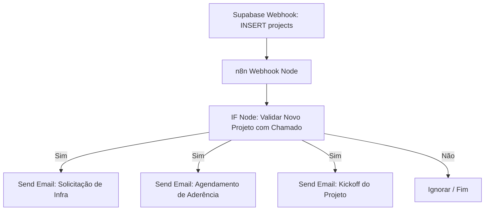
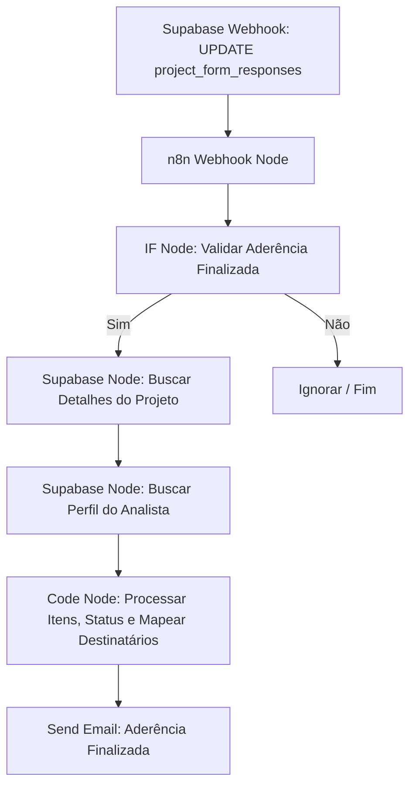
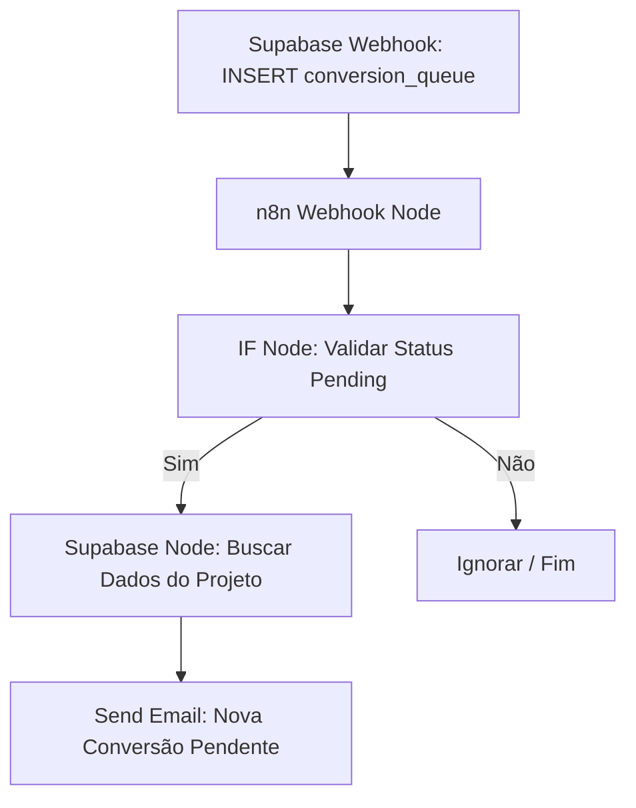
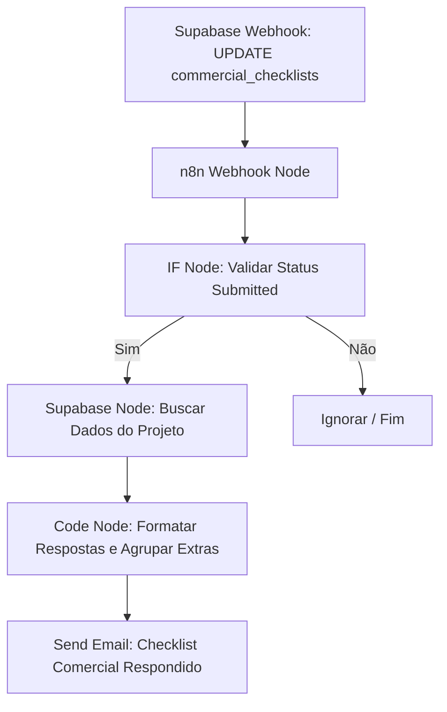
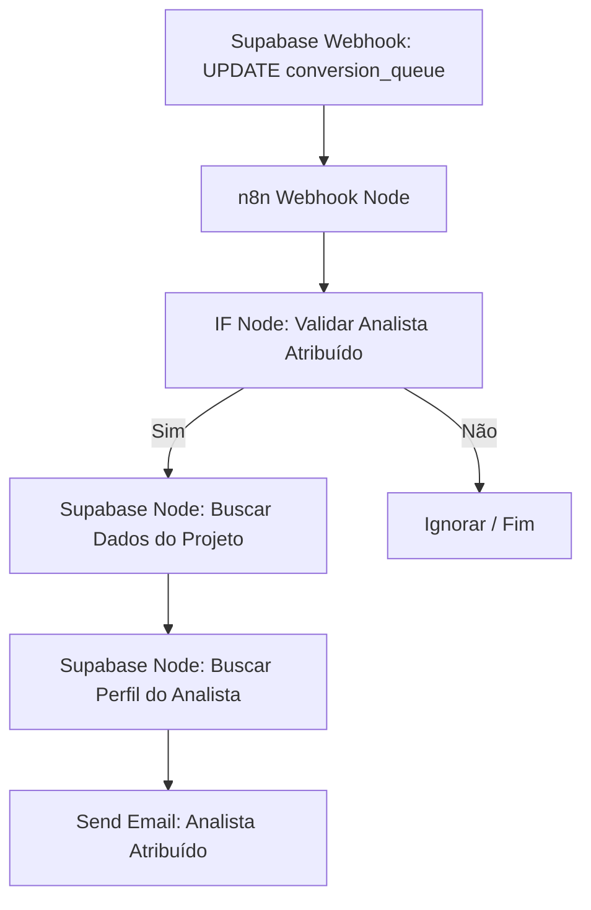

# 🚀 Guia Passo a Passo: Implantação de Automações de Disparo de E-mail — Siplan HUB

Este documento é o manual tático e operacional definitivo para a configuração e implantação das automações de disparo de e-mail do **Siplan HUB**, utilizando a plataforma de integração **n8n (versão 2.22.6 / 0.222.6)**, banco de dados **Supabase** (Database Webhooks e nós nativos do Supabase no n8n) e envio de e-mails via **Gmail SMTP** com App Password configurada.

---

## 📋 Pré-requisitos e Infraestrutura Geral

Antes de iniciar a montagem de cada automação no n8n, é necessário garantir que as credenciais e conexões base estejam configuradas corretamente no ambiente.

E-mail remetente oficial: "siplan.assistants@gmail.com"

### 1. Configuração da Credencial SMTP (Gmail) no n8n
Para enviar e-mails a partir de uma conta do Gmail usando o nó **Send Email (SMTP)** do n8n, configure a credencial conforme os parâmetros abaixo:

*   **Credentials Type:** `SMTP`
*   **Host:** `smtp.gmail.com`
*   **Port:** `465` (com SSL/TLS ativo) ou `587` (com STARTTLS ativo)
*   **SSL/TLS:** Ativado (caso use a porta 465)
*   **User:** O seu e-mail do Gmail (ex: `siplan.assistants@gmail.com` ou e-mail corporativo gerenciado pelo Google Workspace)
*   **Password:** A sua **App Password** de 16 dígitos gerada no painel de segurança da conta Google.
*   **From Address:** O e-mail de origem dos disparos (deve coincidir com o e-mail autenticado ou ser um alias autorizado).

### 2. Configuração de Webhooks de Banco de Dados no Supabase

Todas as automações descritas neste guia são baseadas em eventos ocorridos no banco de dados do Supabase (Event-driven). O Supabase permite registrar **Database Webhooks** que realizam chamadas HTTP (POST) contendo o payload do registro inserido ou atualizado diretamente para a URL correspondente no n8n.

Para cada uma das automações, você deve criar e configurar um Database Webhook específico seguindo o passo a passo geral e os parâmetros individuais listados abaixo.

#### 🛠️ Passo a Passo Geral de Criação no Painel do Supabase:
1. Acesse o painel administrativo do Supabase e entre no projeto correspondente ao **Siplan HUB**.
2. No menu de navegação lateral esquerdo, clique no ícone **Database** (Banco de Dados).
3. Na lista de recursos do banco de dados, clique na opção **Webhooks**.
4. No canto superior direito da tela, clique no botão **Create Webhook**.
5. Preencha o formulário de configuração com os parâmetros específicos descritos a seguir para a respectiva automação.
6. Após preencher todos os campos (Nome, Tabela, Eventos, Método, URL e Headers), clique no botão **Save** no rodapé do formulário.

---

#### 📋 Parâmetros Individuais para Cada Webhook (Configuração por Automação):

##### ⚡ Webhook 1: Novo Projeto via Automação 0800 (Automação 1)
Este webhook monitora a inserção de novos projetos criados via integração com o suporte da Siplan (Automação 0800).
*   **Name:** `n8n_novo_projeto_0800`
*   **Table:** `projects` (tabela de projetos do HUB)
*   **Events:** Selecionar **apenas** a opção `Insert` (Inserção de registro)
*   **Method:** `POST`
*   **URL:**
    *   *Ambiente de Testes (n8n Test):* `https://n8n.siplan.com.br/webhook-test/novo-projeto-0800`
    *   *Ambiente de Produção (n8n Prod):* `https://n8n.siplan.com.br/webhook/novo-projeto-0800`
*   **Headers:**
    *   *Key:* `Content-Type`
    *   *Value:* `application/json`

##### ⚖️ Webhook 2: Análise de Aderência Finalizada (Automação 2)
Este webhook detecta quando a análise de aderência é finalizada no HUB, sendo acionado quando o status do formulário transiciona de `'draft'` para qualquer status concluído (`'approved'`, `'approved_with_restrictions'` ou `'rejected'`).
*   **Name:** `n8n_aderencia_finalizada`
*   **Table:** `project_form_responses` (tabela de respostas aos formulários do projeto)
*   **Events:** Selecionar **apenas** a opção `Update` (Atualização de registro)
*   **Method:** `POST`
*   **URL:**
    *   *Ambiente de Testes (n8n Test):* `https://n8n.siplan.com.br/webhook-test/aderencia-finalizada`
    *   *Ambiente de Produção (n8n Prod):* `https://n8n.siplan.com.br/webhook/aderencia-finalizada`
*   **Headers:**
    *   *Key:* `Content-Type`
    *   *Value:* `application/json`


##### 📥 Webhook 3: Nova Conversão Enviada para a Fila (Automação 3)
Este webhook aciona a notificação de nova demanda de conversão assim que o registro é enfileirado com status pendente.
*   **Name:** `n8n_conversao_criada`
*   **Table:** `conversion_queue` (tabela que gerencia a fila de conversões de banco de dados)
*   **Events:** Selecionar **apenas** a opção `Insert` (Inserção de registro)
*   **Method:** `POST`
*   **URL:**
    *   *Ambiente de Testes (n8n Test):* `https://n8n.siplan.com.br/webhook-test/conversao-criada`
    *   *Ambiente de Produção (n8n Prod):* `https://n8n.siplan.com.br/webhook/conversao-criada`
*   **Headers:**
    *   *Key:* `Content-Type`
    *   *Value:* `application/json`

##### 📝 Webhook 4: Checklist Comercial Respondido pelo Cliente (Automação 4)
Este webhook monitora as atualizações das fichas preenchidas pelos clientes no portal de pré-implantação.
*   **Name:** `n8n_checklist_respondido`
*   **Table:** `commercial_checklists` (tabela que armazena as respostas do checklist comercial do cliente)
*   **Events:** Selecionar **apenas** a opção `Update` (Atualização de registro)
*   **Method:** `POST`
*   **URL:**
    *   *Ambiente de Testes (n8n Test):* `https://n8n.siplan.com.br/webhook-test/checklist-respondido`
    *   *Ambiente de Produção (n8n Prod):* `https://n8n.siplan.com.br/webhook/checklist-respondido`
*   **Headers:**
    *   *Key:* `Content-Type`
    *   *Value:* `application/json`

##### 💡 Webhook 5: Atribuição de Analista na Fila de Conversão (Automação Sugerida A)
Este webhook notifica os gestores e o analista quando uma conversão pendente é assumida para execução técnica.
*   **Name:** `n8n_conversao_assumida`
*   **Table:** `conversion_queue` (tabela que gerencia a fila de conversões de banco de dados)
*   **Events:** Selecionar **apenas** a opção `Update` (Atualização de registro)
*   **Method:** `POST`
*   **URL:**
    *   *Ambiente de Testes (n8n Test):* `https://n8n.siplan.com.br/webhook-test/conversao-assumida`
    *   *Ambiente de Produção (n8n Prod):* `https://n8n.siplan.com.br/webhook/conversao-assumida`
*   **Headers:**
    *   *Key:* `Content-Type`
    *   *Value:* `application/json`


### 3. Conexão Nativa do Supabase no n8n
As consultas complementares de dados (como buscar informações do projeto ou o perfil do usuário) serão realizadas utilizando o **nó nativo do Supabase** já configurado no n8n.

*   **Credentials Type:** `Supabase API`
*   **Host:** A URL da API do seu projeto Supabase (ex: `https://xxxxxx.supabase.co`).
*   **Service Role API Key:** A chave de serviço secreta (`service_role` ou `service_key`) necessária para burlar políticas de RLS quando necessário em rotinas de retaguarda.

### 4. Tabela Geral de Mapeamento de E-mails (Fallback)
Se por algum motivo de inconsistência no banco de dados o e-mail do usuário não for encontrado na tabela de perfis (`public.profiles`), utilize o mapeamento de fallback abaixo:

| Nome do Colaborador  | E-mail Oficial                   |
| :------------------- | :------------------------------- |
| **Marcus**           | `marcus.vinicius@siplan.com.br`  |
| **Bruno Fernandes**  | `bruno.fernandes@siplan.com.br`  |
| **Marcos Ortiz**     | `marcos.ortiz@siplan.com.br`     |
| **Ademar**           | `ademar.souza@siplan.com.br`     |
| **Luciane**          | `luciane.lima@siplan.com.br`     |
| **Eduardo Silva**    | `eduardo.silva@siplan.com.br`    |
| **Luan Caldeira**    | `luan.caldeira@siplan.com.br`    |
| **Amanda Flor**      | `amanda.flor@siplan.com.br`      |
| **Maurilio Camargo** | `maurilio.camargo@siplan.com.br` |
| **Maria**            | `maria.santos@siplan.com.br`     |
| **Alex Silva**       | `alex.silva@siplan.com.br`       |
| **Hugo Januário**    | `hugo.santariosi@siplan.com.br`  |
|                      |                                  |

---

## 🛠️ Automação 1: Criação de Novo Projeto via Automação 0800

### 1. Descrição do Fluxo
Esta automação é disparada quando um integrador externo insere um novo projeto na tabela `projects`. O fluxo valida a entrada e dispara três e-mails distintos com layouts profissionais para diferentes equipes.



### 2. Passo a Passo da Configuração dos Nós no n8n

#### Nó 1: Webhook (Gatilho)
*   **Name:** `Webhook - Novo Projeto`
*   **Authentication:** `None`
*   **HTTP Method:** `POST`
*   **Path:** `novo-projeto-0800`
*   **Response Mode:** `onReceived`
*   **Response Code:** `200`
*   **Options -> Raw Body:** `False`

#### Nó 2: IF (Validação)
Este nó garante que a automação só execute se for uma inserção (`INSERT`) e se existirem dados de chamado associados (`ticket_number` ou `external_id`).
*   **Name:** `IF - Valida Origem`
*   **Conditions -> String:**
    *   **Value 1:** `{{ $json.body.type }}`
    *   **Operation:** `Equal`
    *   **Value 2:** `INSERT`
*   **Conditions -> String (Adicionar condição com operador AND):**
    *   **Value 1:** `{{ $json.body.record.ticket_number }}`
    *   **Operation:** `Not Empty`

#### Nó 3: Send Email (SMTP) - Solicitação de Infraestrutura
*   **Name:** `Email - Solicitação de Infra`
*   **Authentication:** `SMTP Credentials` (Gmail)
*   **From Email:** `siplan.assistants@gmail.com`
*   **To Email:** `marcus.vinicius@siplan.com.br, alex.silva@siplan.com.br, hugo.santariosi@siplan.com.br`
*   **Subject:** `🚀 [SIPLAN HUB] [Infraestrutura] Solicitação de Análise de Infra — {{ $json.body.record.client_name }} (#{{ $json.body.record.ticket_number }})`
*   **Format:** `HTML`
*   **Body (HTML):**
```html
<!DOCTYPE html>
<html lang="pt-BR">
<head>
  <meta charset="UTF-8">
  <meta name="viewport" content="width=device-width, initial-scale=1.0">
  <title>Solicitação de Infraestrutura</title>
</head>
<body style="margin: 0; padding: 0; background-color: #f8fafc; font-family: 'Segoe UI', -apple-system, BlinkMacSystemFont, Roboto, Helvetica, Arial, sans-serif; color: #1e293b; line-height: 1.6;">
  <table width="100%" border="0" cellspacing="0" cellpadding="0" style="background-color: #f8fafc; padding: 20px 40px;">
    <tr>
      <td align="center">
        <table width="100%" border="0" cellspacing="0" cellpadding="0" style="background-color: #ffffff; border-radius: 12px; overflow: hidden; box-shadow: 0 10px 15px -3px rgba(15, 23, 42, 0.05), 0 4px 6px -2px rgba(15, 23, 42, 0.05); border: 1px solid #e2e8f0;">
          <tr>
            <td style="background-color: #0f172a; padding: 28px 40px; text-align: left;">
              <span style="color: #ad0505; font-size: 11px; font-weight: bold; text-transform: uppercase; letter-spacing: 2px; display: block; margin-bottom: 4px;">INFRAESTRUTURA</span>
              <h1 style="color: #ffffff; font-size: 22px; margin: 0; font-weight: 800; letter-spacing: -0.5px;">SIPLAN <span style="color: #ad0505;">HUB</span></h1>
            </td>
          </tr>
          <tr>
            <td height="4" style="background-color: #ad0505; line-height: 4px; font-size: 4px;">&nbsp;</td>
          </tr>
          <tr>
            <td style="padding: 40px 40px;">
              <table border="0" cellspacing="0" cellpadding="0" style="margin-bottom: 25px;">
                <tr>
                  <td>
                    <span style="background-color: #fee2e2; color: #991b1b; padding: 6px 14px; border-radius: 50px; font-size: 12px; font-weight: 700; text-transform: uppercase; letter-spacing: 0.5px; display: inline-block;">
                      ⚠️ AÇÃO PENDENTE
                    </span>
                  </td>
                </tr>
              </table>

              <h2 style="color: #0f172a; font-size: 20px; margin-top: 0; margin-bottom: 12px; font-weight: 700; letter-spacing: -0.3px;">Solicitação de Análise de Infraestrutura</h2>
              <p style="font-size: 15px; color: #475569; margin-bottom: 20px;">Olá equipe de Infraestrutura,</p>
              <p style="font-size: 15px; color: #475569; margin-bottom: 20px;">Um novo projeto foi integrado via automação 0800 e necessita da <strong>Análise de Infraestrutura</strong> inicial. Por favor, revisem os detalhes abaixo e prossigam com o fluxo operacional.</p>
              
              <table width="100%" border="0" cellspacing="0" cellpadding="14" style="background-color: #f8fafc; border-radius: 8px; margin: 25px 0; border: 1px solid #e2e8f0; border-left: 4px solid #ad0505; font-size: 14px;">
                <tr>
                  <td width="20%" style="font-weight: bold; color: #64748b; text-transform: uppercase; font-size: 11px; letter-spacing: 0.5px;">Cliente/Cartório:</td>
                  <td style="color: #1e293b; font-weight: 700;">{{ $json.body.record.client_name }}</td>
                </tr>
                <tr>
                  <td style="font-weight: bold; color: #64748b; text-transform: uppercase; font-size: 11px; letter-spacing: 0.5px;">Chamado:</td>
                  <td style="color: #1e293b; font-weight: 600;">#{{ $json.body.record.ticket_number }}</td>
                </tr>
                <tr>
                  <td style="font-weight: bold; color: #64748b; text-transform: uppercase; font-size: 11px; letter-spacing: 0.5px;">Sistema:</td>
                  <td style="color: #1e293b;">{{ $json.body.record.system_type }}</td>
                </tr>
              </table>

              <table width="100%" border="0" cellspacing="0" cellpadding="0" style="background-color: #fff5f5; border-radius: 8px; border: 1px dashed #feb2b2; margin-top: 25px; padding: 25px;">
                <tr>
                  <td>
                    <h3 style="color: #ad0505; font-size: 14px; margin: 0 0 12px 0; font-weight: bold; text-transform: uppercase; letter-spacing: 0.5px;">
                      🎯 A BOLA ESTÁ COM VOCÊ — PRÓXIMOS PASSOS:
                    </h3>
                    <ul style="margin: 0; padding-left: 20px; color: #475569; font-size: 14px; line-height: 1.8;">
                      <li style="margin-bottom: 8px;"><strong style="color: #ad0505;">🔴 NO HUB:</strong> Acesse a página do projeto e <strong style="color: #1e293b;">atribua o analista técnico</strong> de Infraestrutura responsável no painel.</li>
                      <li style="margin-bottom: 8px;"><strong style="color: #475569;">⚙️ AÇÃO OPERACIONAL:</strong> Entre em contato com o cartório e solicite as especificações físicas e de rede do servidor local.</li>
                      <li style="margin-bottom: 8px;"><strong style="color: #475569;">⚙️ AÇÃO OPERACIONAL:</strong> Preencha a <strong style="color: #1e293b;">Planilha de Análise de Infraestrutura</strong> para validar a conformidade dos requisitos de hardware.</li>
                      <li style="margin-bottom: 0;"><strong style="color: #ad0505;">🔴 NO HUB:</strong> Após a finalização da análise, acesse a etapa <strong style="color: #1e293b;">1. Análise de Infraestrutura</strong> e preencha os campos: <em style="color: #1e293b; font-style: normal; font-weight: 600;">Status Estações</em>, <em style="color: #1e293b; font-style: normal; font-weight: 600;">Status Servidor</em>, <em style="color: #1e293b; font-style: normal; font-weight: 600;">Qtd. de Estações</em> e <em style="color: #1e293b; font-style: normal; font-weight: 600;">Observações & Detalhes</em>.</li>
                    </ul>
                  </td>
                </tr>
              </table>

              <table width="100%" border="0" cellspacing="0" cellpadding="0" style="margin-top: 25px;">
                <tr>
                  <td style="background-color: #fff5f5; border: 1px solid #feb2b2; border-left: 4px solid #ad0505; border-radius: 8px; padding: 20px;">
                    <p style="margin: 0; font-size: 13px; color: #742a2a; line-height: 1.5;">
                      <strong>💡 IMPORTANTE — CENTRALIZE NO HUB:</strong> A execução dessas tarefas diretamente no painel do Siplan HUB calcula automaticamente os tempos de resposta, notifica a liderança e evita cobranças manuais paralelas no Teams. O uso da plataforma é essencial para o fluxo técnico!
                    </p>
                  </td>
                </tr>
              </table>
              
              <table width="100%" border="0" cellspacing="0" cellpadding="0" style="margin-top: 30px;">
                <tr>
                  <td align="center">
                    <a href="https://siplanhub.vercel.app/projects/{{ $json.body.record.id }}" style="background-color: #ad0505; color: #ffffff; padding: 14px 35px; text-decoration: none; border-radius: 6px; font-weight: bold; font-size: 14px; display: inline-block; box-shadow: 0 4px 6px -1px rgba(173, 5, 5, 0.2), 0 2px 4px -1px rgba(173, 5, 5, 0.1); text-transform: uppercase; letter-spacing: 0.5px;">Acessar Projeto no Siplan HUB</a>
                  </td>
                </tr>
              </table>
            </td>
          </tr>
          <tr>
            <td style="background-color: #f8fafc; padding: 25px 40px; text-align: center; font-size: 12px; color: #94a3b8; border-top: 1px solid #f1f5f9;">
              Este é um e-mail automático gerado pelo Siplan HUB.<br>
              
            </td>
          </tr>
        </table>
      </td>
    </tr>
  </table>
</body>
</html>
```

#### Nó 4: Send Email (SMTP) - Agendamento de Aderência
*   **Name:** `Email - Agendamento de Aderência`
*   **Authentication:** `SMTP Credentials` (Gmail)
*   **From Email:** `siplan.assistants@gmail.com`
*   **To Email:** `marcus.vinicius@siplan.com.br, maria.santos@siplan.com.br`
*   **Subject:** `📅 [SIPLAN HUB] [Aderência] Agendar Análise — {{ $json.body.record.client_name }} (#{{ $json.body.record.ticket_number }}) — Sistema: {{ $json.body.record.system_type }}`
*   **Format:** `HTML`
*   **Body (HTML):**
```html
<!DOCTYPE html>
<html lang="pt-BR">
<head>
  <meta charset="UTF-8">
  <meta name="viewport" content="width=device-width, initial-scale=1.0">
  <title>Agendamento de Aderência</title>
</head>
<body style="margin: 0; padding: 0; background-color: #f8fafc; font-family: 'Segoe UI', -apple-system, BlinkMacSystemFont, Roboto, Helvetica, Arial, sans-serif; color: #1e293b; line-height: 1.6;">
  <table width="100%" border="0" cellspacing="0" cellpadding="0" style="background-color: #f8fafc; padding: 20px 40px;">
    <tr>
      <td align="center">
        <table width="100%" border="0" cellspacing="0" cellpadding="0" style="background-color: #ffffff; border-radius: 12px; overflow: hidden; box-shadow: 0 10px 15px -3px rgba(15, 23, 42, 0.05), 0 4px 6px -2px rgba(15, 23, 42, 0.05); border: 1px solid #e2e8f0;">
          <!-- Header -->
          <tr>
            <td style="background-color: #0f172a; padding: 28px 40px; text-align: left;">
              <span style="color: #ad0505; font-size: 11px; font-weight: bold; text-transform: uppercase; letter-spacing: 2px; display: block; margin-bottom: 4px;">ADERÊNCIA</span>
              <h1 style="color: #ffffff; font-size: 22px; margin: 0; font-weight: 800; letter-spacing: -0.5px;">SIPLAN <span style="color: #ad0505;">HUB</span></h1>
            </td>
          </tr>
          <!-- Decorative Line -->
          <tr>
            <td height="4" style="background-color: #ad0505; line-height: 4px; font-size: 4px;">&nbsp;</td>
          </tr>
          <!-- Body -->
          <tr>
            <td style="padding: 40px 40px;">
              <!-- Badge -->
              <table border="0" cellspacing="0" cellpadding="0" style="margin-bottom: 25px;">
                <tr>
                  <td>
                    <span style="background-color: #fef3c7; color: #92400e; padding: 6px 14px; border-radius: 50px; font-size: 12px; font-weight: 700; text-transform: uppercase; letter-spacing: 0.5px; display: inline-block;">
                      ⚠️ AGENDAMENTO PENDENTE
                    </span>
                  </td>
                </tr>
              </table>

              <h2 style="color: #0f172a; font-size: 20px; margin-top: 0; margin-bottom: 12px; font-weight: 700; letter-spacing: -0.3px;">Necessidade de Agendamento - Análise de Aderência</h2>
              <p style="font-size: 15px; color: #475569; margin-bottom: 20px;">Olá Marcus e Maria,</p>
              <p style="font-size: 15px; color: #475569; margin-bottom: 20px;">O projeto do cliente abaixo foi cadastrado e agora aguarda o agendamento da <strong>Análise de Aderência</strong> para mapeamento de rotinas operacionais.</p>
              
              <!-- Card de Informações -->
              <table width="100%" border="0" cellspacing="0" cellpadding="14" style="background-color: #f8fafc; border-radius: 8px; margin: 25px 0; border: 1px solid #e2e8f0; border-left: 4px solid #ad0505; font-size: 14px;">
                <tr>
                  <td width="20%" style="font-weight: bold; color: #64748b; text-transform: uppercase; font-size: 11px; letter-spacing: 0.5px;">Cliente:</td>
                  <td style="color: #1e293b; font-weight: 700;">{{ $json.body.record.client_name }}</td>
                </tr>
                <tr>
                  <td style="font-weight: bold; color: #64748b; text-transform: uppercase; font-size: 11px; letter-spacing: 0.5px;">Chamado:</td>
                  <td style="color: #1e293b; font-weight: 600;">#{{ $json.body.record.ticket_number }}</td>
                </tr>
                <tr>
                  <td style="font-weight: bold; color: #64748b; text-transform: uppercase; font-size: 11px; letter-spacing: 0.5px;">Sistema Contratado:</td>
                  <td style="color: #ad0505; font-weight: bold;">{{ $json.body.record.system_type }}</td>
                </tr>
              </table>

              <!-- Recomendados Checklist -->
              <table width="100%" border="0" cellspacing="0" cellpadding="0" style="background-color: #fff5f5; border-radius: 8px; border: 1px dashed #feb2b2; margin-top: 25px; padding: 25px;">
                <tr>
                  <td>
                    <h3 style="color: #ad0505; font-size: 14px; margin: 0 0 12px 0; font-weight: bold; text-transform: uppercase; letter-spacing: 0.5px;">
                      🎯 A BOLA ESTÁ COM VOCÊ — PRÓXIMOS PASSOS:
                    </h3>
                    <ul style="margin: 0; padding-left: 20px; color: #475569; font-size: 14px; line-height: 1.6;">
                      <li style="margin-bottom: 8px;"><strong style="color: #475569;">⚙️ AÇÃO EXTERNA:</strong> Entre em contato com o cliente e defina a data e horário para a análise.</li>
                      <li style="margin-bottom: 8px;"><strong style="color: #475569;">⚙️ AÇÃO EXTERNA:</strong> Aloque um implantador de acordo com sua agenda para conduzir a análise de aderência.</li>
                      <li style="margin-bottom: 0;"><strong style="color: #ad0505;">🔴 NO HUB:</strong> Salve a <strong style="color: #1e293b;">data  acordada</strong> na etapa "2. Análise de Aderência" do projeto no Siplan HUB!</li>
                    </ul>
                  </td>
                </tr>
              </table>

              <!-- Alerta de Incentivo de Uso do HUB -->
              <table width="100%" border="0" cellspacing="0" cellpadding="0" style="margin-top: 25px;">
                <tr>
                  <td style="background-color: #fff5f5; border: 1px solid #feb2b2; border-left: 4px solid #ad0505; border-radius: 8px; padding: 20px;">
                    <p style="margin: 0; font-size: 13px; color: #742a2a; line-height: 1.5;">
                      <strong>💡 IMPORTANTE — CADASTRE NO HUB:</strong> Registrar a agenda da análise de aderência no HUB, atualiza a escala de compromissos interna e organiza o fluxo de informações do projeto. Centralizar essas informações na plataforma é fundamental!
                    </p>
                  </td>
                </tr>
              </table>
              
              <table width="100%" border="0" cellspacing="0" cellpadding="0" style="margin-top: 30px;">
                <tr>
                  <td align="center">
                    <a href="https://siplanhub.vercel.app/projects/{{ $json.body.record.id }}/adherence" style="background-color: #ad0505; color: #ffffff; padding: 14px 35px; text-decoration: none; border-radius: 6px; font-weight: bold; font-size: 14px; display: inline-block; box-shadow: 0 4px 6px -1px rgba(173, 5, 5, 0.2), 0 2px 4px -1px rgba(173, 5, 5, 0.1); text-transform: uppercase; letter-spacing: 0.5px;">Agendar no Siplan HUB</a>
                  </td>
                </tr>
              </table>
            </td>
          </tr>
          <!-- Footer -->
          <tr>
            <td style="background-color: #f8fafc; padding: 25px 40px; text-align: center; font-size: 12px; color: #94a3b8; border-top: 1px solid #f1f5f9;">
              Este é um e-mail automático gerado pelo Siplan HUB.<br>
              
            </td>
          </tr>
        </table>
      </td>
    </tr>
  </table>
</body>
</html>
```

#### Nó 5: Send Email (SMTP) - Kickoff do Projeto
Como o líder do projeto sempre será Marcus Vinicius ou Bruno Fernandes, a lista fixa do Kickoff já cobre todos de forma ideal.
*   **Name:** `Email - Kickoff do Projeto`
*   **Authentication:** `SMTP Credentials` (Gmail)
*   **From Email:** `siplan.assistants@gmail.com`
*   **To Email:** `marcus.vinicius@siplan.com.br, marcos.ortiz@siplan.com.br, bruno.fernandes@siplan.com.br`
*   **Subject:** `🎉 [SIPLAN HUB] [Kickoff] Novo Projeto Cadastrado — {{ $json.body.record.client_name }} (#{{ $json.body.record.ticket_number }})`
*   **Format:** `HTML`
*   **Body (HTML):**
```html
<!DOCTYPE html>
<html lang="pt-BR">
<head>
  <meta charset="UTF-8">
  <meta name="viewport" content="width=device-width, initial-scale=1.0">
  <title>Kickoff do Projeto</title>
</head>
<body style="margin: 0; padding: 0; background-color: #f8fafc; font-family: 'Segoe UI', -apple-system, BlinkMacSystemFont, Roboto, Helvetica, Arial, sans-serif; color: #1e293b; line-height: 1.6;">
  <table width="100%" border="0" cellspacing="0" cellpadding="0" style="background-color: #f8fafc; padding: 20px 40px;">
    <tr>
      <td align="center">
        <table width="100%" border="0" cellspacing="0" cellpadding="0" style="background-color: #ffffff; border-radius: 12px; overflow: hidden; box-shadow: 0 10px 15px -3px rgba(15, 23, 42, 0.05), 0 4px 6px -2px rgba(15, 23, 42, 0.05); border: 1px solid #e2e8f0;">
          <tr>
            <td style="background-color: #0f172a; padding: 28px 40px; text-align: left;">
              <span style="color: #ad0505; font-size: 11px; font-weight: bold; text-transform: uppercase; letter-spacing: 2px; display: block; margin-bottom: 4px;">KICKOFF</span>
              <h1 style="color: #ffffff; font-size: 22px; margin: 0; font-weight: 800; letter-spacing: -0.5px;">SIPLAN <span style="color: #ad0505;">HUB</span></h1>
            </td>
          </tr>
          <tr>
            <td height="4" style="background-color: #ad0505; line-height: 4px; font-size: 4px;">&nbsp;</td>
          </tr>
          <tr>
            <td style="padding: 40px 40px;">
              <table border="0" cellspacing="0" cellpadding="0" style="margin-bottom: 25px;">
                <tr>
                  <td>
                    <span style="background-color: #e0f2fe; color: #0369a1; padding: 6px 14px; border-radius: 50px; font-size: 12px; font-weight: 700; text-transform: uppercase; letter-spacing: 0.5px; display: inline-block;">
                      🚀 NOVO PROJETO CADASTRADO
                    </span>
                  </td>
                </tr>
              </table>

              <h2 style="color: #0f172a; font-size: 20px; margin-top: 0; margin-bottom: 12px; font-weight: 700; letter-spacing: -0.3px;">Novo Projeto Disponível (Kickoff)</h2>
              <p style="font-size: 15px; color: #475569; margin-bottom: 20px;">Prezados,</p>
              <p style="font-size: 15px; color: #475569; margin-bottom: 20px;">Informamos que o projeto de implantação para o cliente <strong>{{ $json.body.record.client_name }}</strong> foi devidamente inserido no Siplan HUB e está pronto para as primeiras etapas de kickoff da Implantação.</p>
              
              <table width="100%" border="0" cellspacing="0" cellpadding="14" style="background-color: #f8fafc; border-radius: 8px; margin: 25px 0; border: 1px solid #e2e8f0; border-left: 4px solid #ad0505; font-size: 14px;">
                <tr>
                  <td width="20%" style="font-weight: bold; color: #64748b; text-transform: uppercase; font-size: 11px; letter-spacing: 0.5px;">Cliente:</td>
                  <td style="color: #1e293b; font-weight: 700;">{{ $json.body.record.client_name }}</td>
                </tr>
                <tr>
                  <td style="font-weight: bold; color: #64748b; text-transform: uppercase; font-size: 11px; letter-spacing: 0.5px;">Chamado:</td>
                  <td style="color: #1e293b; font-weight: 600;">#{{ $json.body.record.ticket_number }}</td>
                </tr>
                <tr>
                  <td style="font-weight: bold; color: #64748b; text-transform: uppercase; font-size: 11px; letter-spacing: 0.5px;">Título do Chamado:</td>
                  <td style="color: #1e293b;font-weight: 700">{{ $json.body.record.TituloChamado }}</td>
                </tr>
                <tr>
                  <td style="font-weight: bold; color: #64748b; text-transform: uppercase; font-size: 11px; letter-spacing: 0.5px;">Sistema:</td>
                  <td style="color: #1e293b; font-weight: bold;">{{ $json.body.record.system_type }}</td>
                </tr>
              </table>

              <table width="100%" border="0" cellspacing="0" cellpadding="0" style="background-color: #fff5f5; border-radius: 8px; border: 1px dashed #feb2b2; margin-top: 25px; padding: 25px;">
                <tr>
                  <td>
                    <h3 style="color: #ad0505; font-size: 14px; margin: 0 0 12px 0; font-weight: bold; text-transform: uppercase; letter-spacing: 0.5px;">
                      🎯 A BOLA ESTÁ COM VOCÊ — PRÓXIMOS PASSOS:
                    </h3>
                    <ul style="margin: 0; padding-left: 20px; color: #475569; font-size: 14px; line-height: 1.6;">
                      <li style="margin-bottom: 8px;"><strong style="color: #475569;">⚙️ AÇÃO OPERACIONAL:</strong> Reúna os envolvidos para o kickoff técnico e definição do plano de escopo do cartório.</li>
                      <li style="margin-bottom: 8px;"><strong style="color: #ad0505;">🔴 NO HUB:</strong> Acesse o HUB para <strong style="color: #1e293b;">revisar a alocação de horas, sistema legado</strong> e os analistas funcionais encarregados.</li>
                      <li style="margin-bottom: 0;"><strong style="color: #ad0505;">🔴 NO HUB:</strong> Monitore o andamento das tarefas internas e o preenchimento dos prazos de cada setor no painel do projeto.</li>
                    </ul>
                  </td>
                </tr>
              </table>

              <table width="100%" border="0" cellspacing="0" cellpadding="0" style="margin-top: 25px;">
                <tr>
                  <td style="background-color: #fff5f5; border: 1px solid #feb2b2; border-left: 4px solid #ad0505; border-radius: 8px; padding: 20px;">
                    <p style="margin: 0; font-size: 13px; color: #742a2a; line-height: 1.5;">
                      <strong>💡 IMPORTANTE — USE O HUB:</strong> O Siplan HUB centraliza todas as informações do projeto desde o cadastro comercial até a implantação go-live. Usar a plataforma para gerenciar o kickoff dá visibilidade total à equipe e evita retrabalhos de comunicação!
                    </p>
                  </td>
                </tr>
              </table>
              
              <table width="100%" border="0" cellspacing="0" cellpadding="0" style="margin-top: 30px;">
                <tr>
                  <td align="center">
                    <a href="https://siplanhub.vercel.app/projects/{{ $json.body.record.id }}" style="background-color: #ad0505; color: #ffffff; padding: 14px 35px; text-decoration: none; border-radius: 6px; font-weight: bold; font-size: 14px; display: inline-block; box-shadow: 0 4px 6px -1px rgba(173, 5, 5, 0.2), 0 2px 4px -1px rgba(173, 5, 5, 0.1); text-transform: uppercase; letter-spacing: 0.5px;">Abrir Ficha do Projeto</a>
                  </td>
                </tr>
              </table>
            </td>
          </tr>
          <tr>
            <td style="background-color: #f8fafc; padding: 25px 40px; text-align: center; font-size: 12px; color: #94a3b8; border-top: 1px solid #f1f5f9;">
              Este é um e-mail automático gerado pelo Siplan HUB.<br>
              © Siplan - Soluções para Cartórios Extrajudiciais
            </td>
          </tr>
        </table>
      </td>
    </tr>
  </table>
</body>
</html>
```

### 3. Plano de Teste para Automação 1
1.  **Ativar o modo de escuta no n8n:** Clique em **Listen for test event** no nó `Webhook - Novo Projeto`.
2.  **Inserir dados de teste no Supabase:** Acesse o painel SQL Editor do Supabase e execute a seguinte consulta de teste:
    ```sql
    INSERT INTO public.projects (
        client_name, 
        ticket_number, 
        system_type, 
        project_leader, 
        sold_hours, 
        last_update_by, 
        external_id
    ) VALUES (
        'Cartório de Testes de Automação', 
        '999991', 
        'Orion TN', 
        'Marcus', 
        50, 
        'Automacao 0800', 
        'EXT-0800-TEST'
    );
    ```
3.  **Verificar a Execução no n8n:** O n8n deve receber a requisição. Verifique se o fluxo seguiu pelo caminho `true` do IF.
4.  **Confirmar os E-mails Recebidos:** Acesse as caixas de e-mail de teste para garantir que as variáveis foram preenchidas e que os e-mails chegaram com sucesso.
5.  **Limpar Banco de Dados (Pós-teste):**
    ```sql
    DELETE FROM public.projects WHERE ticket_number = '999991';
    ```

---

## ⚖️ Automação 2: Análise de Aderência Finalizada

### 1. Descrição do Fluxo
Esta automação é disparada quando uma análise de aderência (`project_form_responses` com `stage = 'adherence'`) é concluída e seu status é atualizado para qualquer veredito final diferente de `'draft'` (ou seja, `'approved'`, `'approved_with_restrictions'` ou `'rejected'`). O fluxo recupera o projeto relacionado do banco, busca dinamicamente o e-mail do analista na tabela `public.profiles` através de seu UUID (campo `approved_by`), processa as respostas para extrair os itens com impacto técnico e envia a notificação por e-mail com a cópia inteligente (CC) configurada.



### 2. Passo a Passo da Configuração dos Nós no n8n

#### Nó 1: Webhook (Gatilho)
*   **Name:** `Webhook - Aderência Finalizada`
*   **Authentication:** `None`
*   **HTTP Method:** `POST`
*   **Path:** `aderencia-finalizada`
*   **Response Mode:** `onReceived`

#### Nó 2: IF (Validação de Status)
*   **Name:** `IF - Status Finalizado`
*   **Conditions:**
    *   `{{ $json.body.record.stage }} == 'adherence'` **AND**
    *   `{{ $json.body.record.status }} != 'draft'` **AND**
    *   `{{ $json.body.old_record.status }} == 'draft'` (Garante disparo único no momento exato em que a análise de aderência sai do status padrão rascunho/em andamento para um veredito definitivo).

#### Nó 3: Supabase (Consulta de Projeto)
Busca os metadados do projeto na tabela `projects`.
*   **Name:** `Supabase - Get Project`
*   **Operation:** `Get`
*   **Table:** `projects`
*   **Filter -> Column:** `id`
*   **Filter -> Operator:** `Equal`
*   **Filter -> Value:** `{{ $node["Webhook - Aderência Finalizada"].json.body.record.project_id }}`

#### Nó 4: Supabase (Consulta de Perfil do Analista)
Consulta a tabela `profiles` do Supabase para obter dinamicamente o e-mail e nome do analista que finalizou a análise.
*   **Name:** `Supabase - Get Analyst Profile`
*   **Operation:** `Get`
*   **Table:** `profiles`
*   **Filter -> Column:** `id`
*   **Filter -> Operator:** `Equal`
*   **Filter -> Value:** `{{ $node["Webhook - Aderência Finalizada"].json.body.record.approved_by }}`

#### Nó 5: Code (Processar Itens, Status e Destinatários)
*   **Name:** `Code - Processar Itens e Destinatários`
*   **Language:** `JavaScript`
*   **Code:**
```javascript
const responseRecord = $('Webhook - Aderência Finalizada').first().json.body.record;
const projectData = $('Supabase - Get Project').first().json;
let analystProfile = null;

try {
  analystProfile = $('Supabase - Get Analyst Profile').first()?.json;
} catch (e) {
  // Ignora se o nó de profile não retornou dados para evitar quebra do fluxo
}

const status = responseRecord.status || 'rejected';
const formData = responseRecord.data || {};
const finalNotes = formData.finalNotes || 'Nenhuma justificativa informada.';

// Processamento de veredito amigável
let finalVerdict = '';
if (status === 'approved') {
  finalVerdict = 'Totalmente Aderente';
} else if (status === 'approved_with_restrictions') {
  finalVerdict = 'Aderente com Restrições';
} else if (status === 'rejected') {
  finalVerdict = 'Não Aderente / Impeditivo';
} else {
  finalVerdict = formData.finalVerdict || 'Não informado';
}

// Mapeamento dinâmico de layout e mensagens conforme o status
const statusMap = {
  'approved': {
    badgeStyle: 'background-color: #d1fae5; color: #065f46; border: 1px solid #10b981;',
    introMessage: 'Boas notícias! A análise de aderência técnica foi concluída e o projeto foi classificado como <strong>Totalmente Aderente</strong>. Isso significa que os requisitos do cartório e sistemas legados são plenamente compatíveis com o ecossistema Orion.',
    checklistHeader: '🎯 PRÓXIMOS PASSOS (A BOLA ESTÁ COM VOCÊ):',
    checklistHtml: `
      <li style="margin-bottom: 8px;"><strong style="color: #ad0505;">🔴 NO HUB:</strong> Confirme o cronograma no painel e atualize a fase do projeto para iniciar a etapa de Conversão.</li>
      <li style="margin-bottom: 8px;"><strong style="color: #475569;">⚙️ AÇÃO EXTERNA:</strong> Alinhe com a equipe de Produtos sobre os itens pontuados ou pendentes durante a análise.</li>
      <li style="margin-bottom: 0;"><strong style="color: #475569;">👥 ALINHAMENTO:</strong> Comunique o time técnico de Implantação sobre o parecer positivo para que preparem as próximas etapas da implantação.</li>
    `,
    checklistTableStyle: 'background-color: #f0fdf4; border: 1px dashed #bbf7d0; margin-top: 25px; padding: 25px; border-radius: 8px;',
    checklistHeaderColor: '#166534',
    alertBox: `
      <table width="100%" border="0" cellspacing="0" cellpadding="0" style="margin-top: 25px;">
        <tr>
          <td style="background-color: #f0fdf4; border: 1px solid #bbf7d0; border-left: 4px solid #10b981; border-radius: 8px; padding: 20px;">
            <p style="margin: 0; font-size: 13px; color: #166534; line-height: 1.5;">
              <strong>💡 HUB INFORMA:</strong> O avanço imediato para a etapa de Conversão no Siplan HUB garante a sincronia das equipes e mantém o cronograma de implantação dentro da meta estimada.
            </p>
          </td>
        </tr>
      </table>
    `
  },
  'approved_with_restrictions': {
    badgeStyle: 'background-color: #fef3c7; color: #92400e; border: 1px solid #f59e0b;',
    introMessage: 'Atenção: A análise de aderência técnica foi concluída e classificada como <strong>Aderente com Restrições</strong>. Existem gaps ou particularidades que demandam atenção, mas que não impedem a migração desde que mitigados.',
    checklistHeader: '⚠️ PRÓXIMOS PASSOS (ATENÇÃO AOS GAPS):',
    checklistHtml: `
      <li style="margin-bottom: 8px;"><strong style="color: #ad0505;">🔴 NO HUB:</strong> Registre o plano de ação ou contorno para cada uma das restrições apontadas na lista de gaps.</li>
      <li style="margin-bottom: 8px;"><strong style="color: #475569;">⚙️ AÇÃO EXTERNA:</strong> Comunique formalmente o time de Produtos e Comercial sobre as limitações identificadas.</li>
      <li style="margin-bottom: 0;"><strong style="color: #ad0505;">👥 ALINHAMENTO:</strong> Após o aceite das restrições pelo cliente ou comercial no HUB, avise a equipe de Implantação para iniciar os processos das próximas etapas.</li>
    `,
    checklistTableStyle: 'background-color: #fffbeb; border: 1px dashed #fef08a; margin-top: 25px; padding: 25px; border-radius: 8px;',
    checklistHeaderColor: '#78350f',
    alertBox: `
      <table width="100%" border="0" cellspacing="0" cellpadding="0" style="margin-top: 25px;">
        <tr>
          <td style="background-color: #fffbeb; border: 1px solid #fef08a; border-left: 4px solid #f59e0b; border-radius: 8px; padding: 20px;">
            <p style="margin: 0; font-size: 13px; color: #78350f; line-height: 1.5;">
              <strong>💡 ATENÇÃO — REGISTRE NO HUB:</strong> Gaps de aderência não resolvidos ou sem plano de contorno documentado podem gerar gargalos críticos durante o Go-Live. Use o HUB para formalizar a aceitação dos riscos.
            </p>
          </td>
        </tr>
      </table>
    `
  },
  'rejected': {
    badgeStyle: 'background-color: #fee2e2; color: #991b1b; border: 1px solid #ad0505;',
    introMessage: '<strong>ALERTA DE IMPEDIMENTO CRÍTICO:</strong> A análise de aderência técnica foi finalizada com veredito de <strong>Não Aderente / Impeditivo</strong>. Foram detectadas lacunas de hardware, software ou processos que bloqueiam a implantação.',
    checklistHeader: '🚨 PRÓXIMOS PASSOS (AÇÃO IMEDIATA REQUERIDA):',
    checklistHtml: `
      <li style="margin-bottom: 8px;"><strong style="color: #ad0505;">🔴 NO HUB:</strong> Acesse a aba de aderência do projeto para analisar detalhadamente os impedimentos técnicos cadastrados e planejar a adequação.</li>
      <li style="margin-bottom: 8px;"><strong style="color: #475569;">⚙️ AÇÃO EXTERNA:</strong> Passe a demanda de desenvolvimento e solicite avaliação para a equipe de Produtos entender e analisar o esforço necessário.</li>
      <li style="margin-bottom: 0;"><strong style="color: #ad0505;">🔴 NO HUB:</strong> Mantenha o projeto pausado no HUB até que o plano de adequação seja validado e aprovado pelas partes.</li>
    `,
    checklistTableStyle: 'background-color: #fff5f5; border: 1px dashed #feb2b2; margin-top: 25px; padding: 25px; border-radius: 8px;',
    checklistHeaderColor: '#ad0505',
    alertBox: `
      <table width="100%" border="0" cellspacing="0" cellpadding="0" style="margin-top: 25px;">
        <tr>
          <td style="background-color: #fff5f5; border: 1px solid #feb2b2; border-left: 4px solid #ad0505; border-radius: 8px; padding: 20px;">
            <p style="margin: 0; font-size: 13px; color: #742a2a; line-height: 1.5;">
              <strong>🚨 CRÍTICO — IMPEDIMENTOS DETECTADOS:</strong> O projeto permanecerá bloqueado até que todos os itens marcados como impeditivos sejam sanados ou tenham uma solução técnica definitiva validada no HUB.
            </p>
          </td>
        </tr>
      </table>
    `
  }
};

const statusConfig = statusMap[status] || statusMap['rejected'];

// Processamento recursivo dos itens com impacto === true
const impactedItems = [];

function traverse(obj, currentSection = 'Geral') {
  if (!obj || typeof obj !== 'object') return;
  
  for (const key in obj) {
    if (Object.prototype.hasOwnProperty.call(obj, key)) {
      const val = obj[key];
      if (val && typeof val === 'object') {
        if ('impacto' in val) {
          if (val.impacto === true) {
            impactedItems.push({
              section: currentSection,
              question: key.replace(/_/g, ' ').replace(/\b\w/g, c => c.toUpperCase()),
              details: val.detalhes || 'Nenhum detalhe informado.',
              impactLevel: val.nivel_impacto || 'SIM'
            });
          }
        } else {
          traverse(val, key.replace(/_/g, ' ').replace(/\b\w/g, c => c.toUpperCase()));
        }
      }
    }
  }
}

traverse(formData, 'Geral');

// Formatar Tabela HTML
let impactedHtmlTable = '';
if (impactedItems.length === 0) {
  impactedHtmlTable = '<p style="color: #10b981; font-weight: bold; font-size: 14px;">✓ Nenhum item com impacto técnico ou impeditivo foi identificado nesta análise.</p>';
} else {
  impactedHtmlTable = `
    <table width="100%" border="0" cellspacing="0" cellpadding="10" style="border-collapse: collapse; margin-top: 10px; border: 1px solid #e2e8f0; font-size: 13px; border-radius: 8px; overflow: hidden; box-shadow: 0 4px 6px -1px rgba(0, 0, 0, 0.05);">
      <thead>
        <tr style="background-color: #0f172a; text-align: left; font-weight: bold;">
          <th style="padding: 12px 10px; border: 1px solid #e2e8f0; color: #ffffff; border-bottom: 2px solid #ad0505;">Seção</th>
          <th style="padding: 12px 10px; border: 1px solid #e2e8f0; color: #ffffff; border-bottom: 2px solid #ad0505;">Item/Requisito</th>
          <th style="padding: 12px 10px; border: 1px solid #e2e8f0; color: #ffffff; border-bottom: 2px solid #ad0505; text-align: center;">Impacto</th>
          <th style="padding: 12px 10px; border: 1px solid #e2e8f0; color: #ffffff; border-bottom: 2px solid #ad0505;">Detalhes do Blocker</th>
        </tr>
      </thead>
      <tbody>
  `;
  
  impactedItems.forEach(item => {
    let badgeColor = '#ad0505';
    let badgeTextColor = '#ffffff';
    const level = item.impactLevel.toUpperCase();
    if (level === 'BAIXO' || level === 'NÃO') {
      badgeColor = '#f59e0b';
    } else if (level === 'RESTRIÇÃO' || level === 'RESTRIÇÕES') {
      badgeColor = '#f59e0b';
    }
    
    impactedHtmlTable += `
      <tr style="border-bottom: 1px solid #e2e8f0;">
        <td style="padding: 10px; border: 1px solid #e2e8f0; font-weight: 600; color: #1e293b;">${item.section}</td>
        <td style="padding: 10px; border: 1px solid #e2e8f0; color: #475569;">${item.question}</td>
        <td style="padding: 10px; border: 1px solid #e2e8f0; text-align: center;">
          <span style="background-color: ${badgeColor}; color: ${badgeTextColor}; padding: 3px 8px; border-radius: 4px; font-weight: bold; font-size: 11px; display: inline-block;">${item.impactLevel}</span>
        </td>
        <td style="padding: 10px; border: 1px solid #e2e8f0; color: #475569; font-style: italic;">${item.details}</td>
      </tr>
    `;
  });
  impactedHtmlTable += '</tbody></table>';
}

// Resolver o Analista Executor Dinamicamente pelo Profile
let lastUpdatedByEmail = '';
let analystName = 'Analista';

if (analystProfile && analystProfile.email) {
  lastUpdatedByEmail = analystProfile.email;
  analystName = analystProfile.full_name || 'Analista';
} else {
  // Fallback Estático
  const emailMapping = {
    'marcus': 'marcus.vinicius@siplan.com.br',
    'bruno': 'bruno.fernandes@siplan.com.br',
    'marcos': 'marcos.ortiz@siplan.com.br',
    'ademar': 'ademar.souza@siplan.com.br',
    'luciane': 'luciane.lima@siplan.com.br',
    'eduardo': 'eduardo.silva@siplan.com.br',
    'luan': 'luan.caldeira@siplan.com.br',
    'amanda': 'amanda.flor@siplan.com.br',
    'maurilio': 'maurilio.camargo@siplan.com.br',
    'maria': 'maria.santos@siplan.com.br',
    'alex': 'alex.silva@siplan.com.br',
    'hugo': 'hugo.santariosi@siplan.com.br'
  };
  const updatedByUsername = (projectData.last_update_by || 'marcus').toLowerCase();
  lastUpdatedByEmail = emailMapping[updatedByUsername] || 'marcus.vinicius@siplan.com.br';
}

// Resolver CC de acordo com o Tipo de Sistema
const systemType = (projectData.system_type || '').toUpperCase().replace(/\s+/g, '');
const systemSpecificCc = [];

if (systemType === 'ORIONTN' || systemType === 'ORION_TN' || systemType === 'ORION TN') {
  systemSpecificCc.push('luan.caldeira@siplan.com.br', 'vinicius.silva@siplan.com.br');
} else if (systemType === 'ORIONPRO' || systemType === 'ORION_PRO' || systemType === 'ORION PRO') {
  systemSpecificCc.push('maurilio.camargo@siplan.com.br', 'daniel.azevedo@siplan.com.br');
} else if (systemType === 'ORIONREG' || systemType === 'ORION_REG' || systemType === 'ORION REG') {
  systemSpecificCc.push('amanda.flor@siplan.com.br', 'leonardo.rigler@siplan.com.br');
}

// Junta a lista fixa de CC
const ccList = ['marcos.ortiz@siplan.com.br', 'bruno.fernandes@siplan.com.br'];
if (lastUpdatedByEmail && !ccList.includes(lastUpdatedByEmail)) {
  ccList.push(lastUpdatedByEmail);
}
systemSpecificCc.forEach(email => {
  if (email && !ccList.includes(email)) {
    ccList.push(email);
  }
});

return [{
  json: {
    projectId: projectData.id,
    clientName: projectData.client_name,
    ticketNumber: projectData.ticket_number,
    systemType: projectData.system_type,
    finalVerdict: finalVerdict,
    finalNotes: finalNotes,
    analystName: analystName,
    impactedHtmlTable: impactedHtmlTable,
    toEmail: 'marcus.vinicius@siplan.com.br',
    ccEmail: ccList.join(', '),
    printUrl: `https://siplanhub.vercel.app/projects/${projectData.id}/adherence?print=true`,
    statusBadgeStyle: statusConfig.badgeStyle,
    statusIntroMessage: statusConfig.introMessage,
    statusChecklistHeader: statusConfig.checklistHeader,
    statusChecklistHtml: statusConfig.checklistHtml,
    statusAlertBox: statusConfig.alertBox,
    statusChecklistTableStyle: statusConfig.checklistTableStyle,
    statusChecklistHeaderColor: statusConfig.checklistHeaderColor
  }
}];
```

#### Nó 6: Send Email (SMTP)
*   **Name:** `Email - Aderência Finalizada`
*   **Authentication:** `SMTP Credentials` (Gmail)
*   **From Email:** `siplan.assistants@gmail.com`
*   **To Email:** `{{ $json.toEmail }}`
*   **Cc Email:** `{{ $json.ccEmail }}`
*   **Subject:** `⚠️ [SIPLAN HUB] [Aderência] Finalizada — {{ $json.clientName }} (#{{ $json.ticketNumber }}) — Veredito: {{ $json.finalVerdict }}`
*   **Format:** `HTML`
*   **Body (HTML):**
```html
<!DOCTYPE html>
<html lang="pt-BR">
<head>
  <meta charset="UTF-8">
  <meta name="viewport" content="width=device-width, initial-scale=1.0">
  <title>Análise de Aderência Finalizada</title>
</head>
<body style="margin: 0; padding: 0; background-color: #f8fafc; font-family: 'Segoe UI', -apple-system, BlinkMacSystemFont, Roboto, Helvetica, Arial, sans-serif; color: #1e293b; line-height: 1.6;">
  <table width="100%" border="0" cellspacing="0" cellpadding="0" style="background-color: #f8fafc; padding: 20px 40px;">
    <tr>
      <td align="center">
        <table width="100%" border="0" cellspacing="0" cellpadding="0" style="background-color: #ffffff; border-radius: 12px; overflow: hidden; box-shadow: 0 10px 15px -3px rgba(15, 23, 42, 0.05), 0 4px 6px -2px rgba(15, 23, 42, 0.05); border: 1px solid #e2e8f0;">
          <!-- Header -->
          <tr>
            <td style="background-color: #0f172a; padding: 28px 40px; text-align: left;">
              <span style="color: #ad0505; font-size: 11px; font-weight: bold; text-transform: uppercase; letter-spacing: 2px; display: block; margin-bottom: 4px;">ADERÊNCIA CONCLUÍDA</span>
              <h1 style="color: #ffffff; font-size: 22px; margin: 0; font-weight: 800; letter-spacing: -0.5px;">SIPLAN <span style="color: #ad0505;">HUB</span></h1>
            </td>
          </tr>
          <!-- Decorative Line -->
          <tr>
            <td height="4" style="background-color: #ad0505; line-height: 4px; font-size: 4px;">&nbsp;</td>
          </tr>
          <!-- Body -->
          <tr>
            <td style="padding: 40px 40px;">
              <!-- Badge -->
              <table border="0" cellspacing="0" cellpadding="0" style="margin-bottom: 25px;">
                <tr>
                  <td>
                    <span style="padding: 6px 14px; border-radius: 50px; font-size: 12px; font-weight: 700; text-transform: uppercase; letter-spacing: 0.5px; display: inline-block; {{ $json.statusBadgeStyle }}">
                      Veredito: {{ $json.finalVerdict }}
                    </span>
                  </td>
                </tr>
              </table>

              <h2 style="color: #0f172a; font-size: 20px; margin-top: 0; margin-bottom: 12px; font-weight: 700; letter-spacing: -0.3px;">Resultado da Análise de Aderência</h2>
              <p style="font-size: 15px; color: #475569; margin-bottom: 20px;">{{ $json.statusIntroMessage }}</p>
              <p style="font-size: 15px; color: #475569; margin-bottom: 20px;">Esta avaliação foi registrada na plataforma pelo analista <strong>{{ $json.analystName }}</strong>.</p>
              
              <!-- Card Principal de Status -->
              <table width="100%" border="0" cellspacing="0" cellpadding="14" style="background-color: #f8fafc; border-radius: 8px; margin: 25px 0; border: 1px solid #e2e8f0; border-left: 4px solid #ad0505; font-size: 14px;">
                <tr>
                  <td width="20%" style="font-weight: bold; color: #64748b; text-transform: uppercase; font-size: 11px; letter-spacing: 0.5px;">Cartório:</td>
                  <td style="color: #1e293b; font-weight: 700;">{{ $json.clientName }}</td>
                </tr>
                <tr>
                  <td style="font-weight: bold; color: #64748b; text-transform: uppercase; font-size: 11px; letter-spacing: 0.5px;">Chamado:</td>
                  <td style="color: #1e293b; font-weight: 600;">#{{ $json.ticketNumber }}</td>
                </tr>
                <tr>
                  <td style="font-weight: bold; color: #64748b; text-transform: uppercase; font-size: 11px; letter-spacing: 0.5px;">Sistema:</td>
                  <td style="color: #1e293b; font-weight: 600;">{{ $json.systemType }}</td>
                </tr>
                <tr>
                  <td style="font-weight: bold; color: #64748b; text-transform: uppercase; font-size: 11px; letter-spacing: 0.5px; vertical-align: top;">Parecer Geral:</td>
                  <td style="color: #475569; font-style: italic;">"{{ $json.finalNotes }}"</td>
                </tr>
              </table>

              <!-- Seção de Requisitos com Impacto / Gaps -->
              <h3 style="color: #ad0505; font-size: 15px; margin-top: 30px; margin-bottom: 12px; font-weight: bold; text-transform: uppercase; letter-spacing: 0.5px;">Detalhamento de Lacunas e Bloqueios</h3>
              <div style="margin-top: 10px;">
                {{ $json.impactedHtmlTable }}
              </div>

              <!-- Recomendados Checklist -->
              <table width="100%" border="0" cellspacing="0" cellpadding="0" style="{{ $json.statusChecklistTableStyle }}">
                <tr>
                  <td>
                    <h3 style="color: {{ $json.statusChecklistHeaderColor }}; font-size: 14px; margin: 0 0 12px 0; font-weight: bold; text-transform: uppercase; letter-spacing: 0.5px;">
                      {{ $json.statusChecklistHeader }}
                    </h3>
                    <ul style="margin: 0; padding-left: 20px; color: #475569; font-size: 14px; line-height: 1.8;">
                      {{ $json.statusChecklistHtml }}
                    </ul>
                  </td>
                </tr>
              </table>

              <!-- Alerta Dinâmico / Incentivo de Uso do HUB -->
              {{ $json.statusAlertBox }}

              <!-- Links de Acesso e Impressão de PDF -->
              <table width="100%" border="0" cellspacing="0" cellpadding="0" style="margin-top: 30px; text-align: center;">
                <tr>
                  <td>
                    <a href="{{ $json.printUrl }}" style="background-color: #ad0505; color: #ffffff; padding: 14px 35px; text-decoration: none; border-radius: 6px; font-weight: bold; font-size: 14px; display: inline-block; box-shadow: 0 4px 6px -1px rgba(173, 5, 5, 0.2); margin-right: 15px; text-transform: uppercase; letter-spacing: 0.5px;">Visualizar / Imprimir PDF</a>
                    <a href="https://siplanhub.vercel.app/projects/{{ $json.projectId }}/adherence" style="background-color: #0f172a; color: #ffffff; padding: 14px 35px; text-decoration: none; border-radius: 6px; font-weight: bold; font-size: 14px; display: inline-block; box-shadow: 0 4px 6px -1px rgba(15, 23, 42, 0.2); text-transform: uppercase; letter-spacing: 0.5px;">Acessar no HUB</a>
                  </td>
                </tr>
              </table>
            </td>
          </tr>
          <!-- Footer -->
          <tr>
            <td style="background-color: #f8fafc; padding: 25px 40px; text-align: center; font-size: 12px; color: #94a3b8; border-top: 1px solid #f1f5f9;">
              Este é um e-mail automático gerado pelo Siplan HUB.<br>
            </td>
          </tr>
        </table>
      </td>
    </tr>
  </table>
</body>
</html>
```

### 3. Plano de Teste para Automação 2
1.  **Criar Projeto e Resposta de Aderência de Teste:**
    ```sql
    -- 1. Garante que o perfil do Bruno existe e está atualizado
    INSERT INTO public.profiles (id, email, full_name, role)
    VALUES ('d89cedf4-af7b-48e8-8c6d-2aa857af8420', 'bruno.fernandes@siplan.com.br', 'Bruno Fernandes', 'user')
    ON CONFLICT (id) DO UPDATE 
    SET full_name = 'Bruno Fernandes', email = 'bruno.fernandes@siplan.com.br';

    -- 2. Inserir projeto de teste (Sistema: Orion TN)
    INSERT INTO public.projects (id, client_name, ticket_number, system_type, project_leader, last_update_by)
    VALUES ('a9999999-9999-9999-9999-99999999999a', 'Cartório de Testes Aderência', '888882', 'Orion TN', 'Marcus', 'bruno')
    ON CONFLICT (id) DO NOTHING;

    -- 3. Inserir resposta do formulário como rascunho ('draft')
    INSERT INTO public.project_form_responses (project_id, template_id, stage, status, data)
    VALUES (
        'a9999999-9999-9999-9999-99999999999a', 
        (SELECT id FROM public.form_templates LIMIT 1), -- Resolve a FK puxando qualquer template existente
        'adherence', 
        'draft',
        '{"finalVerdict": "Não Aderente / Impeditivo", "finalNotes": "O cliente necessita da rotina X customizada que ainda não está integrado ao Orion TN.", "financeiro": {"utilizou": true, "impacto": true, "nivel_impacto": "IMPEDITIVO", "detalhes": "Sem suporte atual no Orion TN para a rotina X solicitada."}}'::jsonb
    );
    ```
2.  **Preparar n8n:** Ative o modo "Listen" no webhook da automação 2 (`Webhook - Aderência Finalizada`).
3.  **Simular a Finalização com Diferentes Status:**
    Execute um dos updates abaixo para testar as mensagens específicas:
    
    *   **Caso A: Não Aderente / Impeditivo (`status = 'rejected'`):**
        ```sql
        UPDATE public.project_form_responses
        SET status = 'rejected', approved_by = 'd89cedf4-af7b-48e8-8c6d-2aa857af8420', updated_at = now()
        WHERE project_id = 'a9999999-9999-9999-9999-99999999999a' AND stage = 'adherence';
        ```
        *Resultado esperado:* O e-mail deve chegar com badge vermelha "Não Aderente / Impeditivo", o bloco de impedimentos em destaque, e as ações imediatas e alertas específicos de bloqueio.
        
    *   **Caso B: Aderente com Restrições (`status = 'approved_with_restrictions'`):**
        *Primeiro resete para draft:*
        ```sql
        UPDATE public.project_form_responses SET status = 'draft' WHERE project_id = 'a9999999-9999-9999-9999-99999999999a';
        ```
        *Depois simule a finalização:*
        ```sql
        UPDATE public.project_form_responses
        SET status = 'approved_with_restrictions', approved_by = 'd89cedf4-af7b-48e8-8c6d-2aa857af8420', updated_at = now()
        WHERE project_id = 'a9999999-9999-9999-9999-99999999999a' AND stage = 'adherence';
        ```
        *Resultado esperado:* O e-mail deve exibir badge amarela "Aderente com Restrições", e listar as tarefas para o plano de ação de gaps.

    *   **Caso C: Totalmente Aderente (`status = 'approved'`):**
        *Primeiro resete para draft:*
        ```sql
        UPDATE public.project_form_responses SET status = 'draft' WHERE project_id = 'a9999999-9999-9999-9999-99999999999a';
        ```
        *Depois simule a finalização:*
        ```sql
        UPDATE public.project_form_responses
        SET status = 'approved', approved_by = 'd89cedf4-af7b-48e8-8c6d-2aa857af8420', updated_at = now()
        WHERE project_id = 'a9999999-9999-9999-9999-99999999999a' AND stage = 'adherence';
        ```
        *Resultado esperado:* O e-mail deve apresentar badge verde "Totalmente Aderente" e as orientações para o prosseguimento do projeto e liberação da conversão.

4.  **Confirmar Validações de CC:**
    *   Verificar se o CC incluiu a pessoa correta com base no sistema do projeto (`system_type`) e no analista executor.
5.  **Limpar o Banco:**
    ```sql
    DELETE FROM public.project_form_responses WHERE project_id = 'a9999999-9999-9999-9999-99999999999a';
    DELETE FROM public.projects WHERE id = 'a9999999-9999-9999-9999-99999999999a';
    ```


---

## 📥 Automação 3: Nova Conversão Enviada para a Fila

### 1. Descrição do Fluxo
Gatilho executado quando a equipe insere dados na tabela `conversion_queue` com o status `'pending'`. O n8n intercepta, realiza uma busca para puxar dados detalhados do projeto relacionado e encaminha um e-mail estruturado de alerta de demanda de conversão pendente para a fila.



### 2. Passo a Passo da Configuração dos Nós no n8n

#### Nó 1: Webhook (Gatilho)
*   **Name:** `Webhook - Conversão Criada`
*   **Authentication:** `None`
*   **HTTP Method:** `POST`
*   **Path:** `conversao-criada`

#### Nó 2: IF (Verificar Status)
*   **Name:** `IF - Status Pending`
*   **Conditions:**
    *   `{{ $json.body.record.queue_status }} == 'pending'`

#### Nó 3: Supabase (Consulta de Projeto)
Busca dados do cliente na tabela `projects` usando a conexão nativa configurada.
*   **Name:** `Supabase - Buscar Projeto`
*   **Operation:** `Get`
*   **Table:** `projects`
*   **Filter -> Column:** `id`
*   **Filter -> Operator:** `Equal`
*   **Filter -> Value:** `{{ $node["Webhook - Conversão Criada"].json.body.record.project_id }}`

#### Nó 4: Send Email (SMTP)
*   **Name:** `Email - Conversão Pendente`
*   **Authentication:** `SMTP Credentials` (Gmail)
*   **From Email:** `siplan.assistants@gmail.com`
*   **To Email:** `marcus.vinicius@siplan.com.br, ademar.souza@siplan.com.br, luciane.lima@siplan.com.br, eduardo.silva@siplan.com.br, marcos.ortiz@siplan.com.br`
*   **Subject:** `📥 [Fila de Conversão] Nova Conversão Pendente — {{ $node["Supabase - Buscar Projeto"].json.client_name }} (#{{ $node["Supabase - Buscar Projeto"].json.ticket_number }})`
*   **Format:** `HTML`
*   **Body (HTML):**
```html
<!DOCTYPE html>
<html lang="pt-BR">
<head>
  <meta charset="UTF-8">
  <meta name="viewport" content="width=device-width, initial-scale=1.0">
  <title>Nova Conversão Pendente</title>
</head>
<body style="margin: 0; padding: 0; background-color: #f8fafc; font-family: 'Segoe UI', -apple-system, BlinkMacSystemFont, Roboto, Helvetica, Arial, sans-serif; color: #1e293b; line-height: 1.6;">
  <table width="100%" border="0" cellspacing="0" cellpadding="0" style="background-color: #f8fafc; padding: 20px 40px;">
    <tr>
      <td align="center">
        <table width="100%" border="0" cellspacing="0" cellpadding="0" style="background-color: #ffffff; border-radius: 12px; overflow: hidden; box-shadow: 0 10px 15px -3px rgba(15, 23, 42, 0.05), 0 4px 6px -2px rgba(15, 23, 42, 0.05); border: 1px solid #e2e8f0;">
          <!-- Header -->
          <tr>
            <td style="background-color: #0f172a; padding: 28px 40px; text-align: left;">
              <span style="color: #ad0505; font-size: 11px; font-weight: bold; text-transform: uppercase; letter-spacing: 2px; display: block; margin-bottom: 4px;">FILA DE CONVERSÃO</span>
              <h1 style="color: #ffffff; font-size: 22px; margin: 0; font-weight: 800; letter-spacing: -0.5px;">SIPLAN <span style="color: #ad0505;">HUB</span></h1>
            </td>
          </tr>
          <!-- Decorative Line -->
          <tr>
            <td height="4" style="background-color: #ad0505; line-height: 4px; font-size: 4px;">&nbsp;</td>
          </tr>
          <!-- Body -->
          <tr>
            <td style="padding: 40px 40px;">
              <!-- Badge -->
              <table border="0" cellspacing="0" cellpadding="0" style="margin-bottom: 25px;">
                <tr>
                  <td>
                    <span style="background-color: #fee2e2; color: #991b1b; padding: 6px 14px; border-radius: 50px; font-size: 12px; font-weight: 700; text-transform: uppercase; letter-spacing: 0.5px; display: inline-block;">
                      📥 NOVA CONVERSÃO PENDENTE
                    </span>
                  </td>
                </tr>
              </table>

              <h2 style="color: #0f172a; font-size: 20px; margin-top: 0; margin-bottom: 12px; font-weight: 700; letter-spacing: -0.3px;">Nova Demanda de Conversão na Fila</h2>
              <p style="font-size: 15px; color: #475569; margin-bottom: 20px;">Olá equipe de Conversão,</p>
              <p style="font-size: 15px; color: #475569; margin-bottom: 20px;">A equipe de Implantação solicitou o início do processo de Conversão do cartório abaixo. Esta demanda necessita ser assumida e analisada.</p>
              
              <!-- Card de Informações -->
              <table width="100%" border="0" cellspacing="0" cellpadding="14" style="background-color: #f8fafc; border-radius: 8px; margin: 25px 0; border: 1px solid #e2e8f0; border-left: 4px solid #ad0505; font-size: 14px;">
                <tr>
                  <td width="20%" style="font-weight: bold; color: #64748b; text-transform: uppercase; font-size: 11px; letter-spacing: 0.5px;">Cliente:</td>
                  <td style="color: #1e293b; font-weight: 700;">{{ $node["Supabase - Buscar Projeto"].json.client_name }}</td>
                </tr>
                <tr>
                  <td style="font-weight: bold; color: #64748b; text-transform: uppercase; font-size: 11px; letter-spacing: 0.5px;">Chamado:</td>
                  <td style="color: #1e293b; font-weight: 600;">#{{ $node["Supabase - Buscar Projeto"].json.ticket_number }}</td>
                </tr>
                <tr>
                  <td style="font-weight: bold; color: #64748b; text-transform: uppercase; font-size: 11px; letter-spacing: 0.5px;">Sistema:</td>
                  <td style="color: #ad0505; font-weight: bold;">{{ $node["Supabase - Buscar Projeto"].json.system_type }}</td>
                </tr>
                <tr>
                  <td style="font-weight: bold; color: #64748b; text-transform: uppercase; font-size: 11px; letter-spacing: 0.5px;">Enviado Por:</td>
                  <td style="color: #1e293b;">{{ $node["Webhook - Conversão Criada"].json.body.record.sent_by_name }}</td>
                </tr>
                <tr>
                  <td style="font-weight: bold; color: #64748b; text-transform: uppercase; font-size: 11px; letter-spacing: 0.5px;">Prioridade da Fila:</td>
                  <td style="color: #1e293b; font-weight: bold;">
                    {{ $node["Webhook - Conversão Criada"].json.body.record.priority == 1 ? '🚨 Alta' : ($node["Webhook - Conversão Criada"].json.body.record.priority == 2 ? '⚡ Média' : '💤 Normal') }}
                  </td>
                </tr>
              </table>

              <!-- Recomendados Checklist -->
              <table width="100%" border="0" cellspacing="0" cellpadding="0" style="background-color: #fff5f5; border-radius: 8px; border: 1px dashed #feb2b2; margin-top: 25px; padding: 25px;">
                <tr>
                  <td>
                    <h3 style="color: #ad0505; font-size: 14px; margin: 0 0 12px 0; font-weight: bold; text-transform: uppercase; letter-spacing: 0.5px;">
                      🎯 A BOLA ESTÁ COM VOCÊ — PRÓXIMOS PASSOS:
                    </h3>
                    <ul style="margin: 0; padding-left: 20px; color: #475569; font-size: 14px; line-height: 1.8;">
                      <li style="margin-bottom: 8px;"><strong style="color: #ad0505;">🔴 NO HUB:</strong> Acesse a fila de conversão no Siplan HUB e <strong style="color: #1e293b;">assuma a Conversão</strong> correspondente.</li>
                      <li style="margin-bottom: 8px;"><strong style="color: #475569;">⚙️ AÇÃO OPERACIONAL:</strong> Entre em contato com o cliente para solicitar a assinatura do termo de <strong style="color: #1e293b;">Conversão de Dados</strong>.</li>
                      <li style="margin-bottom: 0;"><strong style="color: #ad0505;">🔴 NO HUB:</strong> Utilize a funcionalidade de <strong style="color: #1e293b;">Publicações</strong> para cadastrar anotações, avanços e pendências durante a Conversão!</li>
                      <li style="margin-bottom: 0;"><strong style="color: #ad0505;">🔴 NO HUB:</strong> Após a conversão, libere os dados de acesso para o <strong style="color: #1e293b;">ambiente de Homologação ao analista</strong> e atualize o status da fila no painel para acompanhar a entrega e gerar o histórico.</li>
                    </ul>
                  </td>
                </tr>
              </table>

              <!-- Alerta de Incentivo de Uso do HUB -->
              <table width="100%" border="0" cellspacing="0" cellpadding="0" style="margin-top: 25px;">
                <tr>
                  <td style="background-color: #fff5f5; border: 1px solid #feb2b2; border-left: 4px solid #ad0505; border-radius: 8px; padding: 20px;">
                    <p style="margin: 0; font-size: 13px; color: #742a2a; line-height: 1.5;">
                      <strong>💡 IMPORTANTE — ASSUMA NO HUB:</strong> Assumir e atualizar a fila de conversão no Siplan HUB avisa imediatamente os gestores e o time de infraestrutura sobre o andamento físico da migração. Centralizar essas ações no HUB reduz em até 40% o tempo total de implantação!
                    </p>
                  </td>
                </tr>
              </table>
              
              <table width="100%" border="0" cellspacing="0" cellpadding="0" style="margin-top: 30px; text-align: center;">
                <tr>
                  <td>
                    <a href="https://siplanhub.vercel.app/conversion" style="background-color: #ad0505; color: #ffffff; padding: 14px 35px; text-decoration: none; border-radius: 6px; font-weight: bold; font-size: 14px; display: inline-block; box-shadow: 0 4px 6px -1px rgba(173, 5, 5, 0.2), 0 2px 4px -1px rgba(173, 5, 5, 0.1); text-transform: uppercase; letter-spacing: 0.5px;">Visualizar Fila de Conversão</a>
                  </td>
                </tr>
              </table>
            </td>
          </tr>
          <!-- Footer -->
          <tr>
            <td style="background-color: #f8fafc; padding: 25px 40px; text-align: center; font-size: 12px; color: #94a3b8; border-top: 1px solid #f1f5f9;">
              Este é um e-mail automático gerado pelo Siplan HUB.<br>
              
            </td>
          </tr>
        </table>
      </td>
    </tr>
  </table>
</body>
</html>
```

### 3. Plano de Teste para Automação 3
1.  **Inserir Projeto de Teste e Fila via SQL:**
    ```sql
    INSERT INTO public.projects (id, client_name, ticket_number, system_type, project_leader, last_update_by)
    VALUES ('b9999999-9999-9999-9999-99999999999b', 'Cartório Fila de Teste', '777773', 'Orion PRO', 'Bruno Fernandes', 'Marcus Ortiz')
    ON CONFLICT (id) DO NOTHING;

    INSERT INTO public.conversion_queue (
        project_id, 
        sent_by_name, 
        priority, 
        queue_status
    ) VALUES (
        'b9999999-9999-9999-9999-99999999999b', 
        'Marcus Ortiz', 
        1, 
        'pending'
    );
    ```
2.  **Auditar n8n:** Verifique o recebimento e o join com a tabela de projetos.
3.  **Limpar dados:**
    ```sql
    DELETE FROM public.conversion_queue WHERE project_id = 'b9999999-9999-9999-9999-99999999999b';
    DELETE FROM public.projects WHERE id = 'b9999999-9999-9999-9999-99999999999b';
    ```

---

## 📝 Automação 4: Checklist Comercial Respondido pelo Cliente

### 1. Descrição do Fluxo
Esta automação é ativada quando o cliente responde ao Checklist de Infraestrutura no portal externo, mudando o status da tabela `commercial_checklists` para `'submitted'`. O n8n intercepta, busca dados básicos do projeto relacionado e usa um nó **Code** (JavaScript) para processar de forma organizada as respostas conhecidas (em cartões estilizados) e criar uma tabela HTML dinâmica contendo qualquer outra chave/resposta extra presente no JSON que não faça parte das chaves padrão do formulário, garantindo flexibilidade diante de evoluções de campos.



### 2. Passo a Passo da Configuração dos Nós no n8n

#### Nó 1: Webhook (Gatilho)
*   **Name:** `Webhook - Checklist Respondido`
*   **Authentication:** `None`
*   **HTTP Method:** `POST`
*   **Path:** `checklist-respondido`

#### Nó 2: IF (Validar Status)
*   **Name:** `IF - Status Submitted`
*   **Conditions:**
    *   `{{ $json.body.record.status }} == 'submitted'` **AND**
    *   `{{ $json.body.old_record.status }} != 'submitted'`

#### Nó 3: Supabase (Consulta de Projeto)
*   **Name:** `Supabase - Buscar Projeto2`
*   **Operation:** `Get`
*   **Table:** `projects`
*   **Filter -> Column:** `id`
*   **Filter -> Operator:** `Equal`
*   **Filter -> Value:** `{{ $node["Webhook - Checklist Respondido"].json.body.record.project_id }}`

#### Nó 4: Code (Formatador de Respostas com Tratamento de Chaves Dinâmicas)
*   **Name:** `Code - Formatar Tabela de Respostas`
*   **Language:** `JavaScript`
*   **Code:**
```javascript
const record = $('Webhook - Checklist Respondido').first().json.body.record;
const project = $('Supabase - Buscar Projeto2').first().json;
const resp = record.responses || {};

// Helpers para exibição
const yesNo = (val) => val === true || val === 'yes' || val === 'sim' ? '🟢 SIM' : '🔴 NÃO';
const cleanText = (val) => val ? val.toString().trim() : 'Não informado';

// 1. Chaves Estruturais Conhecidas
const fullname = cleanText(resp.fullname);
const role = cleanText(resp.role);
const email = cleanText(resp.email);
const phones = cleanText(resp.phones);
const fillDate = cleanText(resp.fill_date);
const floors = cleanText(resp.floors);
const totalEmployees = cleanText(resp.total_employees);
const awareOfChange = yesNo(resp.aware_of_change);
const teamAdaptability = cleanText(resp.team_adaptability);

let sectorsText = 'Nenhum setor selecionado';
if (resp.sectors && Array.isArray(resp.sectors)) {
  sectorsText = resp.sectors.join(', ');
}
const sectorsDistribution = cleanText(resp.sectors_distribution);

// Novas chaves mapeadas para a estrutura de perguntas reais
const structureObs = cleanText(resp.structure_obs || resp.local_observacoes_adicionais);
const sectorsObs = cleanText(resp.sectors_obs || resp.setores_observacoes_adicionais);
const employeesBySector = cleanText(resp.employees_by_sector || resp.quantidade_colaboradores_por_setor);
const employeesObs = cleanText(resp.employees_obs || resp.equipe_observacoes_adicionais);

// 2. Colaboradores Chave (Tabela Dinâmica)
let keyPeopleHtml = '<p style="color: #64748b; font-style: italic;">Nenhum líder chave foi cadastrado.</p>';
if (resp.key_people && Array.isArray(resp.key_people) && resp.key_people.length > 0) {
  keyPeopleHtml = `
    <table width="100%" border="0" cellspacing="0" cellpadding="8" style="border-collapse: collapse; margin-top: 10px; border: 1px solid #e2e8f0; font-size: 13px; border-radius: 6px; overflow: hidden; box-shadow: 0 4px 6px -1px rgba(0, 0, 0, 0.05);">
      <thead>
        <tr style="background-color: #0f172a; text-align: left; font-weight: bold;">
          <th style="padding: 10px; color: #ffffff; border-bottom: 2px solid #ad0505;">Nome</th>
          <th style="padding: 10px; color: #ffffff; border-bottom: 2px solid #ad0505;">Cargo / Setor</th>
          <th style="padding: 10px; color: #ffffff; border-bottom: 2px solid #ad0505;">Contato</th>
        </tr>
      </thead>
      <tbody>
  `;
  resp.key_people.forEach(p => {
    keyPeopleHtml += `
      <tr style="border-bottom: 1px solid #cbd5e1;">
        <td style="padding: 8px; border: 1px solid #cbd5e1; font-weight: 600; color: #1e293b;">${cleanText(p.name)}</td>
        <td style="padding: 8px; border: 1px solid #cbd5e1; color: #475569;">${cleanText(p.role || p.sector)}</td>
        <td style="padding: 8px; border: 1px solid #cbd5e1; color: #475569;">${cleanText(p.contact)}</td>
      </tr>
    `;
  });
  keyPeopleHtml += '</tbody></table>';
}

// 3. Processamento de Perguntas Adicionais (Dinâmicas)
const standardKeys = [
  'fullname', 'role', 'email', 'phones', 'fill_date',
  'floors', 'structure_obs', 'local_observacoes_adicionais',
  'sectors', 'sectors_distribution', 'sectors_obs', 'setores_observacoes_adicionais',
  'key_people', 'employees_by_sector', 'quantidade_colaboradores_por_setor',
  'total_employees', 'aware_of_change', 'team_adaptability', 'employees_obs', 'equipe_observacoes_adicionais'
];
const extraItems = [];

for (const key in resp) {
  if (Object.prototype.hasOwnProperty.call(resp, key) && !standardKeys.includes(key)) {
    let val = resp[key];
    let formattedVal = '';
    
    if (typeof val === 'boolean') {
      formattedVal = val ? '🟢 Sim' : '🔴 Não';
    } else if (Array.isArray(val)) {
      formattedVal = val.join(', ');
    } else if (typeof val === 'object' && val !== null) {
      formattedVal = JSON.stringify(val);
    } else {
      formattedVal = cleanText(val);
    }
    
    const friendlyKey = key.replace(/_/g, ' ').replace(/\b\w/g, c => c.toUpperCase());
    extraItems.push({ key: friendlyKey, value: formattedVal });
  }
}

let extraHtmlTable = '';
if (extraItems.length > 0) {
  extraHtmlTable = `
    <h3 style="color: #ad0505; font-size: 14px; text-transform: uppercase; letter-spacing: 0.5px; margin-top: 25px; margin-bottom: 10px; border-bottom: 1px solid #e2e8f0; padding-bottom: 3px;">Outras Respostas Coletadas</h3>
    <table width="100%" border="0" cellspacing="0" cellpadding="8" style="border-collapse: collapse; margin-top: 10px; border: 1px solid #e2e8f0; font-size: 13px; border-radius: 6px; overflow: hidden; box-shadow: 0 4px 6px -1px rgba(0, 0, 0, 0.05);">
      <thead>
        <tr style="background-color: #0f172a; text-align: left; font-weight: bold;">
          <th style="padding: 10px; color: #ffffff; border-bottom: 2px solid #ad0505; width: 40%;">Pergunta</th>
          <th style="padding: 10px; color: #ffffff; border-bottom: 2px solid #ad0505;">Resposta</th>
        </tr>
      </thead>
      <tbody>
  `;
  extraItems.forEach(item => {
    extraHtmlTable += `
      <tr style="border-bottom: 1px solid #cbd5e1;">
        <td style="padding: 8px; border: 1px solid #cbd5e1; font-weight: 600; color: #1e293b;">${item.key}</td>
        <td style="padding: 8px; border: 1px solid #cbd5e1; color: #475569;">${item.value}</td>
      </tr>
    `;
  });
  extraHtmlTable += '</tbody></table>';
}

return [{
  json: {
    clientName: project.client_name,
    ticketNumber: project.ticket_number,
    systemType: project.system_type,
    projectId: project.id,
    fullname,
    role,
    email,
    phones,
    fillDate,
    floors,
    structureObs,
    sectorsText,
    sectorsDistribution,
    sectorsObs,
    keyPeopleHtml,
    employeesBySector,
    totalEmployees,
    awareOfChange,
    teamAdaptability,
    employeesObs,
    extraHtmlTable
  }
}];
```

#### Nó 5: Send Email (SMTP)
*   **Name:** `Email - Checklist Recebido`
*   **Authentication:** `SMTP Credentials` (Gmail)
*   **From Email:** `siplan.assistants@gmail.com`
*   **To Email:** `marcus.vinicius@siplan.com.br, marcos.ortiz@siplan.com.br, bruno.fernandes@siplan.com.br`
*   **Subject:** `📋 [SIPLAN HUB] [Checklist] Respostas Enviadas — {{ $json.clientName }} (#{{ $json.ticketNumber }})`
*   **Format:** `HTML`
*   **Body (HTML):**
```html
<!DOCTYPE html>
<html lang="pt-BR">
<head>
  <meta charset="UTF-8">
  <meta name="viewport" content="width=device-width, initial-scale=1.0">
  <title>Respostas do Checklist Comercial</title>
</head>
<body style="margin: 0; padding: 0; background-color: #f8fafc; font-family: 'Segoe UI', -apple-system, BlinkMacSystemFont, Roboto, Helvetica, Arial, sans-serif; color: #1e293b; line-height: 1.6;">
  <table width="100%" border="0" cellspacing="0" cellpadding="0" style="background-color: #f8fafc; padding: 20px 40px;">
    <tr>
      <td align="center">
        <table width="100%" border="0" cellspacing="0" cellpadding="0" style="background-color: #ffffff; border-radius: 12px; overflow: hidden; box-shadow: 0 10px 15px -3px rgba(15, 23, 42, 0.05), 0 4px 6px -2px rgba(15, 23, 42, 0.05); border: 1px solid #e2e8f0;">
          <!-- Header -->
          <tr>
            <td style="background-color: #0f172a; padding: 28px 40px; text-align: left;">
              <span style="color: #ad0505; font-size: 11px; font-weight: bold; text-transform: uppercase; letter-spacing: 2px; display: block; margin-bottom: 4px;">CHECKLIST COMERCIAL</span>
              <h1 style="color: #ffffff; font-size: 22px; margin: 0; font-weight: 800; letter-spacing: -0.5px;">SIPLAN <span style="color: #ad0505;">HUB</span></h1>
            </td>
          </tr>
          <!-- Decorative Line -->
          <tr>
            <td height="4" style="background-color: #ad0505; line-height: 4px; font-size: 4px;">&nbsp;</td>
          </tr>
          <!-- Body -->
          <tr>
            <td style="padding: 40px 40px;">
              <!-- Badge -->
              <table border="0" cellspacing="0" cellpadding="0" style="margin-bottom: 25px;">
                <tr>
                  <td>
                    <span style="background-color: #d1fae5; color: #065f46; padding: 6px 14px; border-radius: 50px; font-size: 12px; font-weight: 700; text-transform: uppercase; letter-spacing: 0.5px; display: inline-block;">
                      🟢 CHECKLIST RESPONDIDO
                    </span>
                  </td>
                </tr>
              </table>

              <h2 style="color: #0f172a; font-size: 20px; margin-top: 0; margin-bottom: 12px; font-weight: 700; letter-spacing: -0.3px;">Checklist Estrutural Respondido</h2>
              <p style="font-size: 15px; color: #475569; margin-bottom: 20px;">O cliente de implantação finalizou o envio do checklist de infraestrutura. Seguem os dados consolidados para análise técnica:</p>
              
              <!-- Bloco 1: Identificação (Siplan) -->
              <h3 style="color: #ad0505; font-size: 14px; text-transform: uppercase; letter-spacing: 0.5px; margin-top: 25px; margin-bottom: 10px; border-bottom: 1px solid #e2e8f0; padding-bottom: 3px;">1. Identificação</h3>
              <table width="100%" border="0" cellspacing="0" cellpadding="6" style="font-size: 13px;">
                <tr>
                  <td width="35%" style="font-weight: bold; color: #64748b;">Sistema a Implantar:</td>
                  <td style="color: #ad0505; font-weight: bold;">{{ $json.systemType }}</td>
                </tr>
                <tr>
                  <td style="font-weight: bold; color: #64748b;">Nome do Cartório:</td>
                  <td style="color: #1e293b; font-weight: bold;">{{ $json.clientName }}</td>
                </tr>
                <tr>
                  <td style="font-weight: bold; color: #64748b;">Nome Completo:</td>
                  <td style="color: #1e293b; font-weight: bold;">{{ $json.fullname }}</td>
                </tr>
                <tr>
                  <td style="font-weight: bold; color: #64748b;">Cargo / Função:</td>
                  <td style="color: #334155;">{{ $json.role }}</td>
                </tr>
                <tr>
                  <td style="font-weight: bold; color: #64748b;">E-mail de Contato:</td>
                  <td style="color: #334155;">{{ $json.email }}</td>
                </tr>
                <tr>
                  <td style="font-weight: bold; color: #64748b;">Telefone / WhatsApp:</td>
                  <td style="color: #334155;">{{ $json.phones }}</td>
                </tr>
                <tr>
                  <td style="font-weight: bold; color: #64748b;">Data do Preenchimento:</td>
                  <td style="color: #334155;">{{ $json.fillDate }}</td>
                </tr>
              </table>

              <!-- Bloco 2: Estrutura Física e Organizacional -->
              <h3 style="color: #ad0505; font-size: 14px; text-transform: uppercase; letter-spacing: 0.5px; margin-top: 25px; margin-bottom: 10px; border-bottom: 1px solid #e2e8f0; padding-bottom: 3px;">2. Estrutura Física e Organizacional</h3>
              <table width="100%" border="0" cellspacing="0" cellpadding="6" style="font-size: 13px;">
                <tr>
                  <td width="35%" style="font-weight: bold; color: #64748b;">Quantos andares possui a serventia?:</td>
                  <td style="color: #334155;">{{ $json.floors }}</td>
                </tr>
                <tr>
                  <td style="font-weight: bold; color: #64748b; vertical-align: top;">Observações adicionais sobre o local:</td>
                  <td style="color: #334155; font-style: italic;">"{{ $json.structureObs }}"</td>
                </tr>
                <tr>
                  <td style="font-weight: bold; color: #64748b;">Quais setores existem no estabelecimento?:</td>
                  <td style="color: #334155;">{{ $json.sectorsText }}</td>
                </tr>
                <tr>
                  <td style="font-weight: bold; color: #64748b; vertical-align: top;">Como os setores estão distribuídos nos andares?:</td>
                  <td style="color: #334155;">{{ $json.sectorsDistribution }}</td>
                </tr>
                <tr>
                  <td style="font-weight: bold; color: #64748b; vertical-align: top;">Observações adicionais sobre setores:</td>
                  <td style="color: #334155; font-style: italic;">"{{ $json.sectorsObs }}"</td>
                </tr>
              </table>

              <!-- Bloco 3: Estrutura de Colaboradores -->
              <h3 style="color: #ad0505; font-size: 14px; text-transform: uppercase; letter-spacing: 0.5px; margin-top: 25px; margin-bottom: 10px; border-bottom: 1px solid #e2e8f0; padding-bottom: 3px;">3. Estrutura de Colaboradores</h3>
              <table width="100%" border="0" cellspacing="0" cellpadding="6" style="font-size: 13px;">
                <tr>
                  <td width="35%" style="font-weight: bold; color: #64748b; vertical-align: top;">Pessoa(s) Chave(s) para comunicação:</td>
                  <td style="color: #334155; padding: 0;">
                    <div style="margin-top: 5px; margin-bottom: 10px;">
                      {{ $json.keyPeopleHtml }}
                    </div>
                  </td>
                </tr>
                <tr>
                  <td style="font-weight: bold; color: #64748b; vertical-align: top;">Quantidade de colaboradores por setor:</td>
                  <td style="color: #334155;">{{ $json.employeesBySector }}</td>
                </tr>
                <tr>
                  <td style="font-weight: bold; color: #64748b;">Quantidade total de colaboradores:</td>
                  <td style="color: #1e293b; font-weight: bold;">{{ $json.totalEmployees }}</td>
                </tr>
                <tr>
                  <td style="font-weight: bold; color: #64748b;">Todos os colaboradores estão cientes da mudança?:</td>
                  <td style="color: #1e293b; font-weight: bold;">{{ $json.awareOfChange }}</td>
                </tr>
                <tr>
                  <td style="font-weight: bold; color: #64748b; vertical-align: top;">Como a equipe lida com mudanças/sistemas novos?:</td>
                  <td style="color: #334155; font-style: italic;">"{{ $json.teamAdaptability }}"</td>
                </tr>
                <tr>
                  <td style="font-weight: bold; color: #64748b; vertical-align: top;">Observações adicionais sobre equipe/comunicação:</td>
                  <td style="color: #334155; font-style: italic;">"{{ $json.employeesObs }}"</td>
                </tr>
              </table>

              <!-- Bloco 4: Outras Respostas Coletadas -->
              <div style="margin-top: 5px;">
                {{ $json.extraHtmlTable }}
              </div>

              <!-- Recomendados Checklist -->
              <table width="100%" border="0" cellspacing="0" cellpadding="0" style="background-color: #fff5f5; border-radius: 8px; border: 1px dashed #feb2b2; margin-top: 25px; padding: 25px;">
                <tr>
                  <td>
                    <h3 style="color: #ad0505; font-size: 14px; margin: 0 0 12px 0; font-weight: bold; text-transform: uppercase; letter-spacing: 0.5px;">
                      🎯 A BOLA ESTÁ COM VOCÊ — PRÓXIMOS PASSOS:
                    </h3>
                    <ul style="margin: 0; padding-left: 20px; color: #475569; font-size: 14px; line-height: 1.8;">
                      <li style="margin-bottom: 8px;"><strong style="color: #ad0505;">🔴 NO HUB:</strong> Acesse o HUB e <strong style="color: #1e293b;">homologue o checklist comercial</strong> do cliente para integrá-lo formalmente à ficha do projeto.</li>
                      <li style="margin-bottom: 8px;"><strong style="color: #475569;">⚙️ AÇÃO OPERACIONAL:</strong> Analise o mapeamento estrutural e o número total de colaboradores para planejar o cronograma de treinamento.</li>
                      <li style="margin-bottom: 0;"><strong style="color: #ad0505;">🔴 NO HUB:</strong> Registre quaisquer riscos de resistência ou observações humanas mapeadas diretamente no campo "Observações" do projeto.</li>
                    </ul>
                  </td>
                </tr>
              </table>

              <!-- Alerta de Incentivo de Uso do HUB -->
              <table width="100%" border="0" cellspacing="0" cellpadding="0" style="margin-top: 25px;">
                <tr>
                  <td style="background-color: #fff5f5; border: 1px solid #feb2b2; border-left: 4px solid #ad0505; border-radius: 8px; padding: 20px;">
                    <p style="margin: 0; font-size: 13px; color: #742a2a; line-height: 1.5;">
                      <strong>💡 IMPORTANTE — CADASTRE NO HUB:</strong> A análise das respostas do checklist e o consequente registro de pessoas-chave no painel de implantação do Siplan HUB orienta os implantadores em campo sobre quem realmente manda no cartório. Centralizar esses dados na plataforma reduz o atrito de comunicação externa!
                    </p>
                  </td>
                </tr>
              </table>

              <!-- CTA para o Hub -->
              <table width="100%" border="0" cellspacing="0" cellpadding="0" style="margin-top: 35px; text-align: center;">
                <tr>
                  <td>
                    <a href="https://siplanhub.vercel.app/projects/{{ $json.projectId }}" style="background-color: #ad0505; color: #ffffff; padding: 14px 35px; text-decoration: none; border-radius: 6px; font-weight: bold; font-size: 14px; display: inline-block; box-shadow: 0 4px 6px -1px rgba(173, 5, 5, 0.2), 0 2px 4px -1px rgba(173, 5, 5, 0.1); text-transform: uppercase; letter-spacing: 0.5px;">Analisar no Siplan HUB</a>
                  </td>
                </tr>
              </table>
            </td>
          </tr>
          <!-- Footer -->
          <tr>
            <td style="background-color: #f8fafc; padding: 25px 40px; text-align: center; font-size: 12px; color: #94a3b8; border-top: 1px solid #f1f5f9;">
              Este é um e-mail automático gerado pelo Siplan HUB.<br>
              
            </td>
          </tr>
        </table>
      </td>
    </tr>
  </table>
</body>
</html>
```

### 3. Plano de Teste para Automação 4
1.  **Inserir Checklist de Teste com Campos Adicionais (Extras):**
    ```sql
    INSERT INTO public.projects (id, client_name, ticket_number, system_type, project_leader, last_update_by)
    VALUES ('c9999999-9999-9999-9999-99999999999c', 'CATANDUVA - TABELIONATO DE NOTAS E PROTESTO DE TITULOS 02', '666664', 'Orion TN', 'Marcus', 'marcus')
    ON CONFLICT (id) DO NOTHING;

    INSERT INTO public.commercial_checklists (project_id, status, responses)
    VALUES (
        'c9999999-9999-9999-9999-99999999999c',
        'pending',
        '{"fullname": "João da Silva", "role": "Oficial Substituto", "email": "joao.silva@cartoriocatanduva.com.br", "phones": "(17) 99999-1234", "floors": "2", "local_observacoes_adicionais": "Possui rede interna estruturada, divisórias de vidro e elevador para acessibilidade.", "sectors": ["Notas", "Protesto", "Financeiro", "TI"], "sectors_distribution": "Térreo (Notas e Protesto), 1.º andar (Financeiro, TI e Diretoria)", "setores_observacoes_adicionais": "Os guichês de atendimento de Notas e Protesto ficam integrados no térreo.", "key_people": [{"name": "Pedro Souza", "role": "Responsável de TI", "contact": "(17) 98888-4321 / ti@cartoriocatanduva.com.br"}], "quantidade_colaboradores_por_setor": "Notas (6), Protesto (4), Financeiro (2), TI (1)", "total_employees": "13", "aware_of_change": true, "team_adaptability": "Receptivos, mas com alguma ansiedade sobre a migração dos dados legados.", "equipe_observacoes_adicionais": "Toda a equipe foi informada em reunião geral sobre a mudança para o Orion TN."}'::jsonb
    );
    ```
2.  **Mudar o status para submetido:**
    ```sql
    UPDATE public.commercial_checklists
    SET status = 'submitted', submitted_at = now()
    WHERE project_id = 'c9999999-9999-9999-9999-99999999999c';
    ```
3.  **Validar:** O n8n deve gerar a tabela de "Outras Respostas Coletadas" contendo as chaves dinâmicas formatadas, tais como: `Local Observacoes Adicionais`, `Setores Observacoes Adicionais`, `Quantidade Colaboradores Por Setor` e `Equipe Observacoes Adicionais` com suas respectivas respostas.
4.  **Limpar dados:**
    ```sql
    DELETE FROM public.commercial_checklists WHERE project_id = 'c9999999-9999-9999-9999-99999999999c';
    DELETE FROM public.projects WHERE id = 'c9999999-9999-9999-9999-99999999999c';
    ```

---

## 💡 Automação Sugerida A: Atribuição de Analista na Fila de Conversão

### 1. Descrição do Fluxo
Esta automação é acionada por um `UPDATE` na tabela `conversion_queue` quando um analista clica em "Assumir Conversão", atualizando o status para `'in_progress'` e gravando o seu identificador no campo `assigned_to`. A automação busca dinamicamente o e-mail do analista pelo UUID na tabela `public.profiles` e envia o e-mail de notificação.



### 2. Passo a Passo da Configuração dos Nós no n8n

#### Nó 1: Webhook (Gatilho)
*   **Name:** `Webhook - Conversão Assumida`
*   **Authentication:** `None`
*   **HTTP Method:** `POST`
*   **Path:** `conversao-assumida`

#### Nó 2: IF (Validação de Atribuição)
*   **Name:** `IF - Atribuição Efetuada`
*   **Conditions:**
    *   `{{ $json.body.record.queue_status }} == 'in_progress'` **AND**
    *   `{{ $json.body.old_record.assigned_to }} == null` **AND**
    *   `{{ $json.body.record.assigned_to }} != null`

#### Nó 3: Supabase (Consulta de Projeto)
*   **Name:** `Supabase - Buscar Projeto`
*   **Operation:** `Get`
*   **Table:** `projects`
*   **Filter -> Column:** `id`
*   **Filter -> Operator:** `Equal`
*   **Filter -> Value:** `{{ $node["Webhook - Conversão Assumida"].json.body.record.project_id }}`

#### Nó 4: Supabase (Consulta de Perfil do Analista)
Busca o e-mail do analista na tabela `profiles`.
*   **Name:** `Supabase - Buscar Perfil`
*   **Operation:** `Get`
*   **Table:** `profiles`
*   **Filter -> Column:** `id`
*   **Filter -> Operator:** `Equal`
*   **Filter -> Value:** `{{ $node["Webhook - Conversão Assumida"].json.body.record.assigned_to }}`

#### Nó 5: Send Email (SMTP)
*   **Name:** `Email - Analista Atribuído`
*   **Authentication:** `SMTP Credentials` (Gmail)
*   **From Email:** `siplan.assistants@gmail.com`
*   **To Email:** `marcus.vinicius@siplan.com.br, bruno.fernandes@siplan.com.br, marcos.ortiz@siplan.com.br`
*   **Cc Email:** `{{ $node["Supabase - Buscar Perfil"].json.email }}` (Cópia direta para o analista responsável)
*   **Subject:** `⚡ [SIPLAN HUB] [Fila de Conversão] Conversão Iniciada — {{ $node["Supabase - Buscar Projeto"].json.client_name }} (#{{ $node["Supabase - Buscar Projeto"].json.ticket_number }})`
*   **Format:** `HTML`
*   **Body (HTML):**
```html
<!DOCTYPE html>
<html lang="pt-BR">
<head>
  <meta charset="UTF-8">
  <meta name="viewport" content="width=device-width, initial-scale=1.0">
  <title>Analista Atribuído na Conversão</title>
</head>
<body style="margin: 0; padding: 0; background-color: #f8fafc; font-family: 'Segoe UI', -apple-system, BlinkMacSystemFont, Roboto, Helvetica, Arial, sans-serif; color: #1e293b; line-height: 1.6;">
  <table width="100%" border="0" cellspacing="0" cellpadding="0" style="background-color: #f8fafc; padding: 20px 40px;">
    <tr>
      <td align="center">
        <table width="100%" border="0" cellspacing="0" cellpadding="0" style="background-color: #ffffff; border-radius: 12px; overflow: hidden; box-shadow: 0 10px 15px -3px rgba(15, 23, 42, 0.05), 0 4px 6px -2px rgba(15, 23, 42, 0.05); border: 1px solid #e2e8f0;">
          <!-- Header -->
          <tr>
            <td style="background-color: #0f172a; padding: 28px 40px; text-align: left;">
              <span style="color: #ad0505; font-size: 11px; font-weight: bold; text-transform: uppercase; letter-spacing: 2px; display: block; margin-bottom: 4px;">FILA DE CONVERSÃO</span>
              <h1 style="color: #ffffff; font-size: 22px; margin: 0; font-weight: 800; letter-spacing: -0.5px;">SIPLAN <span style="color: #ad0505;">HUB</span></h1>
            </td>
          </tr>
          <!-- Decorative Line -->
          <tr>
            <td height="4" style="background-color: #ad0505; line-height: 4px; font-size: 4px;">&nbsp;</td>
          </tr>
          <!-- Body -->
          <tr>
            <td style="padding: 40px 40px;">
              <!-- Badge -->
              <table border="0" cellspacing="0" cellpadding="0" style="margin-bottom: 25px;">
                <tr>
                  <td>
                    <span style="background-color: #e0f2fe; color: #0369a1; padding: 6px 14px; border-radius: 50px; font-size: 12px; font-weight: 700; text-transform: uppercase; letter-spacing: 0.5px; display: inline-block;">
                      ⚡ CONVERSÃO EM PROGRESSO
                    </span>
                  </td>
                </tr>
              </table>

              <h2 style="color: #0f172a; font-size: 20px; margin-top: 0; margin-bottom: 12px; font-weight: 700; letter-spacing: -0.3px;">Conversão Assumida por Analista</h2>
              <p style="font-size: 15px; color: #475569; margin-bottom: 20px;">Olá equipe,</p>
              <p style="font-size: 15px; color: #475569; margin-bottom: 20px;">A conversão de banco de dados do cartório listado abaixo foi assumida por um analista técnico e está em andamento.</p>
              
              <!-- Card de Informações -->
              <table width="100%" border="0" cellspacing="0" cellpadding="14" style="background-color: #f8fafc; border-radius: 8px; margin: 25px 0; border: 1px solid #e2e8f0; border-left: 4px solid #ad0505; font-size: 14px;">
                <tr>
                  <td width="20%" style="font-weight: bold; color: #64748b; text-transform: uppercase; font-size: 11px; letter-spacing: 0.5px;">Cliente/Cartório:</td>
                  <td style="color: #1e293b; font-weight: 700;">{{ $node["Supabase - Buscar Projeto"].json.client_name }}</td>
                </tr>
                <tr>
                  <td style="font-weight: bold; color: #64748b; text-transform: uppercase; font-size: 11px; letter-spacing: 0.5px;">Chamado:</td>
                  <td style="color: #1e293b; font-weight: 600;">#{{ $node["Supabase - Buscar Projeto"].json.ticket_number }}</td>
                </tr>
                <tr>
                  <td style="font-weight: bold; color: #64748b; text-transform: uppercase; font-size: 11px; letter-spacing: 0.5px;">Sistema:</td>
                  <td style="color: #1e293b;">{{ $node["Supabase - Buscar Projeto"].json.system_type }}</td>
                </tr>
                <tr>
                  <td style="font-weight: bold; color: #64748b; text-transform: uppercase; font-size: 11px; letter-spacing: 0.5px;">Analista Responsável:</td>
                  <td style="color: #ad0505; font-weight: bold;">{{ $node["Supabase - Buscar Perfil"].json.full_name }}</td>
                </tr>
                <tr>
                  <td style="font-weight: bold; color: #64748b; text-transform: uppercase; font-size: 11px; letter-spacing: 0.5px;">Iniciado em:</td>
                  <td style="color: #334155;">{{ $node["Webhook - Conversão Assumida"].json.body.record.started_at }}</td>
                </tr>
              </table>

              <!-- Recomendados Checklist -->
              <table width="100%" border="0" cellspacing="0" cellpadding="0" style="background-color: #fff5f5; border-radius: 8px; border: 1px dashed #feb2b2; margin-top: 25px; padding: 25px;">
                <tr>
                  <td>
                    <h3 style="color: #ad0505; font-size: 14px; margin: 0 0 12px 0; font-weight: bold; text-transform: uppercase; letter-spacing: 0.5px;">
                      🎯 A BOLA ESTÁ COM VOCÊ — PRÓXIMOS PASSOS:
                    </h3>
                    <ul style="margin: 0; padding-left: 20px; color: #475569; font-size: 14px; line-height: 1.8;">
                      <li style="margin-bottom: 8px;"><strong style="color: #475569;">⚙️ AÇÃO OPERACIONAL:</strong> Alinhe detalhes técnicos ou homologações de dados diretamente com o analista técnico responsável.</li>
                      <li style="margin-bottom: 8px;"><strong style="color: #ad0505;">🔴 NO HUB:</strong> Monitore e acompanhe o status físico da conversão na aba de fila no painel do Siplan HUB.</li>
                      <li style="margin-bottom: 0;"><strong style="color: #ad0505;">🔴 NO HUB:</strong> Assim que a conversão for concluída, registre o parecer de validação dos dados na plataforma.</li>
                    </ul>
                  </td>
                </tr>
              </table>

              <!-- Alerta de Incentivo de Uso do HUB -->
              <table width="100%" border="0" cellspacing="0" cellpadding="0" style="margin-top: 25px;">
                <tr>
                  <td style="background-color: #fff5f5; border: 1px solid #feb2b2; border-left: 4px solid #ad0505; border-radius: 8px; padding: 20px;">
                    <p style="margin: 0; font-size: 13px; color: #742a2a; line-height: 1.5;">
                      <strong>💡 IMPORTANTE — ACOMPANHE NO HUB:</strong> O registro do progresso das conversões no Siplan HUB dá visibilidade em tempo real para toda a equipe comercial e operacional. Acompanhar a fila via plataforma evita interrupções desnecessárias por telefone ou WhatsApp!
                    </p>
                  </td>
                </tr>
              </table>

              <table width="100%" border="0" cellspacing="0" cellpadding="0" style="margin-top: 30px; text-align: center;">
                <tr>
                  <td>
                    <a href="https://siplanhub.vercel.app/conversion" style="background-color: #ad0505; color: #ffffff; padding: 14px 35px; text-decoration: none; border-radius: 6px; font-weight: bold; font-size: 14px; display: inline-block; box-shadow: 0 4px 6px -1px rgba(173, 5, 5, 0.2), 0 2px 4px -1px rgba(173, 5, 5, 0.1); text-transform: uppercase; letter-spacing: 0.5px;">Abrir Painel no Siplan HUB</a>
                  </td>
                </tr>
              </table>
            </td>
          </tr>
          <!-- Footer -->
          <tr>
            <td style="background-color: #f8fafc; padding: 25px 40px; text-align: center; font-size: 12px; color: #94a3b8; border-top: 1px solid #f1f5f9;">
              Este é um e-mail automático gerado pelo Siplan HUB.<br>
              
            </td>
          </tr>
        </table>
      </td>
    </tr>
  </table>
</body>
</html>
```

### 3. Plano de Teste para Automação Sugerida A
1.  **Criar Perfil e Fila de Teste:**
    ```sql
    INSERT INTO public.profiles (id, email, full_name, role)
    VALUES ('f8888888-8888-8888-8888-88888888888f', 'eduardo.silva@siplan.com.br', 'Eduardo Silva', 'user')
    ON CONFLICT (id) DO NOTHING;

    INSERT INTO public.projects (id, client_name, ticket_number, system_type, project_leader, last_update_by)
    VALUES ('d9999999-9999-9999-9999-99999999999d', 'Cartório Fila de Teste 2', '555555', 'Orion TN', 'Marcus', 'marcus')
    ON CONFLICT (id) DO NOTHING;

    INSERT INTO public.conversion_queue (project_id, sent_by_name, priority, queue_status)
    VALUES ('d9999999-9999-9999-9999-99999999999d', 'Marcus', 3, 'pending');
    ```
2.  **Simular a Atribuição:**
    ```sql
    UPDATE public.conversion_queue
    SET 
        assigned_to = 'f8888888-8888-8888-8888-88888888888f',
        assigned_to_name = 'Eduardo Silva',
        queue_status = 'in_progress',
        started_at = now()
    WHERE project_id = 'd9999999-9999-9999-9999-99999999999d';
    ```
3.  **Limpar dados:**
    ```sql
    DELETE FROM public.conversion_queue WHERE project_id = 'd9999999-9999-9999-9999-99999999999d';
    DELETE FROM public.projects WHERE id = 'd9999999-9999-9999-9999-99999999999d';
    DELETE FROM public.profiles WHERE id = 'f8888888-8888-8888-8888-88888888888f';
    ```

---

## 📈 Melhores Práticas Operacionais e Monitoramento

1.  **Configuração de Timeouts e Retry:** 
    *   No nó de envio de e-mails (SMTP), marque as opções de **Retry on Failure** (tentar novamente 3 vezes com intervalo de 5 minutos).
2.  **Tratamento de Erros:**
    *   Crie um workflow centralizado para capturar falhas globais nas automações do n8n (utilizando a trigger **Error Trigger**). Quando qualquer erro ocorrer, o n8n dispara uma notificação por e-mail diretamente para o Marcus.
3.  **Validação de Ambientes:**
    *   Sempre teste as alterações na **Test URL** do n8n. Nunca faça alterações estruturais diretamente nas URLs de Produção com o workflow ativo.
