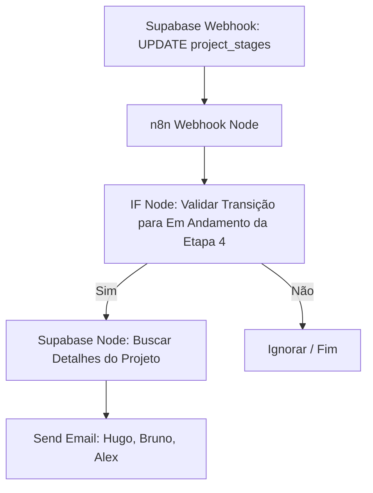

# 🚀 Guia Passo a Passo: Automação de Solicitação de Configuração de Ambiente — Siplan HUB

Este manual técnico orienta a criação, configuração e implantação de uma nova automação no **n8n** integrada ao **Supabase** e **Gmail SMTP**, destinada a notificar os analistas de infraestrutura quando a etapa **4. Preparação de Ambiente** for iniciada no painel de projetos do HUB.

A automação dispara um e-mail estruturado e premium para os responsáveis técnicos da infraestrutura (**Hugo Januário**, **Bruno Fernandes** e **Alex Silva**), solicitando a configuração do servidor local ou em nuvem para o cliente.

---

## 📋 1. Descrição Geral do Fluxo

O progresso de um projeto é acompanhado pelas etapas do painel (`/projects`). Quando a coordenação ou o analista altera o status da etapa **4. Preparação de Ambiente** (representada no banco de dados pela tabela `project_stages`) para **Em Andamento** (`in_progress`), o Supabase dispara um Database Webhook.

O n8n captura o evento, busca no banco de dados as informações complementares do projeto (Cliente, Chamado e Sistema) e envia um e-mail com layout de alta qualidade para a equipe técnica responsável.



---

## 🛠️ 2. Configuração do Webhook no Supabase (Trigger)

Para que o n8n seja avisado da alteração do status da etapa, é necessário cadastrar um Database Webhook no painel do Supabase.

### Passo a Passo de Criação:
1. Acesse o painel administrativo do **Supabase** e selecione o projeto do **Siplan HUB**.
2. No menu lateral esquerdo, clique em **Database** e depois em **Webhooks**.
3. Clique em **Create Webhook** no canto superior direito.
4. Preencha os parâmetros exatamente como especificado abaixo:
    *   **Name:** `n8n_solicitacao_preparacao_ambiente`
    *   **Table:** `project_stages`
    *   **Events:** Selecionar apenas **Update**
    *   **Method:** `POST`
    *   **URL:**
        *   *Ambiente de Testes (n8n Test):* `https://n8n.siplan.com.br/webhook-test/preparacao-ambiente`
        *   *Ambiente de Produção (n8n Prod):* `https://n8n.siplan.com.br/webhook/preparacao-ambiente`
    *   **Headers:**
        *   *Key:* `Content-Type`
        *   *Value:* `application/json`
5. Clique em **Save** para salvar o webhook.

---

## ⚙️ 3. Configuração dos Nós no n8n

O fluxo no n8n é composto por 4 nós principais. Crie um novo fluxo e monte-o seguindo as instruções abaixo:

### Nó 1: Webhook (Gatilho)
Este nó escuta as chamadas HTTP enviadas pelo webhook do Supabase.
*   **Name:** `Webhook - Preparação de Ambiente`
*   **Authentication:** `None`
*   **HTTP Method:** `POST`
*   **Path:** `preparacao-ambiente`
*   **Response Mode:** `onReceived`
*   **Response Code:** `200`
*   **Options -> Raw Body:** `False`

### Nó 2: IF (Filtro de Transição de Status)
Garante que o fluxo só continue se a etapa modificada for especificamente a **etapa 4 (Preparação de Ambiente)** e se o status mudou especificamente para **"Em Andamento"** (`in_progress`), prevenindo múltiplos disparos.
*   **Name:** `IF - Transição para Em Andamento`
*   **Conditions (Combinador):** `AND`
*   *Condição 1 (Validar a Etapa 4):*
    *   **Value 1:** `{{ $json.body.record.stage_number }}` (ou `{{ $json.body.record.stage_name }}` dependendo da nomenclatura)
    *   **Operation:** `Equal`
    *   **Value 2:** `4` (ou `'preparacao_ambiente'` caso o banco use string)
*   *Condição 2 (Status Novo é Em Andamento):*
    *   **Value 1:** `{{ $json.body.record.status }}`
    *   **Operation:** `Equal`
    *   **Value 2:** `in_progress`
*   *Condição 3 (Status Anterior era diferente de Em Andamento - Prevenção de Loops):*
    *   **Value 1:** `{{ $json.body.old_record.status }}`
    *   **Operation:** `Not Equal`
    *   **Value 2:** `in_progress`

### Nó 3: Supabase (Consulta de Projeto)
Busca na tabela `projects` o nome do cliente, o número do chamado e o sistema a ser implantado para enriquecer o e-mail.
*   **Name:** `Supabase - Detalhes do Projeto`
*   **Credential:** `Supabase API`
*   **Resource:** `Database`
*   **Operation:** `Get`
*   **Table:** `projects`
*   **Row ID:** `{{ $node["Webhook - Preparação de Ambiente"].json.body.record.project_id }}`

### Nó 4: Send Email (SMTP - Solicitação de Configuração)
Envia o e-mail formatado em HTML com as diretrizes e links.
*   **Name:** `Email - Solicitação de Configuração`
*   **Authentication:** `SMTP Credentials` (remetente: `siplan.assistants@gmail.com`)
*   **To Email:** `hugo.santariosi@siplan.com.br, bruno.fernandes@siplan.com.br, alex.silva@siplan.com.br`
*   **CC Email:** `marcus.vinicius@siplan.com.br` (Cópia para a gestão acompanhar a fila)
*   **Subject:** `⚙️ [SIPLAN HUB] Solicitação de Preparação de Ambiente — {{ $node["Supabase - Detalhes do Projeto"].json.client_name }} (#{{ $node["Supabase - Detalhes do Projeto"].json.ticket_number }})`
*   **Format:** `HTML`
*   **Body (HTML):** *(O código HTML completo encontra-se na Seção 4 deste manual)*

---

## ✉️ 4. Modelo do E-mail (HTML Premium)

O e-mail utiliza técnicas de design moderno e limpo, alinhadas à identidade visual do Siplan HUB. Ele contém tabelas de informações claras, badges dinâmicos e próximos passos acionáveis.

```html
<!DOCTYPE html>
<html lang="pt-BR">
<head>
  <meta charset="UTF-8">
  <meta name="viewport" content="width=device-width, initial-scale=1.0">
  <title>Solicitação de Configuração de Ambiente</title>
</head>
<body style="margin: 0; padding: 0; background-color: #f8fafc; font-family: 'Segoe UI', -apple-system, BlinkMacSystemFont, Roboto, Helvetica, Arial, sans-serif; color: #1e293b; line-height: 1.6;">
  <table width="100%" border="0" cellspacing="0" cellpadding="0" style="background-color: #f8fafc; padding: 20px 40px;">
    <tr>
      <td align="center">
        <table width="100%" border="0" cellspacing="0" cellpadding="0" style="background-color: #ffffff; border-radius: 12px; overflow: hidden; box-shadow: 0 10px 15px -3px rgba(15, 23, 42, 0.05), 0 4px 6px -2px rgba(15, 23, 42, 0.05); border: 1px solid #e2e8f0; max-width: 650px;">
          <!-- Cabeçalho -->
          <tr>
            <td style="background-color: #0f172a; padding: 28px 40px; text-align: left;">
              <span style="color: #ad0505; font-size: 11px; font-weight: bold; text-transform: uppercase; letter-spacing: 2px; display: block; margin-bottom: 4px;">INFRAESTRUTURA TÉCNICA</span>
              <h1 style="color: #ffffff; font-size: 22px; margin: 0; font-weight: 800; letter-spacing: -0.5px;">SIPLAN <span style="color: #ad0505;">HUB</span></h1>
            </td>
          </tr>
          <!-- Linha Decorativa Vermelha -->
          <tr>
            <td height="4" style="background-color: #ad0505; line-height: 4px; font-size: 4px;">&nbsp;</td>
          </tr>
          <!-- Corpo do E-mail -->
          <tr>
            <td style="padding: 40px 40px;">
              <!-- Badge de Alerta -->
              <table border="0" cellspacing="0" cellpadding="0" style="margin-bottom: 25px;">
                <tr>
                  <td>
                    <span style="background-color: #fffbeb; color: #b45309; border: 1px solid #fde68a; padding: 6px 14px; border-radius: 50px; font-size: 12px; font-weight: 700; text-transform: uppercase; letter-spacing: 0.5px; display: inline-block;">
                      ⚙️ CONFIGURAÇÃO DE AMBIENTE REQUERIDA
                    </span>
                  </td>
                </tr>
              </table>

              <h2 style="color: #0f172a; font-size: 20px; margin-top: 0; margin-bottom: 12px; font-weight: 700; letter-spacing: -0.3px;">Preparação de Ambiente Iniciada</h2>
              <p style="font-size: 15px; color: #475569; margin-bottom: 20px;">Olá equipe de infraestrutura,</p>
              <p style="font-size: 15px; color: #475569; margin-bottom: 20px;">
                O progresso do projeto do cliente abaixo foi atualizado. A etapa <strong>4. Preparação de Ambiente</strong> foi alterada para <strong style="color: #b45309;">Em Andamento</strong>. Por favor, efetuem os procedures técnicos para a liberação da VM e do banco de dados para a implantação.
              </p>
              
              <!-- Card de Detalhes do Projeto -->
              <table width="100%" border="0" cellspacing="0" cellpadding="14" style="background-color: #f8fafc; border-radius: 8px; margin: 25px 0; border: 1px solid #e2e8f0; border-left: 4px solid #ad0505; font-size: 14px;">
                <tr>
                  <td width="25%" style="font-weight: bold; color: #64748b; text-transform: uppercase; font-size: 11px; letter-spacing: 0.5px;">Cliente:</td>
                  <td style="color: #1e293b; font-weight: 700;">{{ $node["Supabase - Detalhes do Projeto"].json.client_name }}</td>
                </tr>
                <tr>
                  <td style="font-weight: bold; color: #64748b; text-transform: uppercase; font-size: 11px; letter-spacing: 0.5px;">Nº Chamado:</td>
                  <td style="color: #1e293b; font-weight: 600;">#{{ $node["Supabase - Detalhes do Projeto"].json.ticket_number }}</td>
                </tr>
                <tr>
                  <td style="font-weight: bold; color: #64748b; text-transform: uppercase; font-size: 11px; letter-spacing: 0.5px;">Sistema:</td>
                  <td style="color: #ad0505; font-weight: bold;">{{ $node["Supabase - Detalhes do Projeto"].json.system_type }}</td>
                </tr>
                <tr>
                  <td style="font-weight: bold; color: #64748b; text-transform: uppercase; font-size: 11px; letter-spacing: 0.5px;">Líder do Projeto:</td>
                  <td style="color: #1e293b;">{{ $node["Supabase - Detalhes do Projeto"].json.project_leader }}</td>
                </tr>
              </table>

              <!-- Bloco de Próximos Passos Técnicos -->
              <table width="100%" border="0" cellspacing="0" cellpadding="0" style="background-color: #fffbeb; border-radius: 8px; border: 1px dashed #fde68a; margin-top: 25px; padding: 25px; text-align: left;">
                <tr>
                  <td>
                    <h3 style="color: #b45309; font-size: 14px; margin: 0 0 12px 0; font-weight: bold; text-transform: uppercase; letter-spacing: 0.5px;">
                      🛠️ PROCEDIMENTOS OPERACIONAIS OBRIGATÓRIOS:
                    </h3>
                    <ul style="margin: 0; padding-left: 20px; color: #475569; font-size: 14px; line-height: 1.8;">
                      <li style="margin-bottom: 8px;"><strong style="color: #0f172a;">Acessar o Servidor:</strong> Efetuar a conexão VPN/SSH ao servidor contratado pelo cliente (local ou cloud).</li>
                      <li style="margin-bottom: 8px;"><strong style="color: #0f172a;">Configurar Docker & VM:</strong> Provisionar o container Docker com a imagem atualizada do sistema Orion e instalar o banco PostgreSQL.</li>
                      <li style="margin-bottom: 8px;"><strong style="color: #0f172a;">Liberar Portas de Rede:</strong> Validar e liberar as portas de rede necessárias do cartório (firewall local) e conexões do sistema.</li>
                      <li style="margin-bottom: 8px;"><strong style="color: #0f172a;">Gerar Credenciais:</strong> Inserir as credenciais e endereços técnicos gerados no HUB para que o conversor e o implantador as utilizem.</li>
                      <li style="margin-bottom: 0;"><strong style="color: #ad0505;">🔴 Concluir no HUB:</strong> Assim que a infraestrutura estiver pronta, mude o status desta etapa para <strong style="color: #0f766e;">Concluído (done)</strong> para liberar a fase de instalação remota.</li>
                    </ul>
                  </td>
                </tr>
              </table>

              <!-- Botão Acessar Projeto -->
              <table width="100%" border="0" cellspacing="0" cellpadding="0" style="margin-top: 30px;">
                <tr>
                  <td align="center">
                    <a href="https://siplanhub.vercel.app/projects/{{ $node["Supabase - Detalhes do Projeto"].json.id }}" style="background-color: #ad0505; color: #ffffff; padding: 14px 35px; text-decoration: none; border-radius: 6px; font-weight: bold; font-size: 14px; display: inline-block; box-shadow: 0 4px 6px -1px rgba(173, 5, 5, 0.2), 0 2px 4px -1px rgba(173, 5, 5, 0.1); text-transform: uppercase; letter-spacing: 0.5px;">Configurar no Siplan HUB</a>
                  </td>
                </tr>
              </table>
            </td>
          </tr>
          <!-- Rodapé -->
          <tr>
            <td style="background-color: #f8fafc; padding: 25px 40px; text-align: center; font-size: 11px; color: #94a3b8; border-top: 1px solid #f1f5f9;">
              E-mail gerado automaticamente pelo orquestrador invisível do Siplan HUB.<br>
              Por favor, não responda diretamente a esta mensagem.
            </td>
          </tr>
        </table>
      </td>
    </tr>
  </table>
</body>
</html>
```

---

## 🧪 5. Scripts de Simulação e Testes (Supabase)

Para testar a integração antes de homologar em produção no n8n, utilize as queries SQL abaixo para inserir dados de simulação e disparar a automação no ambiente de teste.

### 1. Inserir Projeto de Teste
```sql
INSERT INTO public.projects (id, client_name, ticket_number, system_type, project_leader, last_update_by)
VALUES ('e9999999-9999-9999-9999-99999999999e', 'Tabelionato de Teste de Ambiente', '777771', 'Orion TN', 'Marcus', 'admin')
ON CONFLICT (id) DO NOTHING;
```

### 2. Inserir Etapa da Preparação do Ambiente em Status Pendente (`pending`)
```sql
INSERT INTO public.project_stages (project_id, stage_number, stage_name, status, updated_at)
VALUES ('e9999999-9999-9999-9999-99999999999e', 4, 'preparacao_ambiente', 'pending', now())
ON CONFLICT (project_id, stage_number) DO UPDATE
SET status = 'pending';
```

### 3. Simular Alteração para Em Andamento (`in_progress`) — Gatilho da Automação
```sql
UPDATE public.project_stages
SET status = 'in_progress', updated_at = now()
WHERE project_id = 'e9999999-9999-9999-9999-99999999999e' AND stage_number = 4;
```
*   **Resultado Esperado:** O webhook `n8n_solicitacao_preparacao_ambiente` é acionado enviando o payload. O nó IF do n8n filtra o evento, o nó Supabase localiza os metadados do projeto `e9999999-9999-9999-9999-99999999999e` e o nó SMTP realiza o disparo do e-mail com os detalhes do cliente de teste para Hugo, Bruno e Alex.

### 4. Limpeza do Ambiente de Teste
```sql
DELETE FROM public.project_stages WHERE project_id = 'e9999999-9999-9999-9999-99999999999e';
DELETE FROM public.projects WHERE id = 'e9999999-9999-9999-9999-99999999999e';
```
