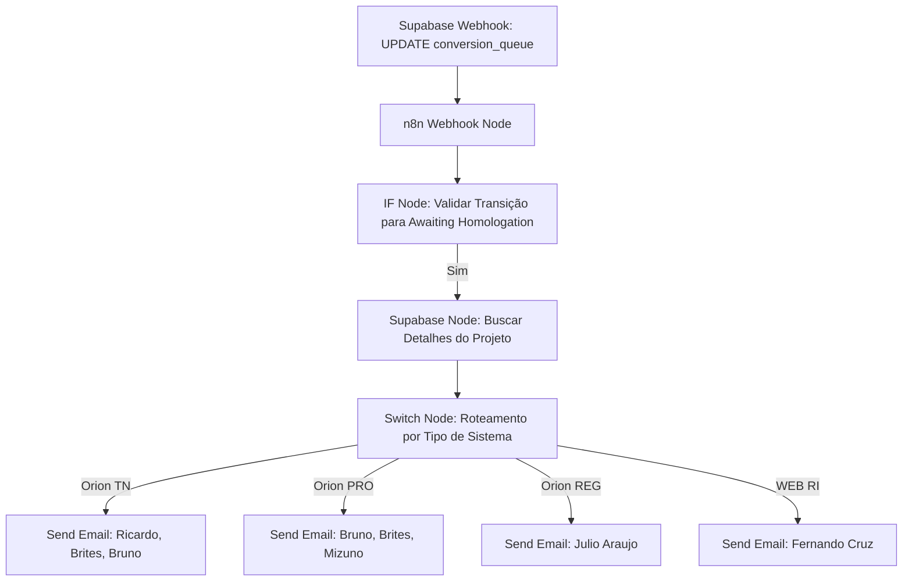
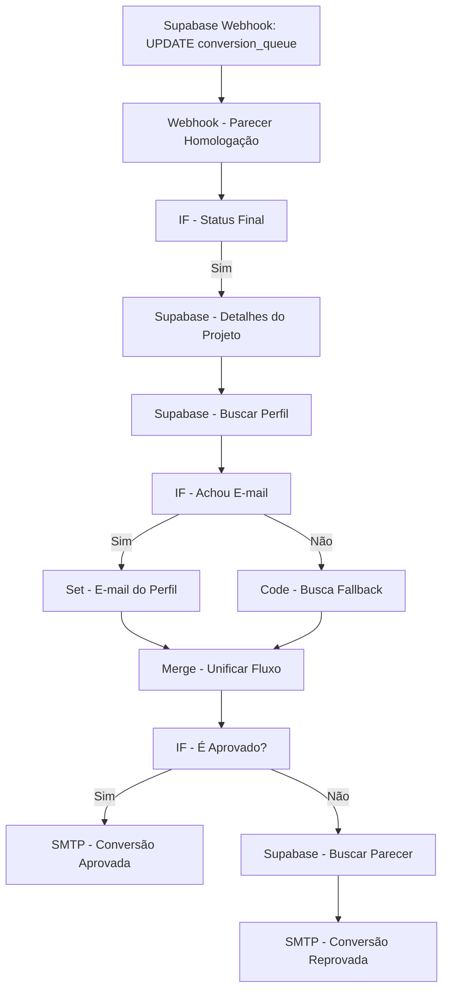

# 🚀 Guia Passo a Passo: Novas Automações da Esteira de Homologação — Siplan HUB

Este manual técnico orienta a criação e configuração de duas novas automações no **n8n** integradas ao **Supabase** e **Gmail SMTP**, destinadas ao controle e comunicação da esteira de Homologação de bases de dados convertidas.

---

## 🛠️ Automação A: Nova Homologação Pendente

### 1. Descrição do Fluxo
Esta automação é acionada quando um analista de conversão finaliza seu trabalho técnico no HUB e clica no botão **Enviar p/ Homologação** (dentro de `/conversion`). O registro na tabela `conversion_queue` tem seu `queue_status` alterado para `awaiting_homologation`. A automação intercepta essa atualização, identifica o tipo de sistema e notifica a equipe de implantadores responsável por e-mail.



### 2. Configuração do Webhook no Supabase (Trigger)
Crie um Database Webhook no painel do Supabase com os seguintes parâmetros:
*   **Name:** `n8n_nova_homologacao_pendente`
*   **Table:** `conversion_queue`
*   **Events:** Selecionar `Update`
*   **Method:** `POST`
*   **URL:**
    *   *Testes:* `https://n8n.siplan.com.br/webhook-test/nova-homologacao`
    *   *Produção:* `https://n8n.siplan.com.br/webhook/nova-homologacao`
*   **Headers:** `Content-Type: application/json`

### 3. Configuração dos Nós no n8n

#### Nó 1: Webhook (Gatilho)
*   **Name:** `Webhook - Nova Homologação`
*   **Authentication:** `None`
*   **HTTP Method:** `POST`
*   **Path:** `nova-homologacao`
*   **Response Mode:** `onReceived`
*   **Response Code:** `200`

#### Nó 2: IF (Filtro de Transição)
Este nó garante que a automação só execute se o status da fila foi atualizado especificamente para `"awaiting_homologation"`.
*   **Name:** `IF - Transição de Status`
*   **Conditions -> String:**
    *   **Value 1:** `{{ $json.body.record.queue_status }}`
    *   **Operation:** `Equal`
    *   **Value 2:** `awaiting_homologation`
*   **Conditions -> String (AND):**
    *   **Value 1:** `{{ $json.body.old_record.queue_status }}`
    *   **Operation:** `Not Equal`
    *   **Value 2:** `awaiting_homologation`

#### Nó 3: Supabase (Consulta de Projeto)
Busca dados adicionais do projeto (como o nome do cliente e o número do ticket) utilizando o ID do projeto do payload.
*   **Name:** `Supabase - Detalhes do Projeto`
*   **Credential:** `Supabase API`
*   **Resource:** `Database`
*   **Operation:** `Get`
*   **Table:** `projects`
*   **Row ID:** `{{ $node["Webhook - Nova Homologação"].json.body.record.project_id }}`

#### Nó 4: Switch (Roteamento por Sistema)
Direciona o fluxo com base no tipo de sistema contratado (`system_type`).
*   **Name:** `Switch - Tipo de Sistema`
*   **Data to typecast:** `String`
*   **Value 1:** `{{ $json.system_type }}`
*   **Rules:**
    *   *Valor:* `Orion TN` -> Encaminhar para Saída 0
    *   *Valor:* `Orion PRO` -> Encaminhar para Saída 1
    *   *Valor:* `Orion REG` -> Encaminhar para Saída 2
    *   *Valor:* `WEB RI` -> Encaminhar para Saída 3

#### Nós de Envio de E-mail (SMTP)
Configure os nós de envio para cada uma das saídas do Switch:

##### 🔴 Saída 0 (Orion TN):
*   **To Email:** `ricardo.vieira@siplan.com.br, rodrigo.brites@siplan.com.br, bruno.santos@siplan.com.br`
*   **Subject:** `📥 [SIPLAN HUB] Nova Homologação Orion TN — {{ $node["Supabase - Detalhes do Projeto"].json.client_name }}`
*   **Format:** `HTML`
*   **Body (HTML):**
```html
<!DOCTYPE html>
<html lang="pt-BR">
<head>
  <meta charset="UTF-8">
  <style>
    body { font-family: 'Segoe UI', Arial, sans-serif; color: #1e293b; background-color: #f8fafc; margin: 0; padding: 20px; }
    .card { background-color: #ffffff; border-radius: 12px; border: 1px solid #e2e8f0; max-width: 600px; margin: 0 auto; overflow: hidden; box-shadow: 0 4px 6px -1px rgba(0, 0, 0, 0.05); }
    .header { background-color: #ad0505; color: #ffffff; padding: 25px; text-align: left; }
    .header h1 { margin: 0; font-size: 20px; font-weight: 800; }
    .content { padding: 30px; }
    .badge { background-color: #fee2e2; color: #ad0505; padding: 6px 12px; border-radius: 50px; font-size: 11px; font-weight: bold; text-transform: uppercase; display: inline-block; margin-bottom: 20px; }
    .info-table { width: 100%; border-collapse: collapse; margin-bottom: 25px; }
    .info-table td { padding: 12px; border-bottom: 1px solid #f1f5f9; font-size: 14px; }
    .info-label { font-weight: bold; color: #64748b; width: 30%; }
    .button-container { text-align: center; margin-top: 30px; }
    .button { background-color: #ad0505; color: #ffffff; padding: 12px 30px; text-decoration: none; border-radius: 6px; font-weight: bold; font-size: 14px; display: inline-block; }
    .footer { background-color: #f8fafc; padding: 20px; text-align: center; font-size: 11px; color: #94a3b8; border-top: 1px solid #f1f5f9; }
  </style>
</head>
<body>
  <div class="card">
    <div class="header">
      <h1>SIPLAN HUB</h1>
    </div>
    <div class="content">
      <span class="badge">📥 Nova Homologação</span>
      <h2 style="margin-top:0; color:#0f172a;">Homologação Pendente de Validação</h2>
      <p>Olá equipe de implantação do <strong>Orion TN</strong>,</p>
      <p>A base de dados do cliente abaixo foi convertida e enviada para homologação. Por favor, realizem os testes e insiram o parecer técnico no painel.</p>
      
      <table class="info-table">
        <tr>
          <td class="info-label">Cliente:</td>
          <td style="font-weight: bold;">{{ $node["Supabase - Detalhes do Projeto"].json.client_name }}</td>
        </tr>
        <tr>
          <td class="info-label">Chamado:</td>
          <td>#{{ $node["Supabase - Detalhes do Projeto"].json.ticket_number }}</td>
        </tr>
        <tr>
          <td class="info-label">Sistema:</td>
          <td><strong style="color: #ad0505;">Orion TN</strong></td>
        </tr>
        <tr>
          <td class="info-label">Enviado por:</td>
          <td>{{ $node["Webhook - Nova Homologação"].json.body.record.sent_by_name }}</td>
        </tr>
      </table>

      <!-- Bloco de Orientação sobre Credenciais e Acessos -->
      <table width="100%" border="0" cellspacing="0" cellpadding="0" style="background-color: #fff5f5; border-radius: 8px; border: 1px dashed #feb2b2; margin: 20px 0; padding: 15px; text-align: left;">
        <tr>
          <td>
            <strong style="color: #ad0505; font-size: 12px; text-transform: uppercase; display: block; margin-bottom: 5px;">🔑 DADOS DE CONEXÃO & SERVIDOR:</strong>
            <span style="font-size: 13px; color: #475569; line-height: 1.5; display: block;">
              Os acessos ao servidor técnico e à base de dados legada variam por projeto. Por favor, <strong>entre em contato diretamente com o responsável pela conversão</strong> (indicado no campo "Enviado por") para obter as credenciais e conexões seguras.
            </span>
          </td>
        </tr>
      </table>

      <!-- Bloco A Bola Está com Você -->
      <table width="100%" border="0" cellspacing="0" cellpadding="0" style="background-color: #fff5f5; border-radius: 8px; border: 1px dashed #feb2b2; margin-top: 20px; padding: 20px; text-align: left;">
        <tr>
          <td>
            <h3 style="color: #ad0505; font-size: 14px; margin: 0 0 12px 0; font-weight: bold; text-transform: uppercase; letter-spacing: 0.5px;">
              🎯 A BOLA ESTÁ COM VOCÊ — PRÓXIMOS PASSOS:
            </h3>
            <ul style="margin: 0; padding-left: 20px; color: #475569; font-size: 14px; line-height: 1.8;">
              <li style="margin-bottom: 8px;"><strong style="color: #ad0505;">🔴 NO HUB:</strong> Acesse a tela de Homologação em `/implantadores/homologation` e clique no botão <strong style="color: #1e293b;">Assumir</strong> na Fila Geral.</li>
              <li style="margin-bottom: 8px;"><strong style="color: #475569;">⚙️ AÇÃO OPERACIONAL:</strong> Entre em contato com o responsável pela Conversão para obter os dados de acesso ao servidor.</li>
              <li style="margin-bottom: 8px;"><strong style="color: #475569;">⚙️ AÇÃO OPERACIONAL:</strong> Efetue os testes operacionais detalhados na base de dados convertida.</li>
              <li style="margin-bottom: 0;"><strong style="color: #ad0505;">🔴 NO HUB:</strong> Preencha o parecer conclusivo no painel e dê seu veredito final (<em style="color: #1e293b; font-style: normal; font-weight: 600;">Aprovado</em> ou <em style="color: #1e293b; font-style: normal; font-weight: 600;">Com Inconsistências</em>).</li>
            </ul>
          </td>
        </tr>
      </table>

      <div class="button-container">
        <a href="https://siplanhub.vercel.app/implantadores/homologation" class="button">Validar no Siplan HUB</a>
      </div>
    </div>
    <div class="footer">
      E-mail automático gerado pelo Siplan HUB. Não responda a este e-mail.
    </div>
  </div>
</body>
</html>
```

##### 🟢 Saída 1 (Orion PRO):
*   **To Email:** `bruno.santos@siplan.com.br, rodrigo.brites@siplan.com.br, rodrigo.mizuno@siplan.com.br`
*   **Subject:** `📥 [SIPLAN HUB] Nova Homologação Orion PRO — {{ $node["Supabase - Detalhes do Projeto"].json.client_name }}`
*   *(HTML idêntico ao TN, alterando apenas a linha do sistema para **Orion PRO**).*

##### 🔵 Saída 2 (Orion REG):
*   **To Email:** `julio.araujo@siplan.com.br`
*   **Subject:** `📥 [SIPLAN HUB] Nova Homologação Orion REG — {{ $node["Supabase - Detalhes do Projeto"].json.client_name }}`
*   *(HTML idêntico ao TN, alterando apenas a linha do sistema para **Orion REG**).*

##### 🟣 Saída 3 (WEB RI):
*   **To Email:** `fernando.lopes@siplan.com.br`
*   **Subject:** `📥 [SIPLAN HUB] Nova Homologação WEB RI — {{ $node["Supabase - Detalhes do Projeto"].json.client_name }}`
*   *(HTML idêntico ao TN, alterando apenas a linha do sistema para **WEB RI**).*

---

## 🛠️ Automação B: Homologação Aprovada ou Reprovada

### 1. Descrição do Fluxo
Esta automação é disparada quando um implantador finaliza o processo de validação em `/implantadores/homologation` e emite o parecer conclusivo. O status do chamado (`queue_status`) transiciona para `done` (Aprovada) ou `homologation_issues` (Reprovada / Com Inconsistências). A automação busca o e-mail do analista de conversão de forma dinâmica no banco de dados e, caso não encontre, aplica um dicionário de mapeamento estático (fallback), notificando o responsável pelo e-mail sobre o veredicto final.



---

### 2. Configuração do Webhook no Supabase (Trigger)
Crie um Database Webhook no painel do Supabase com os seguintes parâmetros operacionais:
*   **Name:** `n8n_parecer_homologacao`
*   **Table:** `conversion_queue`
*   **Events:** Selecionar `Update` (somente atualizações de registros na fila)
*   **Method:** `POST`
*   **URL:**
    *   *Ambiente de Testes:* `https://n8n.siplan.com.br/webhook-test/parecer-homologacao`
    *   *Ambiente de Produção:* `https://n8n.siplan.com.br/webhook/parecer-homologacao`
*   **Headers:** `Content-Type: application/json`

---

### 3. Configuração dos Nós no n8n

#### Nó 1: Webhook (Gatilho)
Este nó atua como o ponto de entrada que escuta as requisições HTTP enviadas pelo Supabase.
*   **Name:** `Webhook - Parecer Homologação`
*   **Authentication:** `None`
*   **HTTP Method:** `POST`
*   **Path:** `parecer-homologacao`
*   **Response Mode:** `onReceived`
*   **Response Code:** `200`
*   **Options -> Raw Body:** `False`

#### Nó 2: IF - Status Final (Filtro de Transição)
Este nó garante que a automação só execute se o status foi de fato alterado para um dos status conclusivos e evita loops caso outros campos da fila sejam atualizados mantendo o mesmo status.
*   **Name:** `IF - Status Final`
*   **Conditions (Combinador):** `AND`
*   *Condição 1:*
    *   **Value 1:** `{{ $json.body.record.queue_status }}`
    *   **Operation:** `Matches Regex` (ou `Regex Match` dependendo da versão do n8n)
    *   **Value 2:** `^(done|homologation_issues)$`
*   *Condição 2 (Prevenção de Loops):*
    *   **Value 1:** `{{ $json.body.old_record.queue_status }}`
    *   **Operation:** `Not Equal`
    *   **Value 2:** `{{ $json.body.record.queue_status }}`

#### Nó 3: Supabase - Detalhes do Projeto (Consulta de Projeto)
Este nó busca os dados do projeto (como nome do cliente e número de ticket) necessários para preencher o e-mail de notificação.
*   **Name:** `Supabase - Detalhes do Projeto`
*   **Credential:** `Supabase API`
*   **Resource:** `Database`
*   **Operation:** `Get`
*   **Table:** `projects`
*   **Row ID:** `{{ $node["Webhook - Parecer Homologação"].json.body.record.project_id }}`

#### Nó 4: Supabase - Buscar Perfil (Consulta Perfil do Conversor)
Busca o perfil cadastrado do analista de conversão usando o ID `assigned_to` para resgatar seu e-mail institucional.
*   **Name:** `Supabase - Buscar Perfil`
*   **Credential:** `Supabase API`
*   **Resource:** `Database`
*   **Operation:** `Get`
*   **Table:** `profiles`
*   **Row ID:** `{{ $node["Webhook - Parecer Homologação"].json.body.record.assigned_to }}`

#### Nó 5: IF - Achou E-mail (Verificação)
Valida se a resposta retornou do banco com um e-mail válido.
*   **Name:** `IF - Achou E-mail`
*   **Conditions -> String:**
    *   **Value 1:** `{{ $json.email }}`
    *   **Operation:** `Is Not Empty`

#### Nó 6: Set - E-mail do Perfil (Normalização True)
Define a variável padronizada `resolved_email` com o e-mail encontrado no perfil do banco de dados.
*   **Name:** `Set - E-mail do Perfil`
*   **Mode:** `Set All Data` (ou adicionar campo)
*   **Values to Set -> String:**
    *   **Name:** `resolved_email`
    *   **Value:** `{{ $json.email }}`

#### Nó 7: Code - Busca Fallback (Normalização False)
Caso o e-mail não esteja cadastrado na tabela de perfis (ou seja, se a busca do Nó 4 retornou vazia), este nó utiliza o dicionário de contatos estáticos para recuperar o e-mail do colaborador associado ao nome textual (`assigned_to_name`).
*   **Name:** `Code - Busca Fallback`
*   **Mode:** `Run Once for Each Item`
*   **Code (JavaScript):**
```javascript
const emailMap = {
  "marcus": "marcus.vinicius@siplan.com.br",
  "bruno fernandes": "bruno.fernandes@siplan.com.br",
  "marcos ortiz": "marcos.ortiz@siplan.com.br",
  "ademar": "ademar.souza@siplan.com.br",
  "luciane": "luciane.lima@siplan.com.br",
  "eduardo silva": "eduardo.silva@siplan.com.br",
  "luan caldeira": "luan.caldeira@siplan.com.br",
  "amanda flor": "amanda.flor@siplan.com.br",
  "maurilio camargo": "maurilio.camargo@siplan.com.br",
  "maria": "maria.santos@siplan.com.br",
  "alex silva": "alex.silva@siplan.com.br",
  "hugo januário": "hugo.santariosi@siplan.com.br",
  "rodrigo brites": "rodrigo.brites@siplan.com.br",
  "brites": "rodrigo.brites@siplan.com.br",
  "ricardo vieira": "ricardo.vieira@siplan.com.br",
  "bruno santos": "bruno.santos@siplan.com.br",
  "bruno matos": "bruno.santos@siplan.com.br",
  "rodrigo mizuno": "rodrigo.mizuno@siplan.com.br",
  "mizuno": "rodrigo.mizuno@siplan.com.br",
  "julio araujo": "julio.araujo@siplan.com.br",
  "julio": "julio.araujo@siplan.com.br",
  "fernando cruz": "fernando.lopes@siplan.com.br"
};

// Obtém o nome livre do conversor a partir do webhook original do parecer
const assignedToName = $('Webhook - Parecer Homologação').item.json.body.record.assigned_to_name || "";
const nameKey = assignedToName.toLowerCase().trim();

// Define a propriedade resolved_email ou aplica o fallback da coordenação (Marcus)
item.json.resolved_email = emailMap[nameKey] || "marcus.vinicius@siplan.com.br";

return item;
```

#### Nó 8: Merge - Unificar Fluxo (Unificação)
Une a saída bem-sucedida do perfil (`Set - E-mail do Perfil`) e a de fallback (`Code - Busca Fallback`) para que os nós subsequentes continuem operando a partir do mesmo caminho com a variável central `resolved_email`.
*   **Name:** `Merge - Unificar Fluxo`
*   **Mode:** `Choose Branch` (ou `Merge inputs by key`)

#### Nó 9: IF - É Aprovado? (Decisão de Roteamento)
Roteia o fluxo com base na aprovação final do veredicto.
*   **Name:** `IF - É Aprovado?`
*   **Conditions -> String:**
    *   **Value 1:** `{{ $node["Webhook - Parecer Homologação"].json.body.record.queue_status }}`
    *   **Operation:** `Equal`
    *   **Value 2:** `done`

---

### 4. Configuração dos Modelos de E-mail

#### 🟢 Fluxo 1: Homologação Aprovada (IF True)
*   **To Email:** `{{ $json.resolved_email }}`
*   **Subject:** `🎉 [SIPLAN HUB] Conversão APROVADA! — {{ $node["Supabase - Detalhes do Projeto"].json.client_name }}`
*   **Format:** `HTML`
*   **Body (HTML):**
```html
<!DOCTYPE html>
<html lang="pt-BR">
<head>
  <meta charset="UTF-8">
  <style>
    body { font-family: 'Segoe UI', Arial, sans-serif; color: #1e293b; background-color: #f8fafc; margin: 0; padding: 20px; }
    .card { background-color: #ffffff; border-radius: 12px; border: 1px solid #e2e8f0; max-width: 600px; margin: 0 auto; overflow: hidden; box-shadow: 0 4px 6px -1px rgba(0, 0, 0, 0.05); }
    .header { background-color: #0f766e; color: #ffffff; padding: 25px; text-align: left; }
    .header h1 { margin: 0; font-size: 20px; font-weight: 800; }
    .content { padding: 30px; }
    .badge { background-color: #ccfbf1; color: #0f766e; padding: 6px 12px; border-radius: 50px; font-size: 11px; font-weight: bold; text-transform: uppercase; display: inline-block; margin-bottom: 20px; }
    .info-table { width: 100%; border-collapse: collapse; margin-bottom: 25px; }
    .info-table td { padding: 12px; border-bottom: 1px solid #f1f5f9; font-size: 14px; }
    .info-label { font-weight: bold; color: #64748b; width: 30%; }
    .footer { background-color: #f8fafc; padding: 20px; text-align: center; font-size: 11px; color: #94a3b8; border-top: 1px solid #f1f5f9; }
  </style>
</head>
<body>
  <div class="card">
    <div class="header">
      <h1>SIPLAN HUB</h1>
    </div>
    <div class="content">
      <span class="badge">✓ APROVADA</span>
      <h2 style="margin-top:0; color:#0f172a;">Parabéns! Conversão Concluída</h2>
      <p>Olá <strong>{{ $node["Webhook - Parecer Homologação"].json.body.record.assigned_to_name }}</strong>,</p>
      <p>A homologação da base de dados do cliente foi realizada e **APROVADA** pelo implantador. O estágio de conversão de dados do projeto foi dado como concluído no painel.</p>
      
      <table class="info-table">
        <tr>
          <td class="info-label">Cliente:</td>
          <td style="font-weight: bold;">{{ $node["Supabase - Detalhes do Projeto"].json.client_name }}</td>
        </tr>
        <tr>
          <td class="info-label">Chamado:</td>
          <td>#{{ $node["Supabase - Detalhes do Projeto"].json.ticket_number }}</td>
        </tr>
        <tr>
          <td class="info-label">Homologado por:</td>
          <td>{{ $node["Webhook - Parecer Homologação"].json.body.record.homologation_analyst_name }}</td>
        </tr>
      </table>
    </div>
    <div class="footer">
      E-mail automático gerado pelo Siplan HUB. Não responda a este e-mail.
    </div>
  </div>
</body>
</html>
```

---

#### 🔴 Fluxo 2: Homologação Reprovada (IF False)

##### Nó Adicional Necessário antes do Envio de E-mail:
Como a reprovação exige que o analista saiba quais foram as inconsistências apontadas, a automação precisa buscar o parecer detalhado inserido na tabela `homologation_events` no campo `notes` (HTML com anotações e imagens).
*   **Name:** `Supabase - Buscar Parecer`
*   **Credential:** `Supabase API`
*   **Resource:** `Database`
*   **Operation:** `Get Many` (ou direct SQL/Query)
*   **Table:** `homologation_events`
*   **Filters:**
    *   `project_id` = `{{ $node["Webhook - Parecer Homologação"].json.body.record.project_id }}`
    *   `to_status` = `homologation_issues`
*   **Sort:** `timestamp` Descending (limite `1` para obter estritamente o último evento de inconsistência).

##### Nó de Envio de E-mail:
*   **To Email:** `{{ $json.resolved_email }}`
*   **Subject:** `⚠️ [SIPLAN HUB] Conversão REPROVADA (Inconsistências) — {{ $node["Supabase - Detalhes do Projeto"].json.client_name }}`
*   **Format:** `HTML`
*   **Body (HTML):**
```html
<!DOCTYPE html>
<html lang="pt-BR">
<head>
  <meta charset="UTF-8">
  <style>
    body { font-family: 'Segoe UI', Arial, sans-serif; color: #1e293b; background-color: #f8fafc; margin: 0; padding: 20px; }
    .card { background-color: #ffffff; border-radius: 12px; border: 1px solid #e2e8f0; max-width: 600px; margin: 0 auto; overflow: hidden; box-shadow: 0 4px 6px -1px rgba(0, 0, 0, 0.05); }
    .header { background-color: #ad0505; color: #ffffff; padding: 25px; text-align: left; }
    .header h1 { margin: 0; font-size: 20px; font-weight: 800; }
    .content { padding: 30px; }
    .badge { background-color: #fee2e2; color: #ad0505; padding: 6px 12px; border-radius: 50px; font-size: 11px; font-weight: bold; text-transform: uppercase; display: inline-block; margin-bottom: 20px; }
    .info-table { width: 100%; border-collapse: collapse; margin-bottom: 25px; }
    .info-table td { padding: 12px; border-bottom: 1px solid #f1f5f9; font-size: 14px; }
    .info-label { font-weight: bold; color: #64748b; width: 30%; }
    .report-box { background-color: #fff5f5; border: 1px solid #feb2b2; border-radius: 8px; padding: 20px; margin-top: 25px; font-size: 14px; line-height: 1.6; }
    .button-container { text-align: center; margin-top: 30px; }
    .button { background-color: #ad0505; color: #ffffff; padding: 12px 30px; text-decoration: none; border-radius: 6px; font-weight: bold; font-size: 14px; display: inline-block; }
    .footer { background-color: #f8fafc; padding: 20px; text-align: center; font-size: 11px; color: #94a3b8; border-top: 1px solid #f1f5f9; }
  </style>
</head>
<body>
  <div class="card">
    <div class="header">
      <h1>SIPLAN HUB</h1>
    </div>
    <div class="content">
      <span class="badge">⚠️ REPROVADA COM INCONSISTÊNCIAS</span>
      <h2 style="margin-top:0; color:#0f172a;">Ajustes Necessários na Conversão</h2>
      <p>Olá <strong>{{ $node["Webhook - Parecer Homologação"].json.body.record.assigned_to_name }}</strong>,</p>
      <p>A base de dados do cliente abaixo retornou da homologação com **inconsistências apontadas pelo implantador**. O projeto foi devolvido para a sua fila em `/conversion` com status pendente de correções.</p>
      
      <table class="info-table">
        <tr>
          <td class="info-label">Cliente:</td>
          <td style="font-weight: bold;">{{ $node["Supabase - Detalhes do Projeto"].json.client_name }}</td>
        </tr>
        <tr>
          <td class="info-label">Chamado:</td>
          <td>#{{ $node["Supabase - Detalhes do Projeto"].json.ticket_number }}</td>
        </tr>
        <tr>
          <td class="info-label">Recusado por:</td>
          <td>{{ $node["Webhook - Parecer Homologação"].json.body.record.homologation_analyst_name }}</td>
        </tr>
      </table>

      <div class="report-box">
        <h3 style="margin-top: 0; color: #991b1b; font-size: 14px; text-transform: uppercase;">📋 PARECER TÉCNICO DE INCONSISTÊNCIAS:</h3>
        <!-- Renderiza o HTML das observações escritas pelo implantador no editor rico (incluindo imagens) -->
        {{ $node["Supabase - Buscar Parecer"].json.notes }}
      </div>

      <!-- Bloco A Bola Está com Você -->
      <table width="100%" border="0" cellspacing="0" cellpadding="0" style="background-color: #fff5f5; border-radius: 8px; border: 1px dashed #feb2b2; margin-top: 20px; padding: 20px; text-align: left;">
        <tr>
          <td>
            <h3 style="color: #ad0505; font-size: 14px; margin: 0 0 12px 0; font-weight: bold; text-transform: uppercase; letter-spacing: 0.5px;">
              🎯 A BOLA ESTÁ COM VOCÊ — PRÓXIMOS PASSOS:
            </h3>
            <ul style="margin: 0; padding-left: 20px; color: #475569; font-size: 14px; line-height: 1.8;">
              <li style="margin-bottom: 8px;"><strong style="color: #ad0505;">🔴 NO HUB:</strong> Acesse a Fila de Conversão em `/conversion` e abra o card detalhado do cliente.</li>
              <li style="margin-bottom: 8px;"><strong style="color: #475569;">📋 OPERACIONAL:</strong> Analise o relatório técnico de inconsistências e prints colados pelo implantador acima.</li>
              <li style="margin-bottom: 8px;"><strong style="color: #475569;">⚙️ AÇÃO OPERACIONAL:</strong> Realize os ajustes e correções necessárias na estrutura/conversor do banco.</li>
              <li style="margin-bottom: 0;"><strong style="color: #ad0505;">🔴 NO HUB:</strong> Após testar as correções, reenvie a base para homologação para que o implantador valide novamente.</li>
            </ul>
          </td>
        </tr>
      </table>

      <div class="button-container">
        <a href="https://siplanhub.vercel.app/conversion" class="button">Acessar Fila de Conversão</a>
      </div>
    </div>
    <div class="footer">
      E-mail automático gerado pelo Siplan HUB. Não responda a este e-mail.
    </div>
  </div>
</body>
</html>
```
