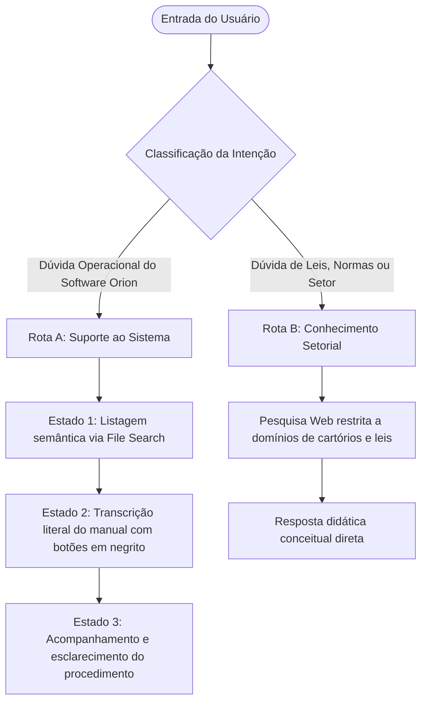

# Análise Estratégica e Arquitetura de Prompts: Orion TN & Orion PRO

Este documento apresenta o diagnóstico técnico e a proposta de reformulação estratégica das instruções dos assistentes virtuais da Siplan para os sistemas **Orion TN** (Tabelionato de Notas) e **Orion PRO** (Tabelionato de Protesto), otimizados para modelos de linguagem avançados (como o GPT-5 mini / GPT-4o mini).

---

## 1. Diagnóstico Técnico dos Prompts Originais

Os prompts originais seguiam uma estrutura binária rígida ("Listar" ou "Transcrever"), o que trazia severas limitações em ambientes reais de atendimento e suporte de TI (Service Desk / WhatsApp / Siplan Hub):

### A. O Loop da Rigidez Dialógica
*   **Problema:** Se o usuário fizesse uma pergunta de acompanhamento (*follow-up*) após o detalhamento de uma rotina (ex: *"Não achei o botão Configurações no passo 2, onde ele fica?"* ou *"O que significa abertura sem troco?"*), o assistente interpretava isso como uma busca de rotina inicial (Etapa 1). Ele tentaria listar novas rotinas correspondentes a "não achei" ou daria um erro informando que a rotina não foi encontrada.
*   **Impacto:** Quebrava a fluidez da conversa e irritava o escrevente ou implantador, reduzindo o valor prático de usar uma IA inteligente. Se a resposta deve ser apenas um texto estático, um banco de dados relacional clássico executaria a tarefa de busca com custo zero de tokens e 100% de precisão. O real diferencial da IA é a **flexibilidade assistiva orientada ao contexto**.

### B. Falta de Tratamento de Termos Equivalentes e Ambiguidade
*   **Problema:** Os usuários finais nos cartórios e implantadores possuem perfis de maturidade tecnológica heterogêneos (conforme detalhado no [GEMINI.md](file:///D:/Projetos%20Obsidian/Siplan%20-%20Implanta%C3%A7%C3%A3o/GEMINI.md)). Eles raramente buscam pelos termos técnicos exatos da base de conhecimento. Um usuário pode digitar "como mandar recibo pro cliente" in vez de "Processo de faturamento e envio de boleto".
*   **Impacto:** Os prompts anteriores forçavam a IA a agir de maneira determinística rígida. Se ela não achasse correspondência semântica imediata, recusava-se a buscar ou alucinava caminhos intuitivos baseados em seu conhecimento prévio de treinamento geral.

### C. Lacunas e Inconsistências de Formatação
*   **Problema:** No prompt do Orion PRO, a instrução de citação dizia: `"Anexe a citação `` no final de cada frase ou item de lista."` Esse espaço vazio (placeholder) deixava o modelo confuso sobre o formato desejado, resultando em respostas inconsistentes ou no descarte completo de citações de origem. No Orion TN, não havia qualquer exigência de citação de origem de arquivo.

---

## 2. A Nova Arquitetura de Prompt Proposta (Roteamento de Duas Rotas)

Para maximizar a eficiência dos assistentes virtuais como guias didáticos dos sistemas e do setor extrajudicial, a nova estrutura de prompts adota um **Roteamento de Duas Rotas Dialógicas Dinâmicas** com base na intenção do usuário:

### Rota A: Suporte Operacional do Sistema (Máquina de Três Estados)
Destina-se a orientar o escrevente ou implantador sobre como operar as telas e botões do sistema Orion TN/PRO.
1.  **Estado 1 - Seleção e Busca (`<estado_busca>`)**:
    *   **Função:** Localizar e listar rotinas correspondentes à busca semântica na base de conhecimento (Vector Store) via **File Search**.
2.  **Estado 2 - Transcrição Estruturada (`<estado_transcricao>`)**:
    *   **Função:** Detalhar os passos operacionais do manual com 100% de fidelidade literal, destacando os caminhos de cliques, botões e telas em **negrito**.
3.  **Estado 3 - Suporte de Acompanhamento e Contexto (`<estado_acompanhamento>`)**:
    *   **Função:** Resolver dúvidas de navegação conceituais adicionais sobre a rotina que acabou de ser exibida, mantendo o escopo restrito ao manual.

### Rota B: Conhecimento Setorial, Leis e Regulamentos
Destina-se a responder a dúvidas gerais do ecossistema de cartórios, termos jurídicos, legislação e funcionamento de órgãos externos (ex: e-Notariado, CENPROT, prazos legais, o que é um título, provimentos do CNJ).
*   **Ação:** O assistente aciona o **Web Search** restrito a domínios oficiais e responde diretamente com explicações claras, técnicas e didáticas, sem passar pela listagem de rotinas do sistema.

---

## 3. Configuração de Ferramentas Hospedadas (OpenAI Platform Tools)

Os assistentes virtuais utilizarão exclusivamente as seguintes ferramentas hospedadas na OpenAI, sem necessidade de integrações de código local (*Functions* ou *Code Interpreter*):

### 1. File Search
*   **Configuração:** Habilitada em ambos.
*   **Vector Store Orion TN:** Carregar exclusivamente o arquivo consolidador único da base de conhecimento **`Orion_TN_Limpo.md`**, contendo todas as rotinas e parametrizações operacionais do Tabelionato de Notas.
*   **Vector Store Orion PRO:** Carregar exclusivamente o arquivo consolidador único da base de conhecimento **`Orion_PRO_Limpo.md`**, contendo todas as rotinas e parametrizações operacionais do Tabelionato de Protesto.

*Nota:* Os arquivos modulares (ex: `Orion TN - Balcão de Firmas.md` ou `Orion PRO - Caixa e Financeiro.md`) são recursos estruturados utilizados exclusivamente para o alinhamento de contexto da inteligência do desenvolvedor do projeto e não são indexados nos assistentes da plataforma final.

### 2. Web Search (Search only in these websites)
*   **Configuração:** Habilitada com restrição estrita de domínios específicos para cada produto:

#### Domínios Permitidos para o Orion TN (Tabelionato de Notas)
Para que o assistente do Orion TN possa explicar conceitos como escrituras públicas, procurações, validações biométricas e provimentos de notas do CNJ, configure o Web Search apenas para os domínios:
*   `e-notariado.org.br` (Serviços notariais eletrônicos).
*   `notariado.org.br` (Colégio Notarial do Brasil - Conselho Federal).
*   `cnj.jus.br` (Conselho Nacional de Justiça - Provimentos e resoluções).
*   `anoreg.org.br` (Associação dos Notários e Registradores).
*   `cnbsp.org.br` (Colégio Notarial do Brasil - Seção São Paulo).

#### Domínios Permitidos para o Orion PRO (Tabelionato de Protesto)
Para que o assistente do Orion PRO possa explicar prazos de pagamento de protesto, o funcionamento da CRA, leis federais de títulos de crédito e sustações judiciais, configure o Web Search apenas para os domínios:
*   `cenprot.com.br` (Central de Protesto Nacional).
*   `cenprotsp.com.br` (Central de Protesto de São Paulo / CRA).
*   `ieptb.com.br` (Instituto de Estudos de Protesto de Títulos do Brasil).
*   `protestobr.com.br` (Instituto de Protesto Nacional).
*   `cnj.jus.br` (Conselho Nacional de Justiça - Provimentos e normas do CNJ).
*   `planalto.gov.br` (Legislação federal, como a Lei de Protesto 9.492/1997 e Lei de Títulos).

---

## 4. Diferenças de Implementação nos Prompts

| Característica Técnica | Orion TN (Tabelionato de Notas) | Orion PRO (Tabelionato de Protesto) | Raciocínio de Design |
| :--- | :--- | :--- | :--- |
| **Vazamento de Metadados** | **Permitido**: Começa a resposta operacional com o título da rotina em negrito. | **Proibido**: Oculta títulos e códigos técnicos. Começa direto na frase de conexão de objetivo. | Mantém o visual limpo para mensagens que trafegam via canais públicos como WhatsApp no Orion PRO. |
| **Destaque em Negrito** | Aplicado a **menus**, **botões**, **telas**, **abas**, **campos** e **opções**. | Aplicado estritamente a **menus**, **botões** e **telas**. | O TN possui telas com configurações complexas de preenchimento de minutas e campos do e-Notariado. |
| **Exibição de Citações/Fontes** | **Proibição Absoluta**: Nunca exibe o nome do arquivo markdown ou marcas de citação de origem. | **Proibição Absoluta**: Nunca exibe o nome do arquivo markdown ou marcas de citação de origem. | Garante uma interface de chat limpa e sem ruídos de compilação interna de notas do Obsidian. |
| **Arquivo Fixo File Search** | `Orion_TN_Limpo.md` | `Orion_PRO_Limpo.md` | O indexador consome um arquivo único consolidado de referência para RAG. |

---

> [!NOTE]
> Ambas as instruções foram atualizadas para suportar o roteamento dinâmico entre suporte operacional ao sistema (File Search) e conhecimento de regras setoriais (Web Search). A menção a Functions, APIs do Siplan Hub e ao Code Interpreter foi integralmente removida de todas as seções e exemplos.
