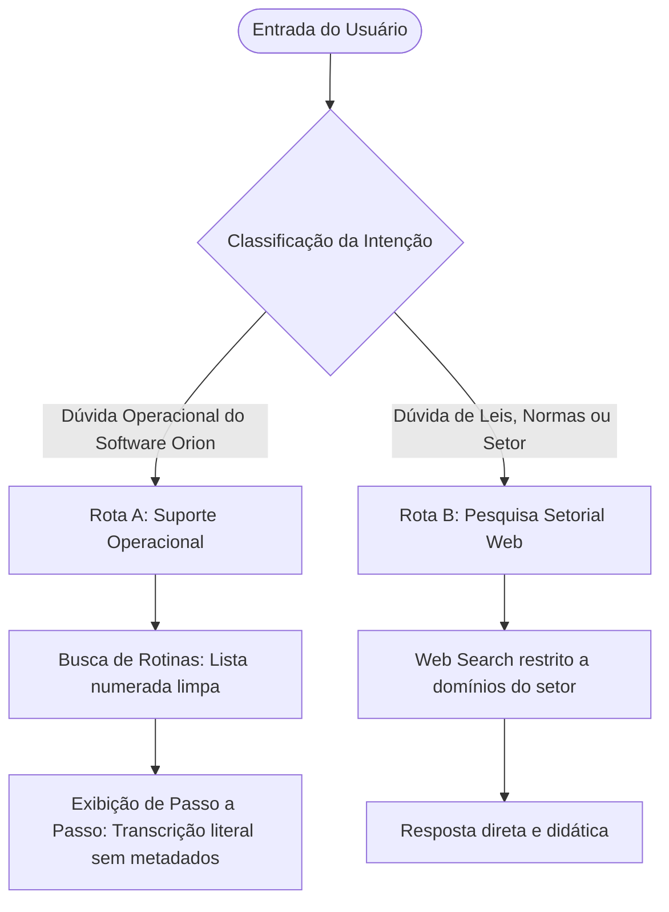

# Análise Estratégica e Arquitetura de Prompts: Orion TN & Orion PRO

Este documento apresenta o diagnóstico técnico e a proposta de reformulação estratégica das instruções dos assistentes virtuais da Siplan para os sistemas **Orion TN** (Tabelionato de Notas) e **Orion PRO** (Tabelionato de Protesto), otimizados para modelos de linguagem avançados (como o GPT-5 mini / GPT-4o mini).

---

## 1. Diagnóstico Técnico dos Prompts Originais

Os prompts originais seguiam uma estrutura binária rígida ("Listar" ou "Transcrever"), o que trazia severas limitações em ambientes reais de atendimento e suporte de TI (Service Desk / WhatsApp / Siplan Hub):

### A. O Loop da Rigidez Dialógica
*   **Problema:** Se o usuário fizesse uma pergunta de acompanhamento (*follow-up*) após o detalhamento de uma rotina (ex: *"Não achei o botão Configurações no passo 2, onde ele fica?"* ou *"O que significa abertura sem troco?"*), o assistente interpretava isso como uma busca de rotina inicial (Etapa 1). Ele tentaria listar novas rotinas correspondentes a "não achei" ou daria um erro informando que a rotina não foi encontrada.
*   **Impacto:** Quebrava a fluidez da conversa e irritava o escrevente ou implantador, reduzindo o valor prático de usar uma IA inteligente. Se a resposta deve ser apenas um texto estático, um banco de dados relacional clássico executaria a tarefa de busca com custo zero de tokens e 100% de precisão. O real diferencial da IA é a **flexibilidade assistiva orientada ao contexto**.

### B. Falta de Tratamento de Termos Equivalentes e Ambiguidade
*   **Problema:** Os usuários finais nos cartórios e implantadores possuem perfis de maturidade tecnológica heterogêneos (conforme detalhado no [GEMINI.md](file:///D:/Projetos%20Obsidian/Siplan%20-%20Implanta%C3%A7%C3%A3o/GEMINI.md)). Eles raramente buscam pelos termos técnicos exatos da base de conhecimento. Um usuário pode digitar "como mandar recibo pro cliente" in vez de "Processo de faturamento e envio de boleto".
*   **Impacto:** Os prompts anteriores forçavam a IA a agir de maneira determinística rígida. Se ela não achasse correspondência semântica imediata, recusava-se a buscar ou alucinava caminhos intuitivos baseados em seu conhecimento prévio de treinamento geral.

### C. Lacunas e Inconsistências de Formatação
*   **Problema:** No prompt do Orion PRO, a instrução de citação dizia: `"Anexe a citação `` no final de cada frase ou item de lista."` Esse espaço vazio (placeholder) deixava o modelo confuso sobre o formato desejado, resultando em respostas inconsistentes ou no descarte completo de citações de origem. No Orion TN, não havia qualquer exigência de citação de origem de arquivo.

---

## 2. A Nova Arquitetura de Prompt Proposta (Roteamento Linear e Simplificado)

Para evitar conflitos lógicos no processamento de raciocínio (*reasoning*) do GPT-4o e GPT-5 mini que causavam lentidão (latência) e falhas de formatação (como a injeção indevida de marcas de citação), a arquitetura acadêmica de tags XML e máquina de estados complexa foi substituída por um **Roteamento Linear Baseado em Markdown Direto**:

### Principais Benefícios da Abordagem Simplificada
1. **Redução da Carga Cognitiva:** Instruções menores e mais enxutas permitem que o modelo processe a lógica de formatação de maneira instantânea, reduzindo drasticamente o tempo gasto em loops de planejamento interno (*reasoning*).
2. **Neutralização do Conflito de Citações:** Ao simplificar a regra ("Zero Citações"), o modelo não entra em conflito com as diretrizes internas da API de File Search da OpenAI. A regra instrui a IA a gerar respostas fingindo que possui "conhecimento intrínseco", inibindo a geração de marcadores (`【`, `†`, etc.) que acionavam a injeção do nome do arquivo físico no frontend.
3. **Escrita Direta em Markdown:** O uso de títulos estruturados comuns no prompt, ao invés de pseudo-tags XML, é processado de forma muito mais natural pelos decoders do modelo de linguagem.

---

## 3. Configuração de Ferramentas Hospedadas (OpenAI Platform Tools)

Os assistentes virtuais utilizarão exclusivamente as seguintes ferramentas hospedadas na OpenAI, sem necessidade de integrações de código local (*Functions* ou *Code Interpreter*):

### 1. File Search
*   **Configuração:** Habilitada em ambos.
*   **Vector Store Orion TN:** Carregar exclusivamente o arquivo consolidador único da base de conhecimento **`OrionTN.md`** (renomeado de `Orion_TN_Limpo.md` para evitar poluição visual na citação automática).
*   **Vector Store Orion PRO:** Carregar exclusivamente o arquivo consolidador único da base de conhecimento **`OrionPRO.md`** (renomeado de `Orion_PRO_Conhecimento.md` para evitar poluição visual na citação automática).

*Nota:* Os arquivos modulares (ex: `Orion TN - Balcão de Firmas.md` ou `Orion PRO - Caixa e Financeiro.md`) são recursos estruturados utilizados exclusivamente para o alinhamento de contexto da inteligência do desenvolvedor do projeto e não são indexados nos assistentes da plataforma final.

### 2. Web Search (Search only in these websites)
*   **Configuração:** Habilitada com restrição estrita de domínios específicos para cada produto:

#### Domínios Permitidos para o Orion TN (Tabelionato de Notas)
Para que o assistente do Orion TN possa explicar conceitos como escrituras públicas, procurações, validações biométricas e provimentos de notas do CNJ, configure o Web Search apenas para os domínios:
*   `e-notariado.org.br` (Serviços notariais eletrônicos).
*   `notariado.org.br` (Colégio Notarial do Brasil - Conselho Federal).
*   `cnj.jus.br` (Conselho Nacional de Justiça - Provimentos e resoluções).
*   `anoreg.org.br` (Associação dos Notários e Registradores).
*   `cnbsp.org.br` (Colégio Notarial do Brasil - Seção São Paulo).

#### Domínios Permitidos para o Orion PRO (Tabelionato de Protesto)
Para que o assistente do Orion PRO possa explicar prazos de pagamento de protesto, o funcionamento da CRA, leis federais de títulos de crédito e sustações judiciais, configure o Web Search apenas para os domínios:
*   `cenprot.com.br` (Central de Protesto Nacional).
*   `cenprotsp.com.br` (Central de Protesto de São Paulo / CRA).
*   `ieptb.com.br` (Instituto de Estudos de Protesto de Títulos do Brasil).
*   `protestobr.com.br` (Instituto de Protesto Nacional).
*   `cnj.jus.br` (Conselho Nacional de Justiça - Provimentos e normas do CNJ).
*   `planalto.gov.br` (Legislação federal, como a Lei de Protesto 9.492/1997 e Lei de Títulos).

---

## 4. Diferenças de Implementação nos Prompts

| Característica Técnica | Orion TN (Tabelionato de Notas) | Orion PRO (Tabelionato de Protesto) | Raciocínio de Design |
| :--- | :--- | :--- | :--- |
| **Vazamento de Título de Rotina** | **Permitido**: Começa a resposta operacional com o título da rotina em negrito no topo. | **Proibido**: Oculta títulos e códigos técnicos. Começa direto na frase de conexão de objetivo. | Mantém o visual mais conciso e fluido para canais onde o PRO opera. |
| **Metadados Internos (Objetivo, Tags, Intenções, Descrição)** | **Proibição Absoluta**: Esses campos servem apenas para RAG/raciocínio interno e devem ser completamente omitidos na resposta. | **Proibição Absoluta**: Esses campos servem apenas para RAG/raciocínio interno e devem ser completamente omitidos na resposta. | Evita a exibição de metadados da estrutura da base de conhecimento que poluem o visual da resposta ao usuário. |
| **Destaque em Negrito** | Aplicado a **menus**, **botões**, **telas**, **abas**, **campos** e **opções**. | Aplicado estritamente a **menus**, **botões** e **telas**. | O TN possui telas com configurações complexas de preenchimento de minutas e campos do e-Notariado. |
| **Exibição de Citações e Anotações** | **Permissão Amigável**: Aceita a citação do arquivo de fonte limpa **`OrionTN.md`** no final, proibindo colchetes e marcadores complexos no corpo. | **Permissão Amigável**: Aceita a citação do arquivo de fonte limpa **`OrionPRO.md`** no final, proibindo colchetes e marcadores complexos no corpo. | Oferece consistência com a infraestrutura OpenAI ao mesmo tempo que torna a citação discreta e legível. |
| **Arquivo Fixo File Search** | `OrionTN.md` | `OrionPRO.md` | Renomeados para melhor legibilidade da citação automática na interface de usuário. |
| **Fidelidade à Transcrição** | **Literal Absoluta**: Proibido resumir, parafrasear ou deduzir caminhos ou botões alternativos. | **Literal Absoluta**: Proibido resumir, parafrasear ou deduzir caminhos ou botões alternativos. | Evita alucinações e instruções incorretas ao implantador e ao escrevente no balcão. |

---

> [!NOTE]
> Ambas as instruções foram atualizadas para suportar o roteamento dinâmico entre suporte operacional ao sistema (File Search) e conhecimento de regras setoriais (Web Search). A menção a Functions, APIs do Siplan Hub e ao Code Interpreter foi integralmente removida. Foi estabelecida uma seção exclusiva e agressiva de **Regras Anti-Citação Estritas** em ambas as instruções, e as restrições globais (`<constraints>`) foram reforçadas para vetar qualquer tipo de caractere especial de anotação vetorial no texto gerado (ex: `【`, `†`, etc.) e nomes de arquivos markdown.
