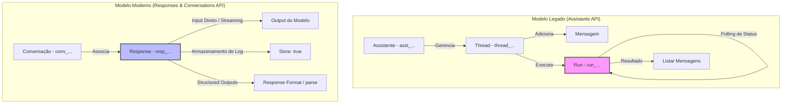

# Análise Estratégica: Migração e Maximização do OpenAI Responses API

Este relatório apresenta um direcionamento técnico exaustivo para a transição dos assistentes virtuais e integrações com Inteligência Artificial dos sistemas **Orion TN** e **Orion PRO** para a nova **Responses API** e **Conversations API** da OpenAI. O objetivo é substituir a infraestrutura legada da Assistants API (com encerramento definitivo programado para **26 de agosto de 2026**) e atingir o potencial máximo de performance, economia de custos e recursos cognitivos.

---

## 🏗️ 1. Arquitetura Comparativa: Assistants API vs. Responses API

A migração para a Responses API altera fundamentalmente o fluxo de chamadas e gerenciamento de estado. Enquanto a Assistants API era inerentemente *stateful* e baseada em polling de execuções (*runs*), a Responses API foi projetada para ser ágil, combinando o melhor do Chat Completions síncrono com a persistência flexível de conversas.

### Comparativo de Componentes



### Tabela Comparativa de Recursos e Paradigmas

| Conceito / Recurso | Assistants API (Legado) | Responses & Conversations API (Moderno) | Vantagem para o Orion TN / PRO |
| :--- | :--- | :--- | :--- |
| **Gerenciamento de Estado** | **Thread** (Servidor OpenAI) | **Conversation** (Servidor OpenAI) | Transição direta de históricos e persistência simplificada. |
| **Execução de Chamadas** | **Run** (Execução assíncrona que exige polling repetitivo) | **Response** (Execução síncrona nativa ou streaming ágil) | Redução de latência (Time To First Token) e simplificação do código de rede no frontend. |
| **Otimização de Custo** | Limitado (reutilização parcial de contexto) | **Prompt Caching Nativo** (Descontos automáticos de até 50% em inputs repetidos) | Redução de custos ao enviar manuais extensos e prompts de sistema pesados a cada chat de suporte. |
| **Saídas Estruturadas** | Complexo (exige tratamento manual de strings JSON) | **Structured Outputs nativo** (validação Pydantic ou JSON Schema integrada) | Extração ultra segura de dados do DUT (Orion TN) ou dados de apresentantes (Orion PRO). |
| **Raciocínio Avançado** | Não suportava nativamente modelos como o1/o3-mini | **Reasoning Effort controlável** (`low`, `medium`, `high`) | Uso de modelos de raciocínio profundo para conferência de notas devolutivas sem estourar custos. |

---

## 🛠️ 2. Como Maximizar o Potencial da Responses API no Ecossistema Siplan

Para explorar 100% das novas capacidades e garantir uma integração robusta, propomos a implementação das seguintes conexões e parâmetros nos produtos Orion e no Siplan Hub:

### 2.1. Otimização de Custos e Latência (Prompt Caching)
O suporte ao **Prompt Caching** na Responses API é ativado automaticamente pela OpenAI quando os prompts de entrada são idênticos e possuem mais de 1024 tokens. 
*   **Aplicação Prática:** Ao carregar manuais operacionais do Orion TN (ex: procedimentos de selagem digital, rotina de firmas) ou do Orion PRO (regras da CRA/CENPROT) como contexto no sistema, as chamadas subsequentes dentro de uma conversação ativa reutilizam a leitura dos manuais diretamente do cache físico da OpenAI. Isso acelera a geração da resposta e diminui o faturamento de tokens de entrada em até 50%.

### 2.2. Structured Outputs para a Rotina de DUT com IA (Orion TN)
Ao ler um Documento Único de Transferência (DUT) escaneado no balcão de firmas, o Orion TN pode utilizar a Responses API com o método `.parse()` do SDK do Python para forçar o modelo a retornar um JSON estruturado validado de forma estrita.

**Exemplo de Implementação (Python):**
```python
from pydantic import BaseModel, Field
from openai import OpenAI

client = OpenAI()

# Define a estrutura exata exigida pelo banco de dados do Orion TN
class DadosDUT(BaseModel):
    placa: str = Field(description="Placa do veículo formatada (AAA-9999 ou Mercosul)")
    renavam: str = Field(description="Número de 11 dígitos do Renavam")
    comprador_nome: str = Field(description="Nome completo do comprador do veículo")
    comprador_cpf: str = Field(description="CPF do comprador formatado")
    valor_transacao: float = Field(description="Valor de venda preenchido no DUT")

# Executa a chamada na Responses API
response = client.responses.parse(
    model="gpt-4o",
    input=[
        {"type": "text", "text": "Extraia as informações do DUT anexo."},
        {"type": "image_url", "image_url": {"url": "https://url-sistema-orion/temp/dut_escanear.jpg"}}
    ],
    text_format=DadosDUT
)

# O objeto retornado já é uma instância validada do Pydantic
dados_extraidos = response.output_parsed
print(dados_extraidos.placa)
print(dados_extraidos.renavam)
```

### 2.3. Controle Dinâmico de Raciocínio (`reasoning_effort`)
Os novos modelos de raciocínio da OpenAI (como o o3-mini e o1) permitem configurar o parâmetro `reasoning_effort`. Podemos ajustar essa configuração dinamicamente com base na complexidade do serviço solicitado no Orion:
*   **Raciocínio Baixo (`low`):** Ideal para o chat de suporte operacional dos escreventes (leitura de manuais simples). Resposta instantânea e de baixo custo.
*   **Raciocínio Alto (`high`):** Ideal para a qualificação de minutas complexas de escrituras com partilha de bens no Orion TN ou análise preliminar de exigências registrais no Orion REG. O sistema eleva temporariamente o esforço para interpretar conflitos de leis ou normativas da CGJ-SP e depois retorna ao modo básico.

### 2.4. Armazenamento e Auditoria (`store: true` e `summary: null`)
Configurar os parâmetros técnicos de acordo com as diretrizes de compliance de cartórios definidas no arquivo `Configurações Assistente OpenAI - Siplan.md`:
*   `store: true`: Mantém os logs de interações na plataforma da OpenAI para permitir que a equipe de tecnologia audite erros e refine instruções do sistema.
*   `summary: null`: Garante que os "pensamentos internos" do modelo (chain-of-thought) não sejam renderizados para o escrevente do cartório, evitando poluição visual e confusão no atendimento ao cliente.

---

## 🔄 3. Plano de Migração Passo a Passo

O time de desenvolvimento da Siplan deve estruturar a transição dos sistemas Orion TN e Orion PRO seguindo estes passos lógicos:

### Passo 1: Mapear os Prompts do Dashboard e Criar Objetivos Unificados
No painel da OpenAI, identifique cada ID de assistente legado (ex: `asst_OrionTN_balcao`, `asst_OrionPRO_protesto`). No menu do dashboard, utilize a funcionalidade de migração para extrair as instruções em um prompt limpo.

### Passo 2: Substituir o Fluxo de Execução de Código
Abaixo está o comparativo prático de como o código do backend em Node.js ou Python deve ser alterado:

#### Fluxo Legado (Assistants API)
```python
# 1. Cria a mensagem no Thread
client.beta.threads.messages.create(
    thread_id=THREAD_ID,
    role="user",
    content="Como configurar a impressora Zebra?"
)
# 2. Inicia o Run e realiza polling manual
run = client.beta.threads.runs.create(
    thread_id=THREAD_ID,
    assistant_id=ASSISTANT_ID
)
while run.status in ["queued", "in_progress"]:
    time.sleep(1)
    run = client.beta.threads.runs.retrieve(thread_id=THREAD_ID, run_id=run.id)

# 3. Puxa a resposta das mensagens
messages = client.beta.threads.messages.list(thread_id=THREAD_ID)
print(messages.data[0].content[0].text.value)
```

#### Fluxo Novo (Responses + Conversations API)
```python
# Tudo é resolvido em uma única chamada síncrona ou em streaming nativo
response = client.responses.create(
    model="gpt-4o",
    conversation_id=CONVERSATION_ID, # Passa o ID da conversa persistida
    input="Como configurar a impressora Zebra?",
    store=True # Salva automaticamente a resposta na conversação no servidor
)

print(response.output_text)
```

### Passo 3: Backfill de Threads de Usuários (Transição Invisível)
Para evitar que clientes percam o histórico de chats e atendimentos em andamento durante a virada de versão dos sistemas, crie um script de backfill que leia as mensagens do thread antigo da Assistants API e crie uma nova conversação no Responses API.

```python
def backfill_thread_to_conversation(thread_id):
    # Puxa mensagens antigas em ordem cronológica ascendente
    legacy_messages = client.beta.threads.messages.list(thread_id=thread_id, order="asc")
    
    items = []
    for msg in legacy_messages.data:
        role = msg.role
        for content in msg.content:
            if content.type == "text":
                # Mapeia os papeis e tipos de texto exigidos pela Responses API
                content_type = "input_text" if role == "user" else "output_text"
                items.append({
                    "role": role,
                    "content": [{"type": content_type, "text": content.text.value}]
                })
                
    # Cria a nova conversação estruturada com o histórico preservado
    new_conversation = client.conversations.create(items=items)
    return new_conversation.id
```

---

## 📈 4. Recomendações e Conexões Estratégicas no Siplan Hub

1.  **Orquestrador Centralizado no Siplan Hub:** Em vez de fazer o Orion TN e o Orion PRO chamarem as APIs da OpenAI individualmente com chaves de API distribuídas, centralize as chamadas no **Siplan Hub** via microsserviço. O Hub atuará como gateway, gerenciando logs, limitando abusos (Rate Limits), gerenciando o cache de prompts de suporte a manuais e armazenando de forma segura as chaves de API e logs de auditoria.
2.  **Conexão com as Automações no n8n:** Conecte o gatilho da Responses API às automações de emails estruturados no n8n. Por exemplo, se a Responses API detectar que o escrevente solicitou uma nota devolutiva complexa, ela gera o texto estruturado e o n8n envia um rascunho de email automático via Outlook para homologação interna antes de enviar ao cliente.
3.  **Monitoramento de Custos e Auditoria:** Utilize o painel do Siplan Hub para cruzar o faturamento mensal da OpenAI com os atendimentos realizados em cada serventia. O uso correto de Prompt Caching deve mostrar uma queda no custo médio por atendimento à medida que a base de conhecimento de manuais e procedimentos se estabiliza.
